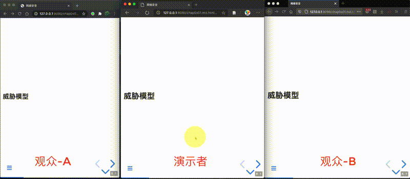

# 网络安全

[](https://creativecommons.org/licenses/by-nc-sa/4.0/)

配套 [《移动互联网安全》本科生教材](https://github.com/c4pr1c3/cuc-mis) 的课件。

## 使用「演示」模式

```bash
# 1. 在「演示」服务器上安装必要的依赖
npm install 

# 2. 启动「演示」广播控制服务 socket.io
node node_modules/reveal-multiplex

# 3. 访问 http://127.0.0.1:1948/token 获得 secret 和 socketId 的值
# 3.1. 修改 lib/revealjs.template.html 中所有标记为【TO REPLACE】的变量值

# 4. 渲染页面
export PRETOKEN="<secret from http://127.0.0.1:1948/token>"
export PREID="<socketId from http://127.0.0.1:1948/token>"
export PRESERVER="http://<观众和演讲者浏览器均可访问到的 IP>:1948"
bash render.sh

# 5. 分别开启「演讲者服务器」和「观众服务器」

# 5.1. 推荐「演讲者服务器」仅限演讲者自己本地可访问
# 5.1. 例如 127.0.0.1
# 5.1. 「演讲者服务器」的站点根目录在 server/

# 5.2. 「观众服务器」要能让观众访问到
# 5.2. 例如互联网上的一个服务器 IP 或域名
# 5.2. 「观众服务器」的站点根目录在 client/

# 5.3. socket.io 服务 IP 要保证能被「观众」的浏览器访问到

# 以下建立 http 静态文件服务器的方法可选，按需自取
python3 -m http.server -b 127.0.0.1 9090
php -S 127.0.0.1:9090
```

### 「演示」模式效果



### ⚠️  警告 ⚠️

1. **「演讲者服务器」严格只能单用户、单页面打开** ，避免观众的页面被并发的冲突控制指令所扰乱。
2. **页面切换间隔建议不小于 1 秒**，避免观众的页面进入混乱切换状态。

### 参考资料

* [reveal/multiplex](https://github.com/reveal/multiplex)

