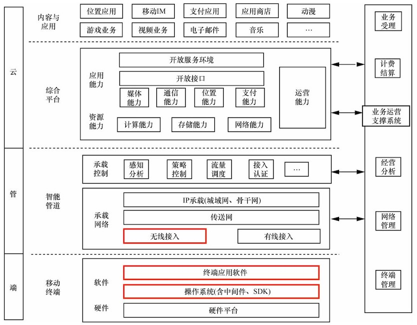
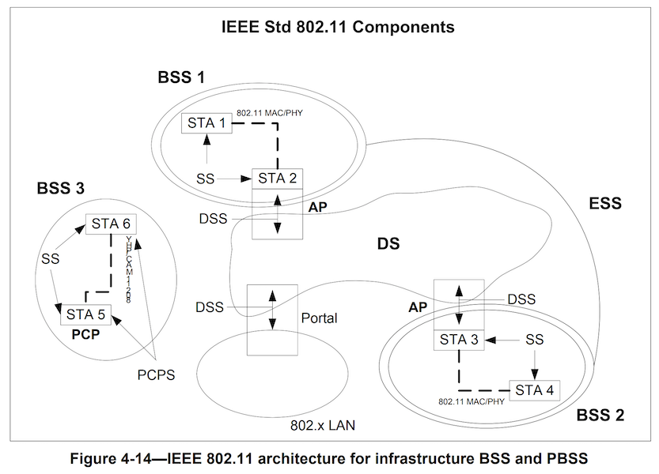
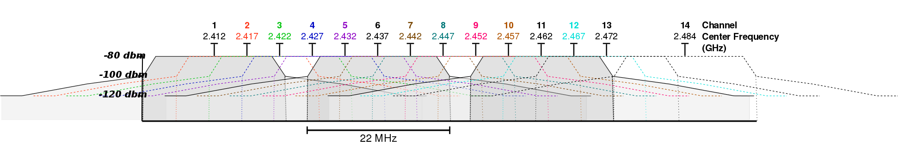
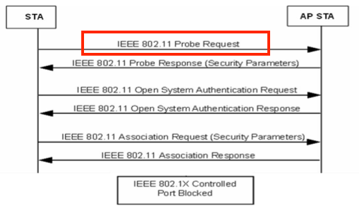
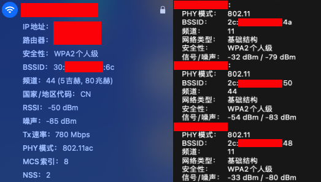

# 第一章 无线网络安全基础

---

## 提纲

* 移动互联网基础
* 无线网络基础

# 移动互联网基础

---


---



# 无线网络基础

---

* 无线网络是什么？（协议基础）
* 无线网络有什么？（设备基础）
* 无线网络的路由？（系统基础）

# 无线网络是什么？

---

> Wi-Fi？WLAN？802.11？蓝牙？NFC？

---

## [Wi-Fi](https://www.wi-fi.org/who-we-are)

> Wi-Fi Alliance® is the worldwide network of companies that brings you Wi-Fi®

> Our work includes the development of innovative technologies, requirements, and test programs that help ensure Wi-Fi provides users the **interoperability**, security, and reliability they have come to expect.

---

> [Wi-Fi is not an acronym; it is a **brand name** created by a marketing firm that’s meant to serve as an **interoperability** seal for marketing efforts.](https://www.cisco.com/c/en/us/products/wireless/what-is-wifi.html)

---

## WLAN

* Wireless Local Area Networks, 无线局域网
* 使用 `射频（Radio Frequency, RF）` 技术建立的不依赖可见物理传输介质的无线通信局域网络

---

## 无线网络通信协议家谱

| ⽆线⽹络类别                              | IEEE                                           | ITU                                               |
| :--:                                      | :--:                                           | :--:                                              |
| 蜂窝通信（2G, 2.5G）<br/>最后几公⾥, Kbps |                                                | GSM, CDMA,GPRS,EDGE                               |
| 3G(WMAN)<br/>最后几公里，1~xx Mbps        | WiMax(802.16e)                                 | WCDMA(欧洲)<br/>CDMA2000(美国)<br/>TD-SCDMA(中国) |
| 4G(WMAN)<br/>最后几公里，1~100 Mbps       | WiMax(802.16m)                                 | LTE(FDD/TDD)                                      |
| 5G<br/>最后1公里，xxxMbps~xxGbps          |                                                | IMT-2020                                          |
| WPAN<br/>10米,Kbps~Mbps                   | 蓝牙(802.15.1)/UWB(802.15.4a)/ZigBee(802.15.4) |                                                   |
| WLAN<br/>100米,10Mbps~xxGbps              | Wi-Fi(802.11)                                  |                                                   |

> [IMT: International Mobile Telecommunications](https://www.itu.int/dms_pubrec/itu-r/rec/m/R-REC-M.2083-0-201509-I!!PDF-E.pdf)

---

### 5G 应用场景 {id="5g-app"}


---

### 5G 技术关键指标 {id="5g-kpi"}


# IEEE 802.11

---

> [IEEE Standard for Information technology - Telecommunications and information exchange between systems Local and metropolitan area networks—Specific requirements-Part 11: Wireless LAN Medium Access Control (MAC) and Physical Layer (PHY) Specifications](https://ieeexplore.ieee.org/document/7786995)

---

## 802.11 技术架构 {id="arch-of-802.11"}



---

## 802.11 技术组件 {id="components-of-802.11"}

* STA
* AP
* Portal
* BSS / IBSS / PBSS
* SS
* ESS
* DS
* 802.x LAN

---

### Wireless station (STA)

* 可寻址的设备（非固定位置）
    * 固定地址、可移植地址、动态地址
        * ⽆线客户端
        * ⽆线路由器
        * ⽆线接⼊点

---

### 无线介质带来的局域网组网新挑战

* 没有可靠的物理层连接质量保障
* 拓扑 **动态性** 和 **位置移动性** 更强
* 普遍的电池供电：电源管理和低功耗需求
* 共享的物理层传输介质：嗅探和中间人劫持风险

---

### 和 `IEEE 802® 协议` 家族的互联互通需求

* logical link control (LLC)：抽象层，解决物理层连接可靠性质量管理
* robust security network association (RSNA)：抽象层，解决共享物理传输介质带来的安全性挑战
* `IEEE 802.11 QoS`：解决 **动态性** 和 **位置移动性** 需求

---

### AP

* Access Point
    * STA的⼀种
    * 对已关联（`associated`）的 `STA` 基于⽆线介质（WM, `Wireless Medium`）提供接⼊分布式服务

---

### BSS

* Basic Service Set
    * STA 加⼊的集合
    * STA 之间是否可以相互可见（通信）取决于接⼊点设备的配置
* BSA: basic service area
    * BSS 的覆盖区域

---

### IBSS

* infrastructure BSS
    * `BSS` 默认就是指的的 `基础设施 BSS` ，`IBSS` 特指 `Independent BSS`
    * ⾄少包含 1 个接⼊点（`Access Point`, AP）
    * `Portal`（门户）是可选项
        * ⽆线服务的逻辑接⼊点，例如学校的⽆线认证页面 
* Independent BSS
    * 最基本的 IEEE 802.11 局域网
    * Ad-hoc
    * 最少包含 2 个 `STA`
    * 不支持接⼊分布式系统

---

### PBSS

* personal BSS
* 类似 IBSS ，STA 之间直接通信
* 不同于 IBSS
    * STA 扮演 `PBSS 控制点（PBSS control point, PCP）`
    * 仅限 IEEE 802.11ad 协议中定义的 `DMG` (Directional **multi-gigabit**) 客户端
        * 使用 `60GHz` 频谱资源，也可使用 2.4G/5G 频谱
        * 有效通信距离小于5米

---

### MBSS

* Mesh BSS, IEEE 802.11s
* 一个典型的 MBSS 是由 `AP` 同时扮演 `BSS` 中的数据转发者和另一个 `BSS` 中的客户端，从而实现跨 BSS 的通信、多物理 AP 组成一个 `ESS`
* 相对固定的分布式基础设施模式无线网络

---

### SS

* Station Service（站点服务）
* 在⼀个指定BSS内提供 `数据链路层通信` 服务
    * 支持在 BSS 内不同 STA 之间传输 `MSDU` 的服务集合 
        * MSDU: medium access control (**M**AC) **S**ervice **D**ata **U**nits

---

### ESS

* Extended Service Set（扩展服务集合）
* 物理上独立的 `BSS` 组成的⼀个逻辑上的独立服务集合
    * 使用相同的ESSID
    * ⽆线热点扩展
        * CUC-WiFi、CUC-Guest、CMCC、ChinaNet …
    * 支持漫游

---

### DS / DSS

* Distribution System （分布式系统）
    * 增加 `BSS` 的覆盖范围（面积）
    * 又被称为 `WDS`（Wireless DS）
* Distribution System Service (DSS)

---

### 802.x LAN

* 802.3: wired local area network
    * 以太网使用双绞线作为传输媒介
    * 在没有中继的情况下，最远可以覆盖 200 米的范围
    * 支持数据传输速率范围：100Mbps ~ 10Gbps
* 802.11: wireless local area network
    * 802.11a/b/g/n/ac/ad/ax
    * 802.11i

---

#### IEEE 802 家族主要协议对应 OSI 模型归属关系


---

### IEEE 802.11 家族协议历史


---

### IEEE 802.11g 第1-14信道的频谱屏蔽范围定义



---

### Wi-Fi 世代与 IEEE 802.11 家族

| Wi-Fi 世代        | 发布时间 | IEEE 版本 | 频谱                   | 理论最大传输速率 |
| :--:              | :--:     | :--:      | :--:                   | :--:             |
| Wi-Fi 1 (非官方） | 1999     | 802.11b   | 2.4GHz                 | 11Mbps           |
| Wi-Fi 2 (非官方） | 1999     | 802.11a   | 5GHz                   | 54Mbps           |
| Wi-Fi 3 (非官方） | 2003     | 802.11g   | 2.4GHz                 | 54Mbps           |
| Wi-Fi 4           | 2009     | 802.11n   | 2.4GHz && 5GHz（可选） | 600Mbps          |
| Wi-Fi 5           | 2014     | 802.11ac  | 5GHz                   | ≈7Gbps           |
| Wi-Fi 6           | 2021     | 802.11ax  | 2.4GHz && 5GHz         | ≈10Gbps          |
| WiGig             | 2012     | 802.11ad  | 60GHz                  | ≈7Gbps           |

---

### BSSID

* `BSS` 模式下是 `AP` 的 `MAC 地址`
* 对于 `IBSS` 来说是随机的 `MAC 地址`

---

### ESSID {id="essid-1"}

* ⼀般简称为 `SSID` ，⽆线⽹络的接⼊唯⼀标识
    * 仅作为⼀种声明
    * <font color="red">可任意声明（伪造）</font>
* STA 与 AP 关联（`Associate`）使用的标识
* 区分⼤小写、2-32 字节
* 单个 AP 可以支持多个 ESSID
    * 取决于设备与系统的支持情况
    * 常见的：客⼈⽹络

---

### ESSID {id="essid-2"}

* 取消 SSID ⼴播 / 隐藏 SSID
    * 客户端不能“主动发现”
    * 并不能增强⽆线⽹络安全性
        * 且听第三章分解
* 构建 ESS 时，所有的 BSS 必须使用相同的 ESSID

---

### 为什么需要 BSSID {id="why-bssid"}

* 增强识别 BSS 的准确性
* 同名 ESSID 时，通过 BSSID 区分不同的 BSS

---

### 802.11 工作模式

* 基础设施 
    * BSS / ESS / MBSS
* Ad-Hoc 
    * IBSS  / PBSS
* 监听（monitor）模式 
    * 第⼆章讲解

---

### 802.11 关联过程（无加密，开放认证）



> 可选步骤，AP 如果开启了 SSID ⼴播，则 STA 可以通过 `beacon frame` 得到认证相关信息

---

### Wireshark 抓包分析实例


---

### 无线网络连接状态实例



> 如图所示的信号来自于位置相近的 2 台无线路由器，可见 2.4GHz 无线信号穿墙效果好于 5GHz 无线信号

---

### STA 加⼊（关联）AP 的策略 {id="sta-join-ap-1"}

* 历史关联记录优先
* 先发现，先关联
* 信号强度⾼者优先
    * `RSSI`：received signal strength indicator
        * 接收信号的强度指示，负值
        * RSS = 10*lgP ，P 是接收到的信号功率，⼀般以 1mW 作为分母
    * dBm：功率绝对值，0 表示最强，越近 0 功率值越大
        * 对于 RSSI 来说，高 dBm 意味着更好的接收效果
        * 对于噪声值来说，高 dBm 意味着更强的干扰
    * dB：功率相对值

---

### STA 加⼊（关联）AP 的策略 {id="sta-join-ap-2"}

* （常见可选）应用层连接质量检查
    * 检测当前无线网络是否可以访问预置受信任网络服务：预防网络劫持和投毒

---

### 抓包结果中的信号强度值实例 {id="cts-rssi"}


---

### 抓包结果中的信号强度值实例 {id="rssi-variation"}


# 无线网络设备基础

---

## 无线网络有什么？

* AP？路由器？热点？
* 上⽹卡？电⼒猫？3G？4G？5G?
* ⼿机？平板？笔记本？台式机？空调？插座？WiFi-SD 卡？

---

## 常见术语与概念

* （⽹卡）芯片 
* 厂商 
* 驱动程序 
* ROM / Flash 
* RAM / 内存 
* 天线

---

## 支持本课程实验的常见 USB 无线网卡 {id="good-usb-dongle"}

* [已验证支持网卡清单](https://c4pr1c3.github.io/cuc-mis/chap0x02/wifi_card_list.html)
    * [结合 iw phy 输出参数详解无线网卡硬件特性](https://c4pr1c3.github.io/cuc-mis/chap0x02/rt3572l_explained.html)
* 支持无线数据帧 `自定义接收`： **嗅探** （`monitor`）
* 支持无线数据帧 `自定义发送`： **注入** （`frame injection`）
    * 网卡进入 `monitor` 模式之后使用 `aireplay-ng --test wlan0` 测试
* 支持工作在 AP 模式 


---

### 常用 USB 无线网卡信息调试指令（Kali）

```bash
# 查看物理网卡的硬件和软件特性支持情况
iw phy
iw list

# 查看 USB 端口上已连接设备基本信息
lsusb

# 查看USB设备所使用的驱动信息及其他详细信息（即使系统没有支持当前无线网卡的驱动程序，但通过该命令可以看到所有连接成功的USB设备）
lsusb -v

# 以树形结构打印输出USB设备基本信息及其驱动加载情况
lsusb -t

# 查看PCI接口设备所使用驱动的详细信息
lspci -k

# 查看硬件驱动和配置详细信息
# 需要手工安装： apt-get install lshw
lshw

# 简要模式打印输出设备中的所有硬件设备及其对应驱动信息
lshw -short

# 上一条命令输出结果里的class字段标识的设备类型，在此处可以作为筛选条件过滤输出结果
lshw -class bus


# 查看所有无线网卡的接口标识信息
iw dev

# 查看最近加载的（硬件）驱动日志信息
dmesg
```

---

## 常见网卡芯片厂商名单


---

## 以 [Atheros AR9271](https://deviwiki.com/wiki/Atheros_AR9271) 为例

* 查询 [支持硬件属性](https://deviwiki.com/wiki/Atheros_AR9271#Properties)
* 查询 [Linux 不同发行版的 **驱动支持** 情况](https://deviwiki.com/wiki/Atheros_AR9271#Linux_support)
* 查询 [哪些设备使用该网卡控制芯片](https://deviwiki.com/wiki/Atheros_AR9271#Table_of_Systems)

---

## 天线（Antenna）

* ⽆源器件
* 通过控制信号发射的角度，来获得信号“增益”
    * 信号的总能量由 AP 决定
    * 天线决定信号如何传播出去
        * 全向（Omni）天线：覆盖角度大，能量聚集度低，覆盖距离短。适用于室内环境
        * 定向（directional）天线：覆盖角度小，能量聚集度高，覆盖距离长。适用于户外环境

# 无线网络系统基础

---

## 知名的路由器操作系统

* [OpenWrt](https://openwrt.org/)
* [dd-wrt](https://dd-wrt.com/)
* [Tomato](http://www.polarcloud.com/tomato)
* [RouterOS](https://mikrotik.com/software)

---

### OpenWrt

* 基于 GNU/Linux 的嵌⼊式设备（主要是⽆线路由器）操作系统，采用 GNU GPLv2 授权协议
* [官⽅硬件兼容性表格](https://openwrt.org/toh/start) 列举了超过 1600 种市面上的⽆线路由器（数据统计截止：2020-12）
* [在 VirtualBox 中体验 OpenWrt](https://c4pr1c3.github.io/cuc-mis/chap0x01/exp.html#openwrt-on-virtualbox)
* 一段分分合合的小插曲
    * 2016 年 OpenWrt 中的一部分开发者因「开发理念不同」基于主干代码创建了一个新分支项目 LEDE ，主打「稳定性」、「规律的版本发布周期」和「透明决策机制」
    * 2018 年 1 月，LEDE 开发小组成员和 OpenWrt 开发小组成员达成和解，LEDE 项目重新回归 OpenWrt 社区，终止 LEDE 项目

---

### DD-WRT {id="dd-wrt-1"}

* 用于⽆线路由器的的第三⽅固件，采用 GPL 协议，支持基于 Broadcom 或 Atheros 芯片参考设计的许多 IEEE 802.11a/b/g/n ⽆线路由器
* 固件是由 BrainSlayer 来维护的，放在 dd-wrt.com
    * DD-WRT 的第⼀个版本基于Sveasoft Inc 公司的 Alchemy 开发出来的, ⽽Alchemy 又是基于 GPL 的 Linksys固件及许多其它开源程序
    * 由于后来⼈们需要向 Sveasoft 支付 20 美元才能下载 Alchemy 固件，直接的后果就是发展出了 DD-WRT

---

### DD-WRT {id="dd-wrt-2"}

* DD-WRT 的新版本 (v24) 是⼀个全新的项目
    * DD-WRT 提供了在 OEM 固件，甚⾄ Sveasoft 收费的固件中没有的⾼级特性
    * 此外它去除了 Sveasoft 固件的产品激活和跟踪功能。
* [官⽅支持设备列表](https://wiki.dd-wrt.com/wiki/index.php/Supported_Devices)

---

### tomato

* 以 HyperWRT 为基础的⽆线路由器固件，支持的路由器型号较少，如下：
    * Linksys WRT54GL v1.x, WRT54G v1-v4, WRT54GS v1-v4, WRTSL54GS (no USB support)
    * Buffalo WHR-G54S, WHR-HP-G54, WZR-G54, WBR2-G54, WBR-G54, WZR-HP-G54, WZR-RS-G54, WZR-RS-G54HP, WVR-G54-NF, WHR2-A54-G54, WHR3-AG54
    * Asus WL520GU (no USB support), WL500G Premium (no USB support), WL500GE
    * Sparklan WX6615GT, Fuji RT390W, Microsoft MN-700

---

### RouterOS

* MikroTik 公司基于 Linux 内核开发的路由器操作系统，可以安装在其私有硬件产品 `RouterBOARD` 系列或标准 `x86 计算机`
* `RouterBOARD` 系列设备在出厂时即预置了RouterOS产品授权秘钥
* PC 设备安装 RouterOS 需要额外获取授权秘钥，授权等级见 [官⽅ Wiki](https://wiki.mikrotik.com/wiki/Manual:License%23License_Levels)

# 本章小结

---

* 无线网络和 IEEE 802.11 协议家族之间的关系
* 基于 IEEE 802.11 构建的无线网络的基本组件
* 无线网络设备基础（无线网卡和无线接入设备）：如何选购符合本课程实验要求的无线网卡
* **课后作业** 在虚拟机中安装 OpenWrt ，搭建「无线软路由」，为第二章学习准备好「无线 AP」实验环境
    * [macOS 上可用的一键下载并安装好 OpenWrt 19.07.5 虚拟机环境脚本，注意先检查脚本代码和注释，理解后再执行](exp/chap0x01/setup-vm.sh)


