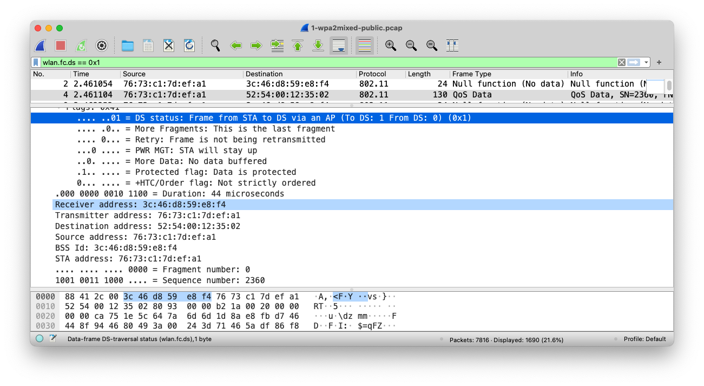
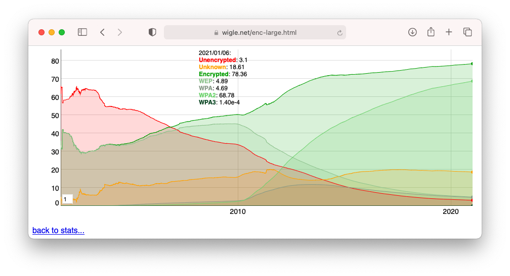
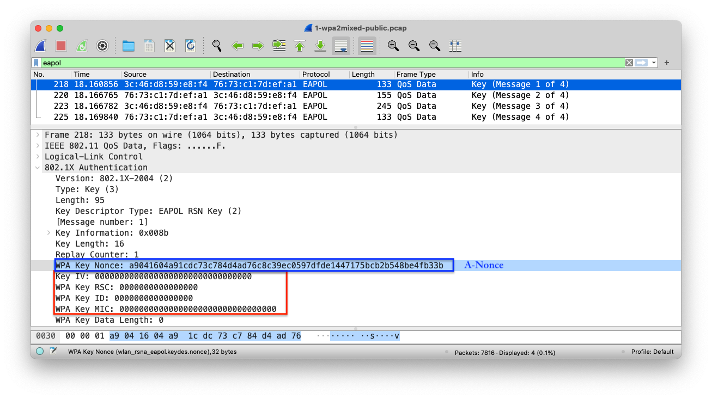
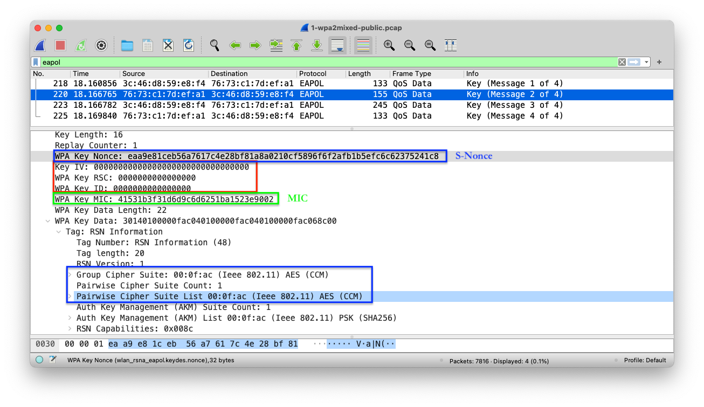
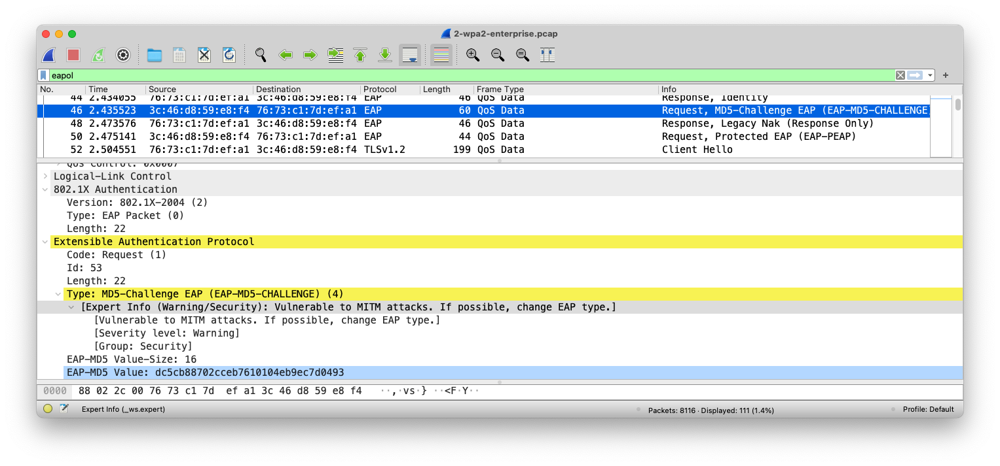

# 第二章 无线接入网监听

---

## 温故

* 了解 IEEE 802.11 与 Wi-Fi 的关系
* 了解 IEEE 802.11 无线网络协议中的关键组件有哪些
* 了解 IEEE 802.11 无线网络中有什么设备
* 了解 OpenWrt 的基本功能与配置方法
* 了解本课程实验所需无线网卡的基本要求

---

## 知新

* 实战无线网监听
* 无线通信数据报文分析

# 实战无线网监听

---

## 无线网络监听的基本条件

* 硬件
    * 无线网卡
* 软件
    * 无线网卡驱动（管理硬件）
    * 无线网卡设备管理软件
    * 报文嗅探软件（抓包器）

---

### USB 接口的无线网卡


> 注意此时无线网卡指示灯 **均已点亮**

---

### 虚拟机连接 USB 接口无线网卡 {id="usb-filter"}


---

### 虚拟机连接 USB 接口无线网卡 {id="usb-connect-to-vm"}


---

### 虚拟机连接 USB 接口无线网卡 {id="usb-connect-to-vm-summary"}

* 确保 `Virtualbox` 的 `USB` 设备管理菜单能识别连入的 USB 无线网卡
* 确保该连入的 USB 无线网卡处于已连入虚拟机状态（ 对应无线网卡状态为✔️  且虚拟机控制台没有报错）


---

### 无线网卡驱动与设备管理软件

* 本课程只推荐 `Kali` 作为基础操作系统
* `Kali` 开箱即用提供了大量 USB 接口无线网卡驱动
* `lsusb` 无法识别的 USB 无线网卡大概率无法使用
* `lsusb` 可识别但 `iw` 无法管理的无线网卡可以通过手动安装对应驱动程序的方式来解决网卡使用问题

---

### 无线网卡设备管理软件示例

```bash
# 查看 USB 接口上是否已识别无线网卡
lsusb
# Bus 002 Device 001: ID 1d6b:0003 Linux Foundation 3.0 root hub
# Bus 001 Device 006: ID 0bda:a811 Realtek Semiconductor Corp. RTL8811AU 802.11a/b/g/n/ac WLAN Adapter
# Bus 001 Device 008: ID 0cf3:9271 Qualcomm Atheros Communications AR9271 802.11n
# Bus 001 Device 001: ID 1d6b:0002 Linux Foundation 2.0 root hub

# 查看无线网卡驱动加载情况
# Driver=rtl88XXau 非空，说明无线网卡驱动加载正常
lsusb -t
# /:  Bus 02.Port 1: Dev 1, Class=root_hub, Driver=xhci_hcd/6p, 5000M
# /:  Bus 01.Port 1: Dev 1, Class=root_hub, Driver=xhci_hcd/8p, 480M
#     |__ Port 1: Dev 2, If 0, Class=Vendor Specific Class, Driver=rtl88XXau, 480M

# 查看 USB 接口连接设备的详细信息
lsusb -v
# Bus 001 Device 006: ID 0bda:a811 Realtek Semiconductor Corp. RTL8811AU 802.11a/b/g/n/ac WLAN Adapter
# Device Descriptor:
# ...
#   idVendor           0x0bda Realtek Semiconductor Corp.
#   idProduct          0xa811 RTL8811AU 802.11a/b/g/n/ac WLAN Adapter
#   bcdDevice            2.00
#   iManufacturer           1 Realtek
#   iProduct                2 802.11ac WLAN Adapter
#   iSerial                 3 00e04c000001
#   bNumConfigurations      1
#   Configuration Descriptor:
# ...

# Bus 001 Device 011: ID 0cf3:9271 Qualcomm Atheros Communications AR9271 802.11n
# Device Descriptor:
# ...
#   idVendor           0x0cf3 Qualcomm Atheros Communications
#   idProduct          0x9271 AR9271 802.11n
#   bcdDevice            1.08
#   iManufacturer          16 ATHEROS
#   iProduct               32 USB2.0 WLAN
#   iSerial                48 12345
#   bNumConfigurations      1
# ...

# 使用 iw 工具查看无线网卡基本信息
iw dev
# phy#1
# 	Interface wlan1
# 		ifindex 6
# 		wdev 0x100000001
# 		addr 0e:05:8c:fd:dc:56
# 		type managed
# 		txpower 20.00 dBm
# phy#0
# 	Interface wlan0
# 		ifindex 5
# 		wdev 0x1
# 		addr 56:6a:c9:ec:2d:2f
# 		type managed
# 		txpower 20.00 dBm

# 查看无线网卡详细硬件参数信息
iw phy
```

---

## 无线网络监听的进阶条件

* 操作系统支持设置⽆线⽹卡进⼊ `monitor`（监听）模式
    * ⽆需加⼊任何⼀个 `BSS`
        * ⽆需绑定到⼀个 `AP` 或进⼊ `Ad-Hoc` 模式
    * ⽆线⽹卡通过 `channel hopping` （跳频）技术在多个 `channel` （频道）之间快速切换
    * 捕获 802.11 数据帧

---

### 无线网络监听的限制因素

* ⽆线⽹卡只能⼯作在⼀个确定的频道上
    * 不能同时监听所有频道和波段
* ⽆线⽹卡对 `IEEE 802.11` 协议的支持有 **硬件差异**
    * 指定范围： `a/b/g/n/ac` ，其中 `b/g` 最为常见

---

### 配置网卡进入监听模式

```bash
# 方法一
# 最傻瓜化的指令 airmon-ng 
# 配置指定网卡 wlan 进入监听模式
# 部分型号无线网卡可能会被重命名
# 重命名后的网卡名称可能是 wlan0mon 
airmon-ng start wlan0

# 配置指定网卡 wlan 退出监听模式（回到默认的 managed 模式）
airmon-ng stop wlan0
# airmon-ng stop wlan0mon

# 使用无线网卡底层配置工具 iw 
# 方法二
# 配置指定网卡 wlan 进入监听模式
iw dev wlan0 set type monitor

# 配置网卡监听 channel
iw dev wlan0 set channel 6

# 配置指定网卡 wlan 进入 managed 模式
iw dev wlan0 set type managed

# 方法三
# 对于硬件支持创建虚拟子接口的网卡可以采用以下指令
iw dev wlan0 interface add mon0 type monitor
# 此时再次查看 iw dev 输出结果会发现多了一个「无线网卡」 mon0

# 如果提示 command failed: Device or resource busy (-16)
# 需要先从操作系统层面禁用无线网卡，再执行上述 iw 指令配置网卡工作模式

# 常见故障排查手段
# 操作系统层面启用无线网卡
ip link set wlan0 up
# 操作系统层面禁用无线网卡
ip link set wlan0 down
# 注意网卡被禁用后通常硬件的工作状态指示灯也会灭掉
```

---

### 配置无线网卡开始抓包 airodump-ng

```bash
# 开始以channel hopping模式抓包
# 注意看清楚 iw dev 输出的网卡名称
airodump-ng wlan0
# CTRL-C退出当前抓包

# 选择一个"感兴趣"的目标AP进行定向（指定工作channel）监听并将结果保存到本地文件
airodump-ng wlan0 --channel 13 -w saved --beacons --wps
# 以上命令会在当前目录保存文件名为saved-NN的几个文件：.cap、.csv、.kismet.csv、.kismet.netxml
# 其中NN按照从01开始编号，重复执行上述命令多次，捕获到的数据报文会保存在不同编号的.cap文件中
# 使用 --beacons 参数可以记录每一个独立BSSID发送的所有beacon frame
# 如果不使用上述参数，airodump-ng 默认对一个独立BSSID只记录一个beacon frame
# 假如某个AP在抓包过程中更换了ESSID，则抓包结果会遗失大部分ESSID
# 不使用 --beacons 参数可以减少大量的I/O写磁盘次数（大部分AP每秒会发送10个beacon frame）
# --wps 可以显示开启了WPS功能的AP的WPS相关信息

# 如果希望只监听指定AP的所有通信数据报文，可以使用以下命令
airodump-ng -c 8 --bssid <bssid> -w saved wlan0
# 上述命令中<bssid>替换为实际目标AP的BSSID值即可
```

---

### 配置无线网卡开始抓包 tcpdump/tshark

```bash
# tcpdump 和 tshark 未开箱即用提供 channel hopping 功能
# 只能固定在一个指定 channel 上抓包
# 部分无线网卡可能不支持 -I 参数
tshark -i wlan0 -I -w saved.cap

tshark --help | grep -- -I
#   -I, --monitor-mode       capture in monitor mode, if available

tcpdump -i wlan0 -w saved.cap
```

---

### 小结无线网络监听步骤

1. 将 USB 无线网卡连入虚拟机
2. 设置网卡进入 `监听模式`
3. 使用抓包器对指定的监听模式无线网卡进行抓包
    * `channel hopping` 模式收集附近无线网络信息
    * 确定抓包目标，进行定向抓包
4. 使用报文分析软件对抓包结果文件进行离线分析

# 无线网卡监听常见故障排查

---

## 故障排查思路 

* 自底向上
    * 先硬件、后软件
    * 先 USB 接口识别、再网卡基本信息识别、最后是网卡管理软件操作验证

---

### 硬件相关常见故障排查

* 更换 `USB 连接接口`，有些电脑的不同 `USB 接口` 由于供电能力差异，部分耗电量较大的 `USB 无线网卡` 可能只能在电脑的特定 `USB 接口` 上可以正常工作；
* 对应上一条排查建议，还可以尝试更换 `USB 无线网卡` 的 `USB 连接线` ，排除连接线故障原因；
* 如果是使用的虚拟机环境，建议检查虚拟机的USB设备共享设置。必要时可以启用 `USB 3.0兼容` 选项或者如果 `USB 3.0兼容模式` 无法正常识别网卡或网卡无法抓包，可以降级为 `USB 2.0兼容模式` 尝试故障排查；

---

### 软件相关常见故障排查

* 确保使用的是最新版的虚拟机软件并安装了必要的扩展包；
* 使用 `tail -F /var/log/messages` ，重新连接 `USB 无线网卡` ，检查该日志中的消息是否有出现一些故障信息报错。尝试在搜索引擎中搜索相关报错信息关键词；
* 确认已安装匹配版本的 USB 无线网卡驱动，必要时需要自己下载驱动源代码进行编译安装；
* `重启` 大法好。无论是虚拟机还是物理主机，有时可能是由于新安装了USB驱动或其他未知不可描述原因，重启或关闭系统再启动（冷启动）就可以解决问题；

# 动手抓包

---

> 准备无线网络抓包实验环境，动手抓包时间。

---

* 自建无线网络
    * 推荐使用无线路由器或 AP 确保连接稳定性
    * 使用 [OpenWrt + USB 无线网卡自建无线网络](chap0x01.md.html#/8/1)
    * 在 Kali 里使用无线网卡自建无线热点（稳定性和并发服务能力均较差）
* 配置不同条件的无线网络供抓包
    * 开放认证（不加密）
    * 隐藏 SSID (禁止广播 SSID）
    * WPA/WPA2/WPA3 个人认证
* 使用抓包工具抓包

---

## [AirCrack-NG](https://www.aircrack-ng.org/)

> Aircrack-ng is a complete suite of tools to assess WiFi network security.

> * Monitoring: Packet capture and export of data to text files for further processing by third party tools
> * Attacking: Replay attacks, deauthentication, fake access points and others via packet injection
> * Testing: Checking WiFi cards and driver capabilities (capture and injection)
> * Cracking: WEP and WPA PSK (WPA 1 and 2)

---

## [AirCrack-NG](https://www.aircrack-ng.org/)

```bash
# 查看版本信息和命令行参数帮助
aircrack-ng --help

# 查看当前系统上的 aircrack-ng 安装了哪些文件
dpkg -L aircrack-ng
```

# 无线通信数据报文分析

---

## 定制 Wireshark 主窗口显示列 {id="customize-wireshark-1"}


* 鼠标右键单击主窗口的信息显示标题行，在弹出菜单中选择 `Column Preferences`

---

## 定制 Wireshark 主窗口显示列 {id="customize-wireshark-2"}


* 添加 `Type` 为 `Custom` 的自定义列，值为 `wlan.fc.type_subtype`

---

## 定制 Wireshark 主窗口显示列 {id="customize-wireshark-3"}


---

## 样例数据

* [样例1：开放式认证连接过程样例数据](exp/chap0x02/0-open-ap-public.pcap)
* [样例2：WPA/WPA2 个人模式加密认证过程样例数据](exp/chap0x02/1-wpa2mixed-public.pcap)
* [样例3：WPA2 企业级加密认证过程样例数据](exp/chap0x02/2-wpa2-enterprise.pcap)

# 以开放式认证连接过程为例

---

## 样例1 中的无线 AP 基本信息 {id="open-ap-1"}


---

## 样例1 中的无线 AP 基本信息 {id="open-ap-2"}


---

## 样例1 中的无线 AP 基本信息 {id="open-ap-3"}


---

## 样例1 中的客户端基本信息 {id="sample1-client-info"}


---

## WPA Open Access 连接过程全貌 {id="flowgraph-of-open-access"}


---

## 上述连接过程全貌里观察到的无线数据帧类型

* Beacon frame
* Probe Request
* Probe Response
* Authentication (Request)
* Authentication (Response)
* Association Request
* Association Response

---

### 开放式认证

* 虽然没有设置加密方式，但「认证」步骤没有跳过


---

> 先讲一段「基础理论」知识

# IEEE 802.11 中定义的主要网络服务 {id="network-services"}

---

* ***数据封包传送***
* ***身份验证(authentication)***
* ***解除验证(de-authentication)***
* ***隐私(privacy)保护***
* 连接(association)服务
* 重连(re-association)服务
* 取消连接（dis-association）服务
* 分发(distribution)服务
* (integration)服务

---

* ***STA*** 必备服务
* DS 中会用到的服务

---

## 数据封包传送服务

* 此服务为最基本的功能
* STA 对待发送数据进⾏封装、传送和接收

---

## 身份验证服务

* 主要用来确认每个 `STA` 的身份
* `IEEE 802.11` 通常要求双向式的身份确认，它也允许同⼀时间⼀个 `STA` 和多个 `STA` （包括 `AP` ）进⾏身份验证

---

## 解除验证服务

* 已完成身份认证的 `STA` 可以用这个服务来取消身份认证，⼀旦取消后连接也同时被取消

---

## 隐私保护服务

* 通过加密机制保护通信数据的机密性

---

## 连接服务 {id="connection-service-1"}

* 目的：在 `STA` 和 `AP` （或 `STA` ）之间建立⼀个通信链路
* 当分布式系统要将数据传送给主机时，必须事先知道这个主机目前是通过哪个 `AP` 接⼊分布式系统的，这些信息都可以由连接服务提供
* ⼀个主机在被允许经由某个AP传送数据给分布式系统前，必须先和此 `AP` 进⾏连接

---

## 连接服务 {id="connection-service-2"}

* 通常在⼀个 `BS` 内有⼀个 `AP` ，因此在这个区域内的任意主机若想要与外界进⾏通信，就必须先与此 `AP` 进⾏连接。这个过程类似注册，当主机完成连接后，`AP` 就会记住这台主机目前在它的管辖范围之内。连接服务通常都由主机启动，用它来与 `AP` 进⾏连接
    * 在任何时刻⼀台主机只会和⼀个 `AP` 进⾏连接，这样才能使分布式系统知道哪个主机是由哪个 `AP` 所管辖的，然⽽⼀个 `AP` 却可以同时与多台主机进⾏连接

---

## 重连服务

* 目的：将⼀个移动中的主机连接由⼀个 `AP` 转移⾄另⼀个 `AP`
* 当主机从⼀个服务区移动到另⼀个服务区时，它将启动重连服务
* 重连服务会将主机与它所移⼊的服务区内的 `AP` 进⾏连接，使分布式系统知道此主机已经转移⾄另⼀个 `AP` 的管辖区域内
* 重连服务通常也是由主机启动

---

## 取消连接服务

* 当⼀台主机数据传送结束时，可以使用取消连接服务对当前已有的连接进⾏取消
* 当主机在服务区内移动时，它除了会对新的 `AP` 启动重连服务外，还会对旧的 `AP` 启动取消连接服务
* 此服务可以由主机或AP任⼀⽅来启动，不论是哪⼀⽅启动的另⼀⽅都不能拒绝。（需要注意的是AP可能因⽹络负荷过重⽽是用取消连接服务对主机取消连接）

---

## 分发服务

* 此服务主要由 `BSS` 中的主机使用
* 当主机需要传送数据时，会先将数据传送⾄ `AP`，再由 `AP` 通过分布式系统传送⾄目的地
* `IEEE 802.11` 并没有规定分布式系统要如何将数据正确的送⾄目的地，但它说明了在连接、取消连接和重连等服务中，数据应该由哪个 `AP` 进⾏输出以将数据送达⾄正确的目标地点

---

## 整合服务

* 目的：让数据能够在分布式系统和现有的局域⽹之间进⾏传送
* 整合服务的任务就是将数据从分布式系统转送到相连的局域⽹络媒介，其主要⼯作就是将不同的地址空间做⼀个转换

---

## CSMA/CD

* IEEE 802.3
* 基于碰撞 **检测** 的载波监听多路访问
    * Carrier Sense Multiple Access With Collision **Detection**

---

## CSMA/CA

* IEEE 802.11
* 基于碰撞 **规避** 的载波监听多路访问
    * Carrier Sense Multiple Access with Collision **Avoidance**
* ⽆线局域⽹数据链路层最基本的接⼊⽅法
* 分布协调功能（DCF）的基础
    * Distributed Coordination Function

---

## 四次握手协议

* 非必选协议
* 解决数据链路层的传输过程中 `隐藏节点并发同 AP 通信` 可能导致的丢帧问题
    * 检测并重发
        * 进⼀步，避免重发时的碰撞，解决 `隐藏节点` 问题，引⼊了 `RTS`/`CTS` + `ACK` 协议
* RTS：发送请求控制
    * Request to send
* CTS：清除发送控制
    * Clear to send

---

## 基于 CSMA/CA 的四次握手协议简易流程 {id="rts-cts-handshake"}


# IEEE 802.11 无线帧类型

---

* 管理帧
* 控制帧
* 数据帧

---

## 管理帧

* 管理帧负责监督⽆线⽹络状态，它主要用于建立第⼆层，即链路层，主机间的连接，管理数据包包括身份认证数据包、关联数据包和 `Beacon` 数据包等
    * 为了限制⼴播或组播管理帧所造成的副作用，收到管理帧后，必须加以查验
    * 只有⼴播或者组播帧来自⼯作站当前所关联的 `BSSID` 时，它们才会被送⾄ `MAC 管理层` ,唯⼀例外的是 `Beacon` 帧

---

### 管理帧相关的分析技巧之 wireshark {id="wlan.mgt.wireshark"}

* [wlan.mgt](https://www.wireshark.org/docs/dfref/w/wlan.html) 
* `wlan.fc.type == 0`


---

### 管理帧相关的分析技巧之 wireshark {id="wlan.fc.type_subtype"}


---

### 管理帧的字段取值定义

| Type | Subtype 2进制表示 | Subtype 10进制表示 | 功能                 |
| :-:  | :-:               | :-:                | :-                  |
| 00   | 1000              | 8                  | Beacon               |
| 00   | 0100              | 4                  | Probe Request        |
| 00   | 0101              | 5                  | Probe Response       |
| 00   | 1011              | 11                 | Authentication       |
| 00   | 1100              | 12                 | Deauthentication     |
| 00   | 0000              | 0                  | Association request  |
| 00   | 0001              | 1                  | Association response |

---

### 管理帧相关的分析技巧之 tshark {id="wlan.mgt.tshark-3"}

```bash
tshark -r 0-open-ap-public.pcap -T fields -e wlan.fc.type -e wlan.fc.subtype -e _ws.col.Info "wlan.mgt" | awk -F ',' '{print $1}' | sort -t 1 -u
# 0	0	Association Request
# 0	1	Association Response
# 0	10	Disassociate
# 0	11	Authentication
# 0	13	Action
# 0	4	Probe Request
# 0	5	Probe Response
# 0	8	Beacon frame
```

---

### 管理帧相关的分析技巧之 scapy {id="wlan.mgt.scapy"}

```python
# 查看 scapy 支持的协议对象
## Dot11 开头的都是 IEEE 802.11 相关协议对象
ls()

# Dot11AssoReq : 802.11 Association Request
# Dot11AssoResp : 802.11 Association Response
# Dot11Auth  : 802.11 Authentication
# Dot11Beacon : 802.11 Beacon
# Dot11Deauth : 802.11 Deauthentication
# Dot11Disas : 802.11 Disassociation
# Dot11ProbeReq : 802.11 Probe Request
# Dot11ProbeResp : 802.11 Probe Response
# Dot11QoS   : 802.11 QoS
# Dot11ReassoReq : 802.11 Reassociation Request
# Dot11ReassoResp : 802.11 Reassociation Response

# 构造一个 Beacon Frame
beacon=RadioTap()/Dot11()/Dot11Beacon()

# 可视化 Beacon Frame 结构
beacon.show2()
# ###[ RadioTap ]###
#   version= 0
#   pad= 0
#   len= 8
#   present=
#   notdecoded= ''
# ###[ 802.11 ]###
#      subtype= Beacon
#      type= Management
#      proto= 0
#      FCfield=
#      ID= 0
#      addr1= 00:00:00:00:00:00 (RA=DA)
#      addr2= 00:00:00:00:00:00 (TA=SA)
#      addr3= 00:00:00:00:00:00 (BSSID/STA)
#      SC= 0
# ###[ 802.11 Beacon ]###
#         timestamp= 0
#         beacon_interval= 100
#         cap=

# 打印 type 和 subtype 字段取值
print("{} {}".format(beacon.getlayer(Dot11).type, frame.getlayer(Dot11).subtype))
# 0 8
# 管理帧字段 type=0
```

---

## 以 Beacon Frame 为例看管理帧的功能 {id="beacon-in-open-ap"}


---

## 控制帧

* 控制帧通常与数据帧搭配使用，负责清空区域、获取信道和载波监听的维护，并在收到数据时予以确认以提⾼⼯作站之间数据传送的可靠性
    * 因为⽆线收发器通常只有半双⼯⼯作模式，即⽆法同时收发数据，为防⽌冲突，`IEEE 802.11` 允许 `STA` 使用 `request to send` 和 `clear to send` 信号来清空传送区域

---

### 管理帧相关的分析技巧之 tshark {id="wlan.mgt.tshark-2"}

```bash
tshark -r 0-open-ap-public.pcap -T fields -e wlan.fc.type -e wlan.fc.subtype -e wlan.fc.type_subtype -e _ws.col.Info "wlan.fc.type==1" | awk -F ',' '{print $1}' | sort -t 1 -u
# 1	11	27	Request-to-send
# 1	12	28	Clear-to-send
# 1	13	29	Acknowledgement
# 1	8	24	802.11 Block Ack Req
# 1	9	25	802.11 Block Ack
```

---

### 管理帧相关的分析技巧之 scapy {id="wlan.ctrl.scapy"}

```python
# 构造一个默认的控制帧
dot11ack=RadioTap()/Dot11()/Dot11Ack()

# 可视化这个控制帧字段结构
dot11ack.show2()
# ###[ RadioTap ]###
#   version= 0
#   pad= 0
#   len= 8
#   present=
#   notdecoded= ''
# ###[ 802.11 ]###
#      subtype= Ack
#      type= Control
#      proto= 0
#      FCfield=
#      ID= 0
#      addr1= 00:00:00:00:00:00 (RA)

# 打印 type 和 subtype 字段取值
print("{} {}".format(dot11ack.getlayer(Dot11).type, dot11ack.getlayer(Dot11).subtype))
# 1 13
# 控制帧字段 type=1
```

---

## 数据帧

* 数据帧中包含实际需要传送的数据，并且是能够从⽆线⽹络转发到有线⽹络的唯⼀帧类型

---

### 管理帧相关的分析技巧之 tshark {id="wlan.data.tshark"}

```bash
tshark -r 1-wpa2mixed-public.pcap -T fields -e wlan.fc.type -e wlan.fc.subtype -e wlan.fc.type_subtype -e _ws.col.Info "wlan.fc.type==2" | awk -F ',' '{print $1}' | sort -t 1 -u
# 2	0	32	Data
# 2	4	36	Null function (No data)
# 2	8	40	Key (Message 1 of 4)
# 2	8	40	Key (Message 2 of 4)
# 2	8	40	Key (Message 3 of 4)
# 2	8	40	Key (Message 4 of 4)
# 2	8	40	QoS Data
```

---

### Null function (No data) 的奥秘 {id="null-sta-goto-sleep"}


---

### Null function (No data) 的奥秘 {id="null-sta-stay-up"}


# 以 WPA 加密认证连接过程为例 {id="wpa2-mixed-flow"}

---

## 样例2 中的无线 AP {id="openwrt-ap-1"}


---

## 样例2 中的客户端基本信息 {id="sample2-client-info"}


---

## 样例2 的显示过滤器示例 {id="sample-2-display-filter"}

```
(wlan.addr == 3c:46:d8:59:e8:f4) || (wlan.addr == 76:73:c1:7d:ef:a1) && (wlan.fc.type_subtype <= 0x1b || eapol)  && !(wlan.addr == ce:1e:34:cd:76:a9) && !(wlan.addr == ba:2a:cd:46:18:22) && !(wlan.da == 48:64:12:67:f9:c2) && !(wlan.fc.type_subtype == 0x001b) && !(wlan.fc.type_subtype == 0x000a) && !(wlan.fc.type_subtype == 0x000c) && !(wlan.addr == 9c:c8:f3:82:89:e0)
```

---

## WPA 加密认证连接过程全貌 {id="wpa2-connect-flowgraph"}


---

## 以 Beacon Frame 为例看管理帧的功能 {id="beacon-in-wpa2-ap"}


---

## Beacon Frame 中的认证和加密信息 {id="rsn-wap1-in-beacon"}


---

## IEEE 802.11 链路层地址类型 {id="mac-addr-types"}

* DA = Destination MAC Address
* SA = Source MAC Address
* RA = Receiver Address indicate MAC Address of STAtion in WM that have to receive frame
* TA = Transmitter Address indicate STAtion which have transmitted frame in WM
* BSSID 

---

## Frame Header

| 分段名称       | FC  | D/I | Addr1 | Addr2 | Addr3 | SC  | Addr4 | body     | CRC |
| :-:            | :-: | :-: | :-:   | :-:   | :-:   | :-: | :-:   | :-:      | :-: |
| 字节数(octets) | 2   | 2   | 6     | 6     | 6     | 2   | 6     | 0 ~ 2312 | 4   |

* FC = Frame Control
* D/I = Duration/connection ID
* SC = Sequence control
* body = Frame body

---

### Frame Control

| 分段名称     | Protocol | Type | Subtype | TD | FD | MF | Retry | PM | MD | PF | Order |
| :-           | :-       | :-   | :-      | :- | :- | :- | :-    | :- | :- | :- | :-    |
| 比特数(bits) | 2        | 2    | 4       | 1  | 1  | 1  | 1     | 1  | 1  | 1  | 1     |

* TD = To DS
* FD = From DS
* MF = More Fragmentation
* PM = Power Management
* PF = Protected Frame

---

### scapy 中可视化无线数据报文 {id="scapy.psdump"}

```python
beacon=RadioTap()/Dot11()/Dot11Beacon()
beacon.psdump('beacon.demo.eps', layer_shift=1)
```

---

### scapy 中可视化无线数据报文 {id="scapy.psdump.result"}


---

### Wireshark 中查看数据报帧头部详细信息 {id="wireshark.frame.hdr"}



# WPA 基础 {id="wpa-wpa2-basics"}

---

* WEP, Wired Equivalent Privacy
* WPA, [Wi-Fi Protected Access](https://www.wi-fi.org/discover-wi-fi/security)

---

## 安全协议概述 {id="wifi-security-protocols-1"}

|                | WEP         | WPA            | WPA2           | WPA3              |
| :-             | :-          | :-             | :-             | :-                |
| 发布时间       | 1997        | 2003           | 2004           | 2018              |
| 安全模型       | Open/Shared | PSK/Enterprise | PSK/Enterprise | PSK/Enterprise    |
| 加密算法       | RC4         | TKIP           | AESS-CCMP      | AES-CCMP/AES-GCMP |
| 密钥长度       | 64b/128b    | 128b           | 128b           | 128b/256b         |
| 完整性校验算法 | CRC-32      | 64b MIC        | CBC-MAC        | SHA-2             |
| PMF 支持       | 不支持      | 可选           | 可选           | 强制要求          |
| FS 支持        | ❌          | ❌             | ❌             | ✅                |
| 已淘汰（2021） | 2004        | 2012           | 未淘汰         | 未淘汰            |

---

## 安全协议概述 {id="wifi-security-protocols-2"}

* 密钥长度 - 包括初始化向量 IV 的长度
* PMF - Protected Management Frame
* FS  - Forward Secrecy
* TKIP - Temporal Key Integrity Protocol
* CCMP - Counter Cipher Mode Protocol，默认密钥长度 128bit
* GCMP - Galois Counter Mode Protocol, 默认密钥长度 256bit

---

## 安全协议普及应用概况

[](https://wigle.net/enc-large.html)

---

本课程专注于 `WPA/WPA2` 协议及其安全问题讲解。

---

## WPA 工作模式 {id="wpa-work-modes"}

* 个人模式
    * 适用于家庭和小规模企业无线网络
    * 基于 **单一** `预共享密钥` 机制
* 企业模式
    * 适用于企业无线网络
    * 基于 `IEEE 802.1X` 标准，支持非共享的独立认证凭据

# WPA 个人模式 {id="wpa-personal"}

---

## 密钥分类概述

| 密钥类型 | 用途                             | 来源           |
| :-       | :-                               | :-             |
| PSK      | 认证                             | （离线）配置😈 |
| PMK      | 长期使用😈，产生其他加密用途密钥 | EAP 协商       |
| PTK      | 加密单播(unicast)通信            | 产生自 PMK/PSK |
| GTK      | 加密多播(multicast)通信          | 产生自 PMK/PSK |
 
---

### PSK

* Pre-Shared Key, 预共享密钥
* 网络中所有使用者（客户端） **共享** 该密钥

---

### PMK

* Pairwise Master Key, 成对主密钥
* PMK = PBKDF(PSK, SSID, ssidLength, c)
    * PBKDF: Password-Based Key Derivation Function
    * CCMP: c=4096, 输出长度：256bit

---

### PBKDF {id="pbkdf-1"}


---

### PBKDF {id="pbkdf-2"}

* 相同的密码输入，经过 `PBKDF` 运算之后每次的结果都不相同
* 通过增大迭代参数 `c`，增加暴力破解的计算量，从而增加破解时间
* `salt` 的选择如果做到 **不可预测** ，则可以抵御预先计算 `PBKDF` 字典的加速暴力破解攻击方法
    * `WPA/WPA2 PSK` 使用的 `salt` 是 `SSID` 和 `ssidLength`

---

### PTK

* Authenticator: 认证服务提供者
* Supplicant: 认证服务申请者
* A-nonce: Authenticator (generated) nonce, 随机值
* S-nonce: Supplicant (generated) nonce, 随机值
* Pairwise Transient Key, 成对 **临时** 密钥
* PTK = Function(PMK, A-nonce, S-nonce, Authenticator MAC, Supplicant MAC)
    * 此处的 `Function` 是 `预先定义好的伪随机函数`

---

## WPA/WPA2 4 次握手示意图 {id="wpa-4way-handshake"}


---

## WPA/WPA2 4 次握手实例 - 消息1 {id="wpa-4way-handshake-sample-1"}



---

## WPA/WPA2 4 次握手实例 - 消息2 {id="wpa-4way-handshake-sample-2"}



---

## WPA/WPA2 4 次握手实例 - 消息3 {id="wpa-4way-handshake-sample-3"}


---

## WPA/WPA2 4 次握手实例 - 消息4 {id="wpa-4way-handshake-sample-4"}


# 抓包任务

---

* 分别使用电脑、手机、Kali 虚拟机连接 USB 无线网卡作为无线网络客户端
* 无线网络分别配置 `DHCP` 和禁用 `DHCP` 状态下进行抓包
    * `AP` 广播的 `beacon frame`
    * `STA` 主动发出的 `probe request frame`
    * 开放认证: 认证成功、解除认证
    * WPA-PSK: 认证成功、认证失败、解除认证
    * WPA2-PSK: 认证成功、认证失败、解除认证

# 数据包分析任务

---

* 查看统计当前信号覆盖范围内一共有多少独立的SSID？其中是否包括隐藏SSID？哪些无线热点是加密/非加密的？加密方式是否可知？
* 如何分析出一个指定手机在抓包时间窗口内在手机端的无线网络列表可以看到哪些SSID？这台手机尝试连接了哪些SSID？最终加入了哪些SSID？
* SSID包含在哪些类型的802.11帧？

# Wireshark 分析常用技巧汇总

---

* pcap 文件基本信息
    * pcap 基本统计信息
    * 无线网络流量聚类统计
* 加密无线流量的解密
* 数据可视化

# Scapy 编程基础

---

## 使用 scapy 构造 802.11 帧的基本层次结构 {id="scapy-layers-hier"}

```ini
[RadioTap]
-[Dot11]
-- [Dot11<Frame Type>]
--- [Dot11Elt]
--- [Dot11Elt]
 …
--- [Dot11Elt]
```

---

## 使用 scapy 构造 802.11 帧 {id="scapy-build-frame"}

```python
frame = RadioTap()/Dot11()/Dot11ProbeReq()/Dot11Elt()

# 查看 Dot11 字段定义
ls(Dot11)
# subtype    : BitMultiEnumField  (4 bits)         = (0)
# type       : BitEnumField  (2 bits)              = (0)
# proto      : BitField  (2 bits)                  = (0)
# cfe        : BitEnumField (Cond) (4 bits)        = (0)
# FCfield    : MultipleTypeField                   = (<Flag 0 ()>)
# ID         : ShortField                          = (0)
# addr1      : _Dot11MacField                      = ('00:00:00:00:00:00')
# addr2      : _Dot11MacField (Cond)               = ('00:00:00:00:00:00')
# addr3      : _Dot11MacField (Cond)               = ('00:00:00:00:00:00')
# SC         : LEShortField (Cond)                 = (0)
# addr4      : _Dot11MacField (Cond)               = ('00:00:00:00:00:00')

# 查看 Dot11Elt 字段定义
ls(Dot11Elt)
# ID         : ByteEnumField                       = (0)
# len        : FieldLenField                       = (None)
# info       : StrLenField                         = (b'')

# 发送构造好的 wireless frame
sendp(frame, iface='wlan0', count=10, inter=0.2)
# 从 pcap 中读取 wireless frame
frame_list = rdpcap(filename)
frame_obj = frame_list[0]
# 嗅探模式实时抓包
# count=10 捕获 10 个 frame 后退出嗅探
# prn=FrameHandler 注册一个回调函数 FrameHandler 
# 用于每收到一个 frame 后调用该函数
sniff(iface='wlan0', count=10, prn=FrameHandler)
# 捕获数据写入文件
wrpcap(filename, frames_list)
```

---

## 课本资源

* [scapy 无线网络编程入门](https://c4pr1c3.github.io/cuc-mis/chap0x02/scapy.html)
* [scapy 无线网络编程实例](https://c4pr1c3.github.io/cuc-mis/chap0x03/scapy.html)

# WPA 企业模式 {id="wpa-enterprise"}

---

## 概述

* 认证服务器和 AP 分离
* 认证服务器和 AP 之间使用 `RADIUS` 协议认证
    * EAP, Extensible Authentication Protocol

---

## 802.11 与 802.1X {id="wpa-802dot1x"}

* `802.11` 是无线网络链路层协议规范
* `802.1X` 是物理层无关的基于端口的（链路层）访问控制协议
* 两者组合后可以提高无线网络安全性

---

## 802.1X 与 802.11 身份认证需求 {id="wpa-802dot1X-requirements"}

* 可以解决
	* 不同无线客户端使用独立认证凭据
	* 伪造 AP 和中间人攻击
	* 精细化授权
* 无法解决
	* 伪造数据报文和伪造断开连接请求进行 `DoS` 攻击

---

## EAP

* 非简单用户名和密码
* 很容易封装到数据链路层协议数据帧
* 提供了一个适用于所有认证方法的通用框架
* 更简单的不同认证方法的互操作和兼容性
* 在 `IEEE 802.11` 协议中提供 `STA` 和认证服务器之间的端到端认证
    * `AP` 在这个过程中扮演认证代理角色
    * `RADIUS` 是 `EAP` 在 `IP` 网络中传输的事实标准

---

### EAPOL

EAP encapsulation over LAN.

---

## EAP 的常见可选认证方法 {id="eap-auth-alternatives"}

* 按普及程度从高到低排序
    * PEAP
    * EAP-MD5
    * EAP-TTLS
    * EAP-TLS (安全等级最高）
    * LEAP （安全性最差）
    * EAP-FAST

---

## 802.1X

* 解决用户身份认证问题
* 定义了有线和无线局域网传送 `EAP` 的标准
* `EAP` 消息被封装在以太帧负载
* 提供基于（交换机）端口的访问控制
* 在不改动现有网络设备的前提下提供高层应用新的认证方式
* 保证最新的安全技术可以兼容现有网络基础设施

---

## 基于 802.1X 的 WPA 企业级认证流程简化 {id="wpa-enterprise-flowgraph"}


---

## WPA 企业级认证架构组成 {id="wpa-enterprise-arch"}


# 搭建 WPA2 企业级认证软 AP {id="setup-wpa-enterprise-ap"}

---

## 软件依赖

* OpenWRT
* FreeRADIUS

---

## 基于 OpenWRT 的软 AP 配置效果 {id="wpa2-openwrt-enterprise"}


---

## 无线客户端连接时的证书警告


---

## Wireshark 里的 WPA2 企业级认证连接过程分析 {id="wpa2-eap-md5-vulnerability"}



---

[OpenWRT 官网的 FreeRADIUS 指南](https://openwrt.org/docs/guide-user/network/wifi/freeradius)

# WPA2 企业级认证配置简要指南 {id="wpa2-enterprise-guide-on-openwrt"}

---

⚠️  本节内容仅限「教学演示」用途，包含严重安全漏洞，切勿用于生产环境！！

⚠️  本节内容仅限「教学演示」用途，包含严重安全漏洞，切勿用于生产环境！！

⚠️  本节内容仅限「教学演示」用途，包含严重安全漏洞，切勿用于生产环境！！

---

## OpenWRT 系统基本信息

OpenWrt 19.07.5, r11257-5090152ae3

---

## 安装依赖软件

```bash
opkg update && opkg install freeradius3-default freeradius3-utils
```

---

## 配置 freeradius 客户端认证配置文件

`freeradius3/clients.conf`

```ini
# 修改配置文件中 secret 变量赋值
# AP 访问 FreeRADIUS 使用的秘密凭据
secret = SecretForAP1
```

---

## 配置 freeradius 授权用户配置文件

`freeradius3/mods-config/files/authorize`

```ini
# 添加以下「用户密码明文对」到文件第一行
# 无线客户端连接 AP 时使用的独立用户名密码
bob Cleartext-Password := "password1"
```

---

## 开启 freeradius 的登录审计功能

`freeradius3/sites-available/default`

```ini
# 取消 radutmp 这一行的行首注释
radutmp
```

`freeradius3/sites-available/inner-tunnel`


```ini
# 取消注释 'update output.session-state' 这一小节配置
update outer.session-state {
        User-Name := &User-Name
}
```

---

## 编辑无线网络配置

```ini
config wifi-iface 'default_radio0'
	option device 'radio0'
	option mode 'ap'
	option ssid 'OpenWrt'
	option network 'wan'
	option encryption 'wpa2'
	option server '127.0.0.1'
	option key 'SecretForAP1'
	option acct_server '127.0.0.1'
	option acct_secret 'SecretForAP1'
```

---

完成以上配置之后，可以通过 `LuCI` 重启无线网络以使配置生效。

