# 第三章 无线接入网入侵与防御

---

## 温故

* 无线网络全生命周期包括哪些阶段
* [Wireshark 的 802.11 PSK 解密功能](https://c4pr1c3.github.io/cuc-mis/chap0x02/exp.html#wireshark%E7%9A%8480211-psk%E8%A7%A3%E5%AF%86%E5%8A%9F%E8%83%BD)

---

## 知新

* SSID 隐藏与发现
* Evil Twin 攻击与防御
* 花式中间人攻击与防御
* WLAN 认证机制攻防
* 基于 Scapy 的无线网络编程实践

# 实战回顾无线网络全生命周期

---

## 本章演示使用到的 pcap 样例数据文件 {id="pcap-as-examples"}

1. [WPA2-CCMP EAPOL 4 次握手包，完整连接过程](exp/chap0x03/full-connect-public.pcap)
2. [WPA-TKIP 4 次握手包](exp/chap0x03/wpa-tkip-public.pcap)
3. [WPA/WPA2 等多安全机制组合](exp/chap0x03/wpa-wpa2-auth-public.pcap)
4. [中文 SSID](exp/chap0x03/utf8-ssid-full-beacons-public.pcap)
5. [隐藏 SSID](exp/chap0x03/hidden-essid-public.pcap)
6. [DeAuth Attack](exp/chap0x03/deauth-public.pcap)

---

## 无线 AP 配置信息 {id="ap-configure-info"}

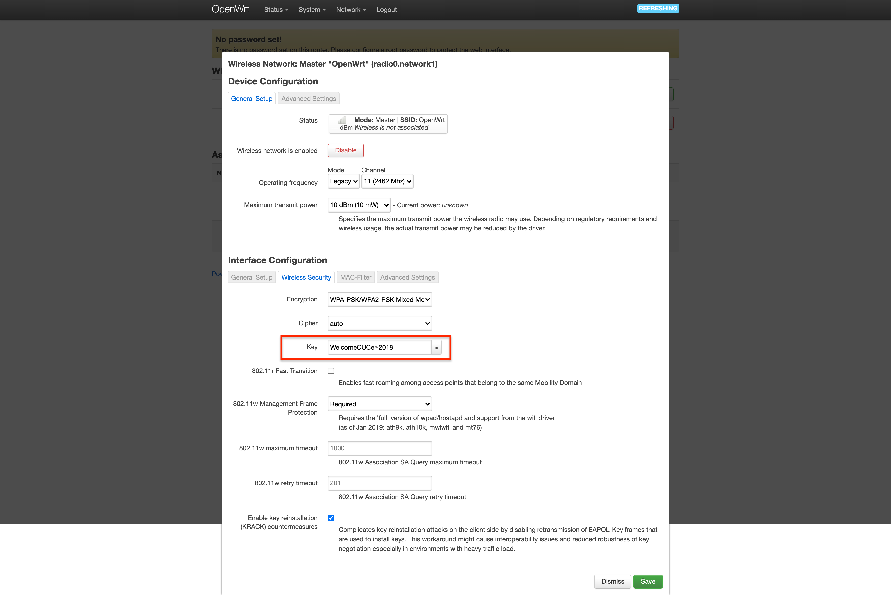

---

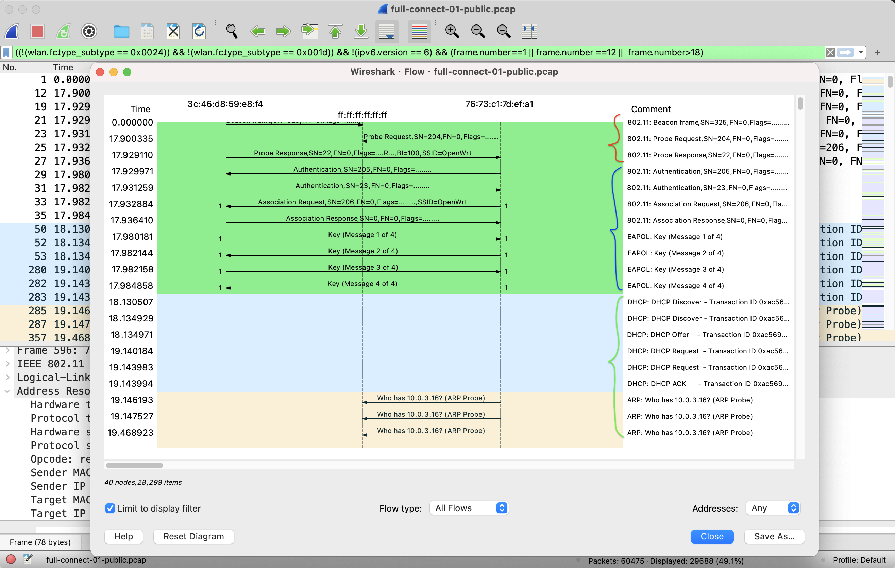

---

```
(!(wlan.fc.type_subtype==0x24) && !(wlan.fc.type_subtype==0x1d)) && !(ipv6.version==6) && (frame.number==1 || frame.number==12||frame.number>18)
```

---

## 一个典型的无线网络完整生命周期

* 加入无线网络前
* 加入无线网络
* 加入无线网络后
* 上行有线接入网络通信

# 加入无线网络前 [WEAK-0-0]

---

> 悄无声息的「监听」模式

* 无加密的无线网络通信就是在“裸奔”
* 有加密的无线网络通信数据逃不过被获取原始通信数据的命运

---

> 动手准备好自己的无线「监听」环境

# 加入无线网络前 [WEAK-0-1]

---

> SSID 信息泄露

---

## 回顾：SSID包含在哪些类型的802.11帧？

* Beacon Frame
* Probe Request
* Probe Response
* Association Request
* Re-Association Request （样例数据文件中不包含）

---

## Tshark 小技巧示范 {id="tshark-tricks-1"}

```bash
echo "SA\t\t\tEnc\tType\tESSID"
tshark -r full-connect-public.pcap -Y "wlan.fc.type_subtype==0x08 || wlan.fc.type_subtype==0x04 || wlan.fc.type_subtype==0x05 || wlan.fc.type_subtype==0" -T fields -e frame.number -e wlan.sa -e wlan.fixed.capabilities.privacy -e wlan.fc.type_subtype -e wlan.ssid | sort -u
# 3c:46:d8:59:e8:f4	1	5	OpenWrt
# 3c:46:d8:59:e8:f4	1	8	OpenWrt
# 76:73:c1:7d:ef:a1		4	OpenWrt
# 76:73:c1:7d:ef:a1	1	0	OpenWrt

# 包含中文的 ESSID 怎么办？
echo "SA.Addr\t\t\tEnc\tFC_TS\tESSID"
tshark -r utf8-ssid-full-beacons-public.pcap -Y "wlan.fc.type_subtype==0x08 || wlan.fc.type_subtype==0x04 || wlan.fc.type_subtype==0x05 || wlan.fc.type_subtype==0" -T fields -e wlan.sa -e wlan.fixed.capabilities.privacy -e wlan.fc.type_subtype -e wlan.ssid | sort -u
```

---

## Wireshark 中查看中文 ESSID {id="essid-in-wireshark"}


---

```bash
echo -e "\xe8\xae\xa9\xe6\x88\x91\xe5\xba\xb7\xe5\xba\xb7\xe4\xbd\xa0"
# 让我康康你
```

---

## 交给 Scapy 来自动化完成这个任务 {id="scapy-decode-essid"}

```python
#!/usr/bin/env python

import os
import sys
from scapy.all import Dot11Elt, rdpcap


pcap = sys.argv[1]

if not os.path.isfile(pcap):
    print('input file does not exist')
    exit(1)

pkts = rdpcap(pcap)

i = 0
output = {}

print("{:5} {:18} {:18} {:18}".format("No.", "SA", "Type", "ESSID"))
for pkt in pkts:
    i += 1
    if not pkt.haslayer(Dot11Elt) or pkt.info.decode('utf8').strip('\x00') == '':
        continue
    if pkt.subtype == 0:  # Association Req
        output["{:18} {:18} {:18}".format(pkt.addr2, "Assoc Req", pkt.info.decode('utf8'))] = "{:5} {:18} {:18} {:18}".format(i, pkt.addr2, "Assoc Req", pkt.info.decode('utf8'))
    if pkt.subtype == 4:  # Probe Req
        output["{:18} {:18} {:18}".format(pkt.addr2, "Probe Req", pkt.info.decode('utf8'))] = "{:5} {:18} {:18} {:18}".format(i, pkt.addr2, "Probe Req", pkt.info.decode('utf8'))
    if pkt.subtype == 5:  # Probe Resp
        output["{:18} {:18} {:18}".format(pkt.addr2, "Probe Resp", pkt.info.decode('utf8'))] = "{:5} {:18} {:18} {:18}".format(i, pkt.addr2, "Probe Rep", pkt.info.decode('utf8'))
    if pkt.subtype == 8:  # Beacon Frame
        output["{:18} {:18} {:18}".format(pkt.addr2, "Beacon", pkt.info.decode('utf8'))] = "{:5} {:18} {:18} {:18}".format(i, pkt.addr2, "Beacon", pkt.info.decode('utf8'))

for key in output.keys():
    print(output[key])
```

---

## 隐藏 ESSID 发现实验 {id="hidden-essid-1"}


---

## 隐藏 ESSID 发现实验 {id="hidden-essid-2"}

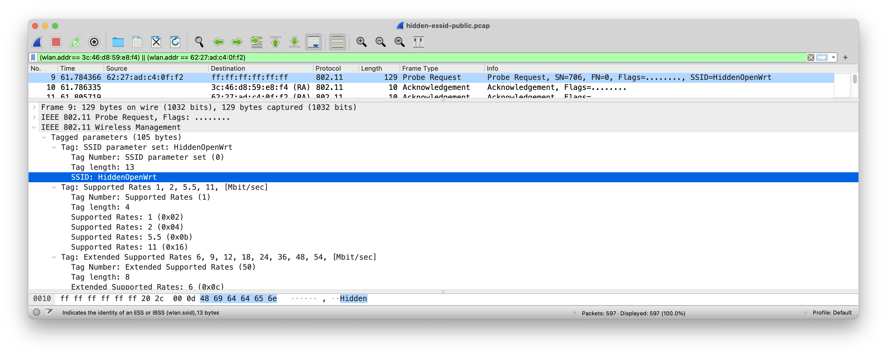

---

## 隐藏 ESSID 发现实验 {id="hidden-essid-3"}


# 加入无线网络前 [WEAK-0-2] 

---

> STA Mac Address 信息泄露

---

## Wi-Fi 探针有关的新闻 {id="wifi-collector-news"}

[](https://finance.sina.cn/chanjing/gsxw/2019-08-29/detail-ihytcern4346376.d.html)

---

## Probe Request 泄露你的行踪 {id="how-probe-req-leakage-happens"}


---

## 协议标准化组织在行动

[IEEE group recommends random MAC addresses for Wi-Fi security - 2015.7](https://www.csoonline.com/article/2945044/ieee-groups-recommends-random-mac-addresses-for-wi-fi-security.html)

> We have tried it on 802.11n, on 802.11g and 802.11ac," he said. "This is something that can be done by a firmware update, if manufacturers decide to do so.

---

## 设备厂商在行动 - Apple {id="apple-against-weak2"}

* [iOS 8+ 设备在扫描 Wi-Fi 时系统会使用的 MAC 地址来防止设备被跟踪，只有在连接成功后才会使用物理网卡地址 - 2014](https://support.apple.com/zh-cn/guide/security/secb9cb3140c/web)
* [iOS 14+ / iPadOS 14+ / watchOS 7+ 会在每个无线局域网中使用不同的 MAC 地址（私有地址） - 2020](https://support.apple.com/zh-cn/HT211227)

---

### macOS Big Sur 11.1 不支持 MAC 地址随机化功能

[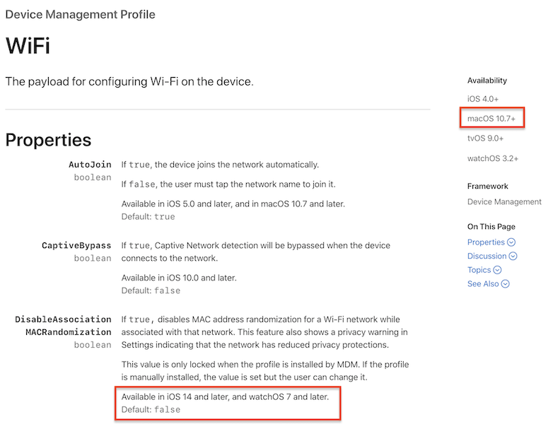](https://developer.apple.com/documentation/devicemanagement/wifi)

---

### macOS 用户自己手动修改网卡 MAC 地址

```bash
# 使用「随机」MAC 地址
sudo ifconfig en0 ether $(openssl rand -hex 6 | sed 's/\(..\)/\1:/g; s/.$//')

# 使用「指定」MAC 地址 aa:bb:cc:dd:ee:ff
sudo ifconfig en0 ether aa:bb:cc:dd:ee:ff
```

---

## 设备厂商在行动 - Microsoft {id="microsoft-against-weak2-1"}

[](https://huitema.wordpress.com/2015/12/31/mac-address-randomization-in-windows-10/)

---

## 设备厂商在行动 - Microsoft {id="microsoft-against-weak2-2"}

[](https://support.microsoft.com/zh-cn/windows/%E5%A6%82%E4%BD%95%E4%BD%BF%E7%94%A8%E9%9A%8F%E6%9C%BA%E7%A1%AC%E4%BB%B6%E5%9C%B0%E5%9D%80-ac58de34-35fc-31ff-c650-823fc48eb1bc)

---

## Android 社区在行动 {id="android-against-weak2"}

* [从 Android 8.0 开始，Android 设备在未连接到网络的情况下探测新网络时，会使用随机分配的 MAC 地址 - 2017](https://source.android.com/devices/tech/connect/wifi-mac-randomization#:~:text=In%20Android%2010%2C%20MAC%20randomization,and%20Wi%2DFi%20RTT%20operations.)
    * 从 Android 6 开始，设备扫描无线网络时使用的是随机化的 MAC 地址 - 2015 
    * 在 Android 9 中，用户可以启用一个开发者选项（默认处于停用状态），使设备在连接到 WLAN 网络时使用随机分配的 MAC 地址 - 2018
    * 在 Android 10 中，默认为客户端模式、SoftAp 和 WLAN 直连启用随机分配 MAC 地址功能 - 2019

---

## Linux 社区在行动 {id="linux-against-weak2"}

[2015-03-15 wpa_supplicant v2.4](https://w1.fi/cgit/hostap/plain/wpa_supplicant/ChangeLog)

> add support for MAC address randomization in scans with nl80211

---

⚠️  不仅是 Probe Request 泄露你的行踪

---

## Beacon Frame 暴露你（家）的位置 {id="how-beacon-leakage-happens-1"}

[](https://www.wifimap.io/633-beijing-free-wifi/map)

---

## Beacon Frame 暴露你（家）的位置 {id="how-beacon-leakage-happens-2"}

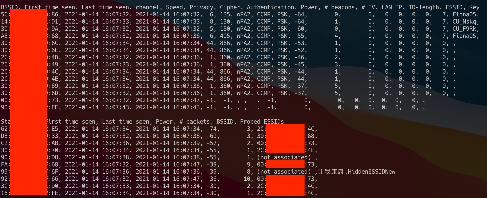

---

## Beacon Frame 暴露你（家）的位置 {id="how-beacon-leakage-happens-3"}

> kismet wifi wardriving

# 加入无线网络前 [WEAK-0-3]

---

> SSID 滥用与 Evil SSID

---

## SSID 字段定义 {id="evil-ssid-1"}

| 唯一标识 | 长度  | ESSID    |
| :-       | :-    | :-       |
| 1byte    | 1byte | 0~32byte |

* 唯一标识：广播的 `SSID` ，此字段设置为0
* 长度：`SSID` 字段的长度
* `SSID`：人类可读、可识别的无线网络名称
    * `IEEE 802.11-2012` 允许字符集范围未定义（未限制）

---

## Evil SSID {id="evil-ssid-2"}

* 格式化字符串注入
* 广告：传播垃圾信息
* XSS
* CSRF

[ref: Deral Heiland, Practical Exploitation Using A Malicious Service Set Identifier (SSID) , Blackhat EU 2013](https://media.blackhat.com/eu-13/briefings/Heiland/bh-eu-13-practical-exploitation-heiland-slides.pdf)

---

### 广告：传播垃圾信息


---

### XSS 成功示例 {id="xss-ok-case"}


---

### 使用 airebase-ng 创建一个广播 XSS 攻击向量的假 AP {id="airebase-ng-xss-1"}

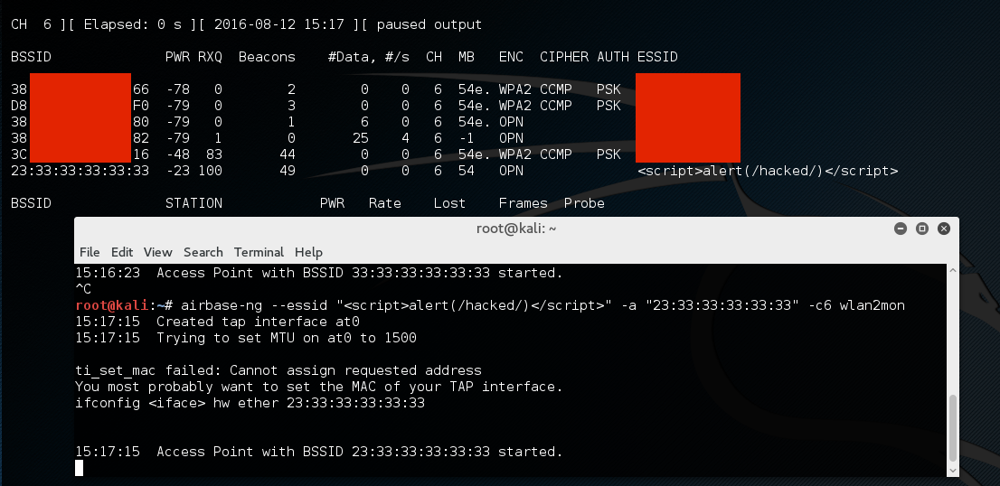

---

### 使用 airebase-ng 创建一个广播 XSS 攻击向量的假 AP {id="airebase-ng-xss-2"}

```bash
sudo airbase-ng --essid "<script>alert(/hacked/)</script>" -a "23:33:33:33:33:33" -c6 wlan0
```


---

### XSS 失败示例 {id="xss-failed-case"}


# 加入无线网络 [WEAK-1-0]

---

## Evil Twin

* [公开资料最早见于 2001 年的技术白皮书：Wireless LAN Security](http://www.packetnexus.com/docs/wireless_LAN_security.pdf)

> **Access Point Clone (`Evil Twin`) Traffic Interception** – An attacker fools legitimate wireless clients into connecting to the attacker’s own network by placing an unauthorized access point with a **stronger signal in close proximity** to wireless clients. Users attempt to log into the substitute servers and unknowingly give away passwords and similar sensitive data.

---

## Evil Twin 常见分类 {id="evil-twin-variants"}

* [KARMA Attack - 2004~2006](http://theta44.org/karma/) | [Simple Karma Attack (Tool)](https://github.com/Leviathan36/SKA)
* [MANA Attack - 2014](https://github.com/sensepost/hostapd-mana/wiki/KARMA---MANA-Attack-Theory)
* [Lure10 Attack - 2017](https://census-labs.com/news/2017/05/11/lure10-exploiting-windows-automatic-association-algorithm/)
    * 影响 [Windows 10 version 1703 以前版本](https://support.microsoft.com/zh-cn/windows/在-windows-10-中连接到开放-wlan-热点-bcec4e8b-00e7-4930-d3ff-5349a3e70037)
* [Known Beacon Attack - 2018](https://census-labs.com/news/2018/02/01/known-beacons-attack-34c3/)

---

## KARMA Attack {id="karma-attack-1"}

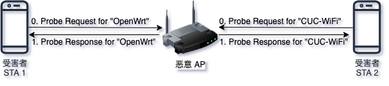

---

## KARMA Attack {id="karma-attack-2"}

* 攻击目标是「无线客户端」
* 攻击条件不依赖于「被克隆/伪装 AP 在附近」
    * 「无线客户端」会在后台静默广播检测附近是否存在历史加入过的无线网络 SSID

---

## 已有的针对 KARMA Attack 防御措施 {id="defense-against-karma"}

* 减少主动后台静默广播 Probe Request 或干脆只依赖于被动监听 Beacon Frame
* 客户端保存「历史加入过的无线网络」（`Preferred Network List, PNL`）时，同时保存 {ESSID, BSSID} ， **自动连接** 历史网络时同时校验 ESSID 和 BSSID
    * 攻击者除非能准确伪造出 BSSID ，否则无法强制客户端连入陷阱网络
* 移动客户端在保存 `PNL` 时，甚至可以同时保存 {ESSID, BSSID, Location} 。超出历史无线网络所在定位范围过大时，拒绝 **自动加入** 目标无线网络
* 不需要使用无线网络时，关闭无线网卡硬件开关

---

## MANA Attack

* 现代无线设备在第一次探测 `Probe Request` 没有得到响应之后，就会认为目标无线网络当前不在附近，后续的 `Probe Response` 会在一段时间之内被自动忽略
* `MANA Attack` 会通过网络嗅探自动保存所有「看到」的 `STA` 网络连接请求和通信会话形成一个本地 `PNL` ，后续再收到 `Probe Request` 后会对本地 `PNL` 中存在的 `STA` 发送匹配的 `Probe Response`
* 已有的针对 `KARMA Attack` 的防御措施也能用来防御 `MANA Attack`

---

## Lure10 Attack

* `Windows 10 build 1703 之前版本` 默认启用的 `Wi-Fi Sense` 功能会自动连入系统内置的所谓「高质量热点名单中热点」
* 剩下的攻击原理同 `KARMA Attack` 
* 已有的针对 `KARMA Attack` 的防御措施也能用来防御 `Lure10 Attack`

---

## Known Beacon Attack

* 攻击者主动基于一个「常见热点名单」进行 `Beacon Frame` 广播
* 客户端一旦认定其中 `Beacon Frame` 有 `SSID` 包含在自己的 `PNL` ，则会自动发起连接
* 剩下的攻击原理同 `KARMA Attack` 
* 已有的针对 `KARMA Attack` 的防御措施也能用来防御 `Known Beacon Attack`

---

## 动手实验

* 本节 `Evil Twin` 实验指南详见[课本](https://c4pr1c3.github.io/cuc-mis/chap0x03/exp.html)
* 第一章课后实验搭建的 `OpenWrt` 也可以用于 `Evil Twin` 实验


# 加入无线网络 [WEAK-1-1]

---

> 恢复/破解认证凭据

* WEP
* WPA/WPA2 PSK
* WPA/WPA2 企业级认证

# 加入无线网络 WEP [WEAK-1-1-0]

---

## 短命的 WEP {id="short-life-of-wep"}

* **W**ired **E**quivalent **P**rivacy (1997-2004) ，属于早期 `IEEE 802.11` 协议的组成部分
* `IEEE` 随后在 2004.7.23 的 `IEEE 802.11i-2004` 报告中同时包含了 `TKIP` 和 `CCMP` 
    * 废止了 `WEP` 协议
    * `Wi-Fi 联盟` 接受了 `IEEE` 的上述相关报告并冠以 `WPA2` 这个 **商业名称** 发布

---

## 临时救火队员 TKIP {id="temporary-tkip"}

* 2002.10.31，`Wi-Fi 联盟` 提出 `TKIP` 协议，归类于 `WPA` 标准的一部分
    * `TKIP` - Temporal Key Integrity Protocol，临时密钥完整性协议
    * 用于升级 `WEP` 的 **临时过渡** 解决方案，保留了 `WEP` 的基本架构与过程方式
* `TKIP` 随后由于安全性原因于 2009 年 1 月被 `IEEE` 废弃
* 自 2012 年的 `IEEE 802.11` 标准中，`TKIP` 已不再视为安全，目前已经处于废弃状态

---

## WEP 的已知经典密钥恢复相关漏洞 

* [`FMS` attack on WEP RC4 - 2001](http://www.cs.cornell.edu/People/egs/615/rc4_ksaproc.pdf)
* [KoreK 改进了 `FMS` attack - 2006](https://infoscience.epfl.ch/record/113785)
* [`PTW` Attack - 2007](https://eprint.iacr.org/2007/120.pdf) 
    * 基于 2005 年发布的 `Klein's attack on RC4`

# 加入无线网络 WPA/WPA2 PSK [WEAK-1-1-1]

---

## 回顾 WPA/WPA2 PSK 四次握手认证过程 {id="review-of-wpa-psk-flow-1"}


---

## 回顾 WPA/WPA2 PSK 四次握手认证参数定位和计算方法 {id="review-of-wpa-psk-flow-2"}

```
PTK = PRF(PMK||A-nonce||S-nonce|| AP Mac || STA Mac)
PMK = PBKDF(Passphrase, SSID, ssidLength, 4096, 256)
```

* 上述公式里的 `PRF` 通常使用 `Hash` 函数来实现
    * PRF = Pseudo-Random Function
* `A-nonce` 在 4 次握手消息中的第 1 个 EAP 包；
* `S-nonce` 在 4 次握手消息中的第 2 个 EAP 包；
* 剩下的变量在 `AP` 的 `beacon frame` 广播包、`STA` 和 `AP` 之间的 `probe request`、`probe response`、`association request` 和 `association response` 中都可以提取到；

---

> 如果我们可以恢复/破解出上述公式中的 Passphrase 就可以加入目标网线网络

---

> ⚠️ 我们在嗅探获得的数据包中并不能得到 `PTK`

---

> 实际上我们能够提取到的是 `PTK` 的组成部分之一：校验和字段 `MIC` 值

---

## PMK 与 MIC 的关系 {id="pmk-and-mic"}


---

### TKIP 声明 {id="tkip-in-beacon"}


---

### TKIP EAPOL 中的 MIC {id="tkip-in-eapol"}


---

### CCMP 声明 {id="ccmp-in-beacon-1"}


---

### CCMP EAPOL 中的 MIC {id="ccmp-in-eapol-1"}


---

### CCMP 声明 {id="ccmp-in-beacon-2"}


---

### CCMP with SHA256 {id="ccmp-in-wpa3"}


---

### CCMP EAPOL 中的 MIC {id="ccmp-in-eapol-2"}


---

### 使用 OpenWrt 自行组合以下安全策略 {id="openwrt-security-config-1"}

* WPA/WPA2 Mixed
* WPA/WPA2 TKIP
* WPA/WPA2 CCMP
* WPA CCMP
* WPA TKIP
* WPA2 TKIP
* WPA2 CCMP

---

### 使用 OpenWrt 自行组合以下安全策略 {id="openwrt-security-config-2"}


---

### 在 Wireshark 中筛选不同安全策略组合

```bash
# CCMP
wlan.rsn.pcs.type==4 && wlan.rsn.pcs.count==1

# TKIP
wlan.rsn.pcs.type==2 && wlan.rsn.pcs.count==1

# CCMP && TKIP mixed
wlan.rsn.pcs.type==2 && wlan.rsn.pcs.type==4

# ex: exp/chap0x03/wpa-wpa2-auth-public.pcap
# CCMP 条件下协商使用 AES Cipher, HMAC-SHA1 MIC (2) 
# 只看 AP 的 Beacon Frame 中声明的安全信息
wlan_rsna_eapol.keydes.key_info.keydes_version == 2 || (wlan.rsn.pcs.type==4 && wlan.fc.type_subtype==8)

# ex: exp/chap0x03/full-connect-public.pcap
# CCMP 条件下协商使用 AES Cipher, AES-128-CMAC MIC (3)
# 只看 AP 的 Beacon Frame 中声明的安全信息
wlan_rsna_eapol.keydes.key_info.keydes_version == 3 || (wlan.rsn.pcs.type==4 && wlan.fc.type_subtype==8)

# ex: exp/chap0x03/wpa2-tkip-public.pcap
# TKIP 条件下协商使用 RC4 Cipher, HMAC-MD5 MIC (1)
# 只看 AP 的 Beacon Frame 中声明的安全信息
wlan_rsna_eapol.keydes.key_info.keydes_version == 1 || (wlan.rsn.pcs.type==2 && wlan.fc.type_subtype==8)
```

---

### WPA/WPA2 PSK 秘钥恢复的关键 {id="key-to-key-recovery-in-wpa-wpa2-1"}

* 无论 `TKIP` 还是 `CCMP` 加密模式，均是「数据机密性」保护算法，与身份认证无关
* WPA 和 WPA2 的 PSK 认证机制均是 `AP` **单向** 通过 `挑战-响应` 模式验证客户端身份，且挑战算法均使用了「消息签名算法」来生成 **随机数挑战值**
    * HMAC 或 [AES-CMAC](https://tools.ietf.org/html/rfc4493) 的区别而已

---

### WPA/WPA2 PSK 秘钥恢复的关键 {id="key-to-key-recovery-in-wpa-wpa2-2"}

* 上述身份验证算法在设计时没有考虑 **防重放** 攻击
* 攻击者只要通过网络嗅探，拿到了以下关键参数
    * `A-nonce` 在 4 次握手消息中的第 1 个 EAP 包；
    * `S-nonce` 在 4 次握手消息中的第 2 个 EAP 包；
    * `SSID`, `AP MAC` 和 `STA MAC`
* 遍历寻找 `TargetPassphrase` 代入 `PMK` 公式
    * `TargetPMK = PBKDF(TargetPassphrase, SSID, ssidLength, 4096, 256)`

---

### WPA/WPA2 PSK 秘钥恢复的关键 {id="key-to-key-recovery-in-wpa-wpa2-3"}

* 根据 `EAPOL` 包中的签名算法信息（例如 `AES-128-CMAC` 或 `HMAC-SHA1` 或 `HMAC-MD5`）即可计算出对应的 `TargetPTK` 
* 再根据 `EAPOL` 中的 `MIC` 算法信息计算出 `TargetMIC` 与 `EAPOL` 握手消息中的第 2 个消息中包含的 `MIC` 进行比较
* 如果 `TargetMIC == MIC` ，则说明找到了 `Passphrase = TargetPassphrase`。否则，继续遍历尝试下一个 `TargetPassphrase` ，直到找到或穷举完口令字典

---

> 等等，目标客户端已经连接上目标 AP 了怎么抓取到认证 4 次握手中的前 2 个数据包？

---

> 请看稍候即将登场的 Deauthentication Attack

---

> 目标 AP 不在附近也能恢复出目标 AP 的入网认证口令？

---

### 主动攻击离线客户端

* 提前开启无线数据嗅探
* 使用 `Evil Twin` 去攻击附近曾经连接过 `目标 AP` 的无线客户端
* 目标：获取 4 次握手认证过程的前 2 个数据包

---

## 使用工具完成上述秘钥恢复算法

```bash
aircrack-ng -w /usr/share/wordlists/rockyou.txt -e OpenWrt exp/chap0x03/full-connect-public.pcap
```

---

### PMKID Hash Dictionary Attack

* 2018 年由 [Hashcat](https://hashcat.net/hashcat/) 的作者 `Steube` 公布了一种[基于 PMKID 的针对 WPA/WPA2 PSK 认证算法的新型字典攻击方法](https://hashcat.net/forum/thread-7717.html)
* 攻击者需要能直接和目标 AP 通信
* 目标 AP 需要开启 **漫游** 功能

---

### OpenWrt 中开启 **漫游** 功能 {id="roaming-in-openwrt"}


---

### PMKID 消息示例


---

### PMKID 计算方法 {id="how-pmkid-is-generated"}

```
PMKID = HMAC-SHA1-128(PMK, "PMK Name" | MAC_AP | MAC_STA)
```

* 上述公式中 `PMK Name` 是固定静态字符串，`PMKID`，`MAC_AP` 和 `MAC_STA` 均可以通过抓包获得
* 剩下的工作原理就和前述 `MIC` 字典爆破过程原理相同

---

### PMKID 攻击的工具实现方法 {id="pmkid-tools"}

[Hashcat 作者给出的攻击原理详解和工具使用说明](https://hashcat.net/forum/thread-7717.html)

---

### PMKID 相比较于 MIC 爆破方法 {id="pmkid-vs-mic-crack"}

* 更隐蔽
    * 无需获取 EAPOL 4 次握手认证包
        * 无需依赖目标 AP 的任何在线或离线客户端
        * 无需等待客户端连接加入目标 AP 的认证握手过程
        * 无需对客户端实施 `Deauthentication Attack` ，客户端意外掉线会引起目标用户警觉
* 结果更可靠
    * 不用担心警觉用户故意输错连接口令导致的 EAPOL 中的 MIC 无法匹配出正确的联网口令

---

## 离线字典方式爆破口令的其他改进措施

* 基本思想1：空间换时间，针对常见 SSID 预先计算好 PMK
    * genpmk - WPA-PSK precomputation attack 
    * [pyrit](https://github.com/JPaulMora/Pyrit) 
* 基本思想2：使用 GPU 代替 CPU 计算字典
    * [pyrit](https://github.com/JPaulMora/Pyrit) - A GPGPU-driven WPA/WPA2-PSK key cracker
    * [hashcat](https://hashcat.net/hashcat/) - World's fastest password cracker
* 基本思想3：并行/分布式计算
    * Google: distributed wpa crack

---

## 防御 WPA/WPA2 PSK 认证口令恢复攻击

* 使用健壮的认证口令
    * 口令长度设置 **与时俱进** ，当前建议不少于 16 位
    * 大小写字母、数字、特殊符号随机组合

# 加入无线网络 WPA/WPA2 企业级认证 [WEAK-1-1-2]

---

## 回顾 WPA/WPA2 企业级认证 {id="wpa-enterprise-1"}

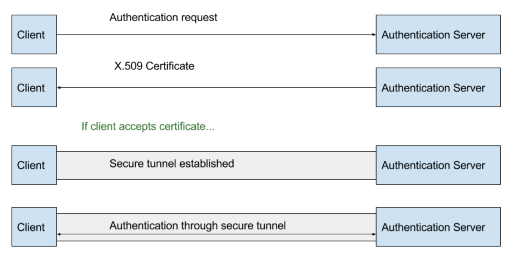

---

> 逻辑上来说，EAP认证过程发生在请求者（supplicant）和认证服务器（authentication server）之间

---

## 回顾 WPA/WPA2 企业级认证 {id="wpa-enterprise-2"}


> 物理上来说，AP 扮演了认证过程的中间人

---

## 回顾 WPA/WPA2 企业级认证 {id="wpa-enterprise-3"}


---

* 在安全隧道建立之前，`AP` 是一个开放访问的接入点
* 开放无线网络易遭受 `Evil Twin` 攻击，因为（客户端）没有办法验证 `AP` 的身份
    * `Evil Twin` 攻击针对 `WPA/WPA2` 企业级认证是否能成功主要取决于「无线网络用户」的安全意识

---

## 你会重视连接无线网络时的证书警告吗？


---

## 一旦被 `Evil Twin` 攻击得手 {id="wpa-enterprise-after-evil-twin-1"}


---

### 虽然在无线信道上认证数据是安全的

* SSL/TLS 加密隧道保护了传输的 EAPOL 相关报文
    * WPA/WPA2 PSK 认证过程使用的 EAPOL 是明文传输、易被捕获

---

## 一旦被 `Evil Twin` 攻击得手 {id="wpa-enterprise-after-evil-twin-2"}


`假 AP` 搭建的 SSL/TLS 加密隧道，当然可以直接“看到”基于明文口令生成的 `挑战-响应应答消息`（**单向散列运算值**），如上图所示。

---

## 一旦被 `Evil Twin` 攻击得手 {id="wpa-enterprise-after-evil-twin-3"}


`asleep` 直接 **跑字典** 爆破出口令。

---

## 加固 WPA/WPA2 企业级认证 {id="protect-wpa-wpa2-enterprise"}

* 健壮口令设置
* 禁用不安全的 `EAP` 实现方法，例如：EAP-MD5, EAP-OTP, [EAP-GTC](https://www.defcon.org/images/defcon-21/dc-21-presentations/djwishbone-PuNk1nPo0p/DEFCON-21-djwishbone-PuNk1nPo0p-BYO-Disaster-Updated.pdf) , LEAP
* 启用并 **正确配置** 安全的 `EAP` 实现方法，例如：PEAP, TTLS, EAP/TLS
* 在无线客户端上预置自签发的 `EAP` 认证证书信任链或购买权威CA签发的用于身份认证的证书
* 无线客户端启用永远验证服务器证书有效性
* 教育无线网络用户不要信任任何被警告的证书
    * 学会手工验证证书的 `CN` 字段值是否与公司通告一致（只是缓解风险，如果攻击者完全克隆企业的证书信息，则本方法无效）

# 加入无线网络 [WEAK-1-2]

---

> 绕过 AP 的 MAC 地址过滤

---

## 绕过原理 {id="random-client-mac-against-mac-filtering-2"}

* 客户端 MAC 地址可以「任意伪造」
* 客户端 MAC 地址在无线通信过程中是明文
* 无线网络流量可以被「悄无声息」地监听

> ⚠️  基于 MAC 地址过滤功能的是「纸老虎」安全机制 

---

## 无线客户端地址随机化功能对 MAC 地址过滤功能的影响 {id="random-client-mac-against-mac-filtering-1"}

* 已有的无线客户端 MAC 地址随机化功能均支持按照指定 BSSID 固定「私有地址」功能
* 已有的无线客户端 MAC 地址随机化功能均可以按需关闭该功能
* 如果无线网络 MAC 地址过滤功能发生在无线客户端完成加入目标无线网络相关的身份认证流程
    - 之后，则 MAC 地址过滤功能可以正常工作
    - 之前，则需要先关闭无线客户端的地址随机化功能，连接成功后再开启客户端地址随机化功能

# 加入无线网络 [WEAK-1-3]

---

> 脆弱的 WPS 认证机制

* 静态 PIN 码预测攻击：部分设备厂商的脆弱性实现
* 离线破解认证凭据：WPS Pixie Dust Attack
* 在线破解认证凭据：WPS Brute Force Attck

---

## 静态 PIN 码预测攻击 {id="vulnerable-pin-generator"}

* 针对 `Headless` 设备静态预分配 `PIN` 码的弱随机产生算法或静态确定性产生算法

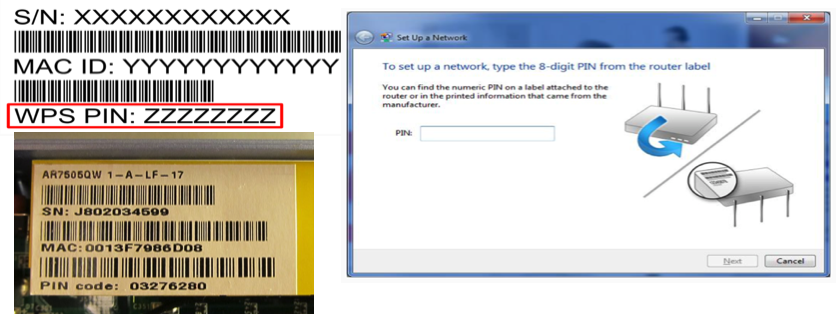

---

### 相关历史安全事件

* [2012年爆出所有MAC地址前6位是C83A35和00B00C的腾达和磊科全系路由器采用了确定性PIN码算法可以通过嗅探无线路由器MAC地址后秒算PIN码](http://wifibeta.com/2012-04/thread-712-1-1.html)
    * 这些WPS PIN是通过mac的后6位 DEC2HEX 取舍而得
* [2014年D-Link部分路由器的WPS PIN算法被逆向并可以从BSSID秒算](http://www.devttys0.com/2014/02/reversing-the-wrt120n-firmware-obfuscation/)
* [2015年贝尔金部分路由器的WPS PIN算法被逆向并可以从路由器MAC地址秒算](http://www.freebuf.com/articles/wireless/63627.html)

---

### 又是协议设计无缺陷，实现偷工减料导致安全漏洞的实例

[《Wi-Fi Simple Configuration Technical Specification》](https://c4pr1c3.gitee.io/cuc-mis/chap0x03/attach/chap0x02/media/Wi-Fi_Simple_Configuration_Technical_Specification_v2.0.5.pdf) 的 `4.3.2 Guidelines and Requirements for PIN values` 

> The recommended length for a manually entered device password is an 8-digit numeric PIN.  This length does not provide a large amount of entropy for strong mutual authentication, but the design of the Registration Protocol protects against dictionary attacks on PINs if a fresh PIN or a rekeying key is used each time the Registration Protocol is run.

---

> ***PIN values should be randomly generated, and they SHALL NOT be derivable from any information that can be obtained by an eavesdropper or active attacker***. The device’s serial number and MAC address, for example, are easily eavesdropped by an attacker on the in-band channel.  Furthermore, if a device includes multiple PIN values, these values SHALL be cryptographically separate from each other.  If, for example, a device includes both a label-based PIN and a Device Password on an integrated NFC Tag, the two Device Passwords SHALL be different and uncorrelated.   

---

## WPS Brute Force Attack

* `WPS` 协议中使用到的 `PIN` 码本身是 **定长的 8 位数字** ，理论爆破需要尝试 $10^8$ 次，即 1亿次；
* [2011 年公布的一种改进版爆破算法](https://sviehb.files.wordpress.com/2011/12/viehboeck_wps.pdf) 最多只需要尝试 11000 次即可恢复出 PSK

---

### WPS 两轮认证过程存在的设计缺陷 {id="wps-two-fold-auth-weakness"}

> 以下内容是为了便于理解，简化说明

* WPS 在线认证过程也会用到 PSK 校验，但会先将 PSK 一分为二：PSK-1 和 PSK-2 
* 第一轮验证 PIN 只用到了前 4 位，在线爆破尝试最多 $10^4$ 次后成功得到 PSK-1
* 第二轮验证 PIN 只用到了后 4 位，且最后 1 位是校验和位，实际只验证后 3 位，在线爆破尝试最多 $10^3$ 次后成功得到 PKS-2。
* PSK = PKS1 || PSK2

---

### 使用工具 [reaver](https://github.com/t6x/reaver-wps-fork-t6x)


---

### 防御 WPS 在线认证暴力破解 {id="defend-against-wps-brute-force"}

* 设置「认证封禁策略」，将短时间内多次 WPS 认证失败的 `STA MAC` 加入黑名单封禁一段时间 
    * 启用「动态罚时」策略：每次封禁时长动态增长
* `AP` 配置禁用 `WPS` 功能

---

## [WPS Pixie Dust Attack](https://forums.kali.org/showthread.php?24286-WPS-Pixie-Dust-Attack-\(Offline-WPS-Attack\))

* WPS 认证过程中的关键变量 `E-Hash1`、`E-Hash2`、`PKE`、`PKR` 都是可以直接通过抓包获得的，剩下的 `PSK1` 和 `PSK2` 分别对应 `PIN` 码前后两半，可被枚举
* `E-S1` 和 `E-S2` 是整个 **离线破解** 的关键，⼀旦这 2 个参数被计算出来，则对照公式可以离线遍历 `PSK-1` 和 `PSK-2` 的可能性验证计算出的 `E-Hash1` 是否与抓包得到的 `E-Hash1` 相同
* `E-S1` 和 `E-S2` 在实际设备中的实现算法使用的是 **伪随机数发⽣器**

---

### 伪随机数发生器常见实现缺陷

* 嵌⼊式设备⼤多采用 32 位 CPU，状态空间不⾜，导致产生的随机数取值空间较小
* 伪随机算法可能被逆向
* 伪随机数种⼦状态可能会被预测和恢复

---

### 伪随机数发生器缺陷实例

* Broadcom/eCos，E-S1 + E-S2 使用与 N1 相同的随机数发⽣器
* Realtek，E-S1 = E-S2 = N1 或使用秒为单位的 UNIX 时间戳格式整数作为随机数发⽣器种⼦
* Ralink / MediaTek / Celeno， E-S1 = E-S2 = 0

---

### 使用工具 [pixiewps](https://github.com/wiire-a/pixiewps)

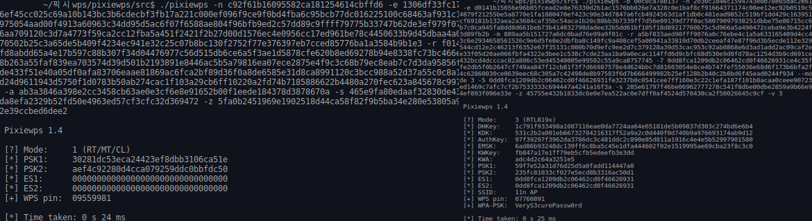

> 依赖于存在伪随机数发生器缺陷的特定路由器

---

### 防御 WPS 离线认证暴力破解 {id="defend-against-wps-pixie"}

* 修补路由器的伪随机数发生器缺陷


# 加入无线网络后 [WEAK-2-0]

---

> 回顾 《网络安全》第 4 章 网络监听 一节提到的所有 **局域网** 攻防手段

* ARP 欺骗
* DNS 投毒
* SSL Stripping

---

## 防御方法 {id="defense-against-arp"}

* 设置无线和有线客户端隔离


# 加入无线网络后 [WEAK-2-1]

---

> Deauthentication Attack

---

## Deauthentication 攻击原理 {id="deauth-attack-internals"}

* 公开资料可查最早描述该攻击方法的文章: [R. Bidou, “Denial of service attacks,” 2000](http://www.iv2-technologies.com/DOSAttacks.pdf)
* 伪造目标客户端 `MAC 地址`、类型为 `Deauthenticaion(subtype=12)` 的 `管理帧` 不断发往目标 `AP`

---

## DeAuthenticaion 攻击可视化 {id="deauth-attack-visualization"}

> Statistics -> I/O Graphs

---


---

## aireplay-ng

```bash
sudo aireplay-ng --deauth 1 -a  3C:46:D8:59:E8:F4 -c 62:27:AD:C4:0F:F2 wlan0 --ignore-negative-one
# 18:36:35  Waiting for beacon frame (BSSID: 3C:46:D8:59:E8:F4) on channel 11
# 18:36:43  Sending 64 directed DeAuth (code 7). STMAC: [62:27:AD:C4:0F:F2] [44|39 ACKs]
# sudo aireplay-ng --deauth 1 -a  3C:46:D8:59:E8:F4 -c 62:27:AD:C4:0F:F2 wlan0 --ignore-negative-one
# 18:37:18  Waiting for beacon frame (BSSID: 3C:46:D8:59:E8:F4) on channel 11
# 18:37:26  Sending 64 directed DeAuth (code 7). STMAC: [62:27:AD:C4:0F:F2] [31|30 ACKs]
```

---

## 防御 deauthentication-attack {id="in-defense-of-deauth-1"}

* 在 AP 上启用 [IEEE 802.1w-2009](https://standards.ieee.org/standard/802_11w-2009.html) 引入的 `Protected Management Frames (PMF)` 机制
    * 对管理帧启用了机密性、完整性、来源真实性和重放保护机制
* `WPA2` 启用了 `PMF` 后（`WPA` 不支持）
    * `MIC` 产生算法从 `HMAC-SHA1` 进化为 `AES-CMAC`
    * `PTK` 产生算法从 `SHA-1` 进化为 `SHA-256`

---

## 防御 deauthentication-attack {id="in-defense-of-deauth-2"}


# 加入无线网络后 [WEAK-2-2]

---

> 解密流量

* WPA/WPA2-PSK 在拿到 PSK 情况下直接解密历史和进行中通信数据
* [Hole196 Vulnerability - 2010](http://securedsolutions.com.my/pdf/WhitePapers/WPA2-Hole196-Vulnerability.pdf)
* [KRACK Attack against WPA/WPA2 - 2017](https://www.krackattacks.com/)

---

## 使用 Wireshark 解密 WPA/WPA2 PSK 加密的流量

* Edit->Preferences->Protocol->IEEE 802.11->Enable decryption->descryption keys选择 `wpa-pwd` ，填入已知共享密钥保存
* 在 `IEEE 802.11` 的首选项设置面板，勾选启用：`Enable decryption` 功能

---


---

### 从 Passphrase 到 PSK {id="from-pwd-to-psk"}

* [Wireshark 官网提供的网页版小工具](https://www.wireshark.org/tools/wpa-psk.html)
* 使用命令行工具 `wpa_passphrase`

```bash
wpa_passphrase <SSID> <Passphrase>
# wpa_passphrase OpenWrt WelcomeCUCer-2018
# network={
#         ssid="OpenWrt"
#         #psk="WelcomeCUCer-2018"
#         psk=04f305d51a8331d0839a48900a47560f80665d4fdb1ca28290bdcbb3908ffb64
# }
```

```python
import hashlib, binascii

def wpa_psk(ssid, password):
    dk = hashlib.pbkdf2_hmac(
        'sha1',
        str.encode(password),
        str.encode(ssid),
        4096,
        256
    )
    return (binascii.hexlify(dk))

print(wpa_psk('OpenWrt', 'WelcomeCUCer-2018')[0:64].decode('utf8'))
```

---

## [Hole196 Vulnerability - 2010](http://securedsolutions.com.my/pdf/WhitePapers/WPA2-Hole196-Vulnerability.pdf)

基于 `加密 GTK 负载` 的 **纯无线** ARP 投毒攻击

---

### 回顾第二章内容：无线网络中的单播、组播和广播加密 {id="enc-in-wpa-wpa2"}

| 密钥类型 | 用途                                     | 来源           |
| :-       | :-                                       | :-             |
| PSK      | 认证                                     | （离线）配置😈 |
| PMK      | 长期使用😈，产生其他加密用途密钥         | EAP 协商       |
| PTK      | 加密单播(unicast)通信                    | 产生自 PMK/PSK |
| GTK      | 加密广播(broadcast)和多播(multicast)通信 | 产生自 PMK/PSK |

---

### 相比较于前述无线局域网中的直接 ARP 投毒 {id="hole196-vs-arp"}


---

## 防御方法 {id="defense-against-hole196"}

* 设置无线和有线客户端隔离

# [KRACK Attack against WPA/WPA2 - 2017](https://www.krackattacks.com/)

---

## 简介

* **K**ey **R**einstallation **A**tta**ck**s, Breaking WPA2 by forcing nonce reuse
    * WPA/WPA2 PSK 协议的 EAPOL 认证过程存在消息重放漏洞，导致相同的密钥和加密用 nonce 被反复使用在不同的会话上
* WPA/WPA2 PSK 认证过程中的 EAPOL 4 次握手第 3 步存在协议设计缺陷
* 无线客户端实现漏洞利用

---

## 协议设计缺陷原理

* 不管是 `AES-CCMP` 还是 `RC4-TKIP` ，实际的无线通信数据加密过程使用了 `流密码加密` 工作模式
* 原本的 `密钥流` 虽然也会复用加密密钥和 IV，但存在一个不断增长的 `密钥重用计数器` 。只要计数器正常计数工作，`密钥流` 就不会出现重用现象

---

### 流密码加密的密钥重用攻击原理 {id="stream-cipher-1"}

* 给定明文 A 和明文 B，定义加密函数为 `E()` 。
* 随机序列生成器定义为 `C(K)` ，其中 `K` 为主密钥。
* 流密码加密过程为以主密钥 `K` 为种子、`C(K)` 为随机序列生成器产生一个“无限长”的 `流密钥`，将待加密明文与 `流密钥` 进行逐字节异或操作完成 `流密码加密`

---

### 流密码加密的密钥重用攻击原理 {id="stream-cipher-2"}

```
E(A) = A xor C
E(B) = B xor C

E(A) xor E(B) = (A xor C) xor (B xor C) = A xor B xor C xor C = A xor B
```

从以上计算公式可以看出：如果 C 在 A 和 B 的加密过程中被重用，则攻击者只需要掌握了：

* A 攻击者自行构造的明文
* E(A) 攻击者通过数据嗅探捕获到的自己发出的密文
* E(B) 攻击者通过数据嗅探捕获到的目标用户发出的密文

即使不知道密钥 `K` ，也可以通过 `B = E(A) xor E(B) xor A` 恢复出目标用户发出的明文

---

## 回到 KRACK 中的协议设计缺陷原理 {id="back-to-krack-design-flaws-1"}

* `WPA/WPA2 PSK` 的 `4 次握手认证` 消息中的第 3 个消息 $EAPOL_3$ 是由 `AP` 发给 `STA` 
* 由于无线网络的物理传输介质不可靠特性，`IEEE 802.11i` 规定如果丢包可以重传
* 攻击者利用上述协议规定 **精心构造** 第 3 个消息的多次重放达到 `KRACK` 攻击的多种攻击效果
    * `WPA` 的 `RC4-TKIP` 和 `WPA2` 的 `AES-CCMP` 均受漏洞影响
    * 不需要恢复和掌握 `PTK` 的前提下，解密通信数据、中间人篡改消息
    * 不需要恢复和掌握 `GTK` 的前提下，解密通信数据、中间人篡改消息

---

## 回到 KRACK 中的协议设计缺陷原理 {id="back-to-krack-design-flaws-2"}

* $EAPOL_3$ 的作用是 `AP` 通知 `STA` ：`PTK` 已生成完毕，可以 `安装` 用于后续单播通信加密。另外，`GTK` 被加密后以密文形式包含在 $EAPOL_3$ 中。此时 `重放计数器` 被设置为 `AP` 发送 $EAPOL_1$ 时设置的 `重放计数器r+1`
* `AP` 只有在接收到 `STA` 发送的 $EAPOL_4$ 才会真正 `安装 PTK` 

---

> IEEE 802.11i 协议最关键的缺陷定义即将登场

---

* `STA` 只要自己把 $EAPOL_4$ “成功” 发出去，就会按照协议规定认为 `EAPOL 4 次握手` 已经完结，接下来的会话过程就会使用前述“握手成功”的 `PTK` 和 `GTK` 
* 但实际上如果 `AP` 并没有 “成功接收” 到 $EAPOL_4$ ，还可以重发一遍 $EAPOL_3$ ，要求 `STA` 重新安装一次 `PTK` 和 `GTK`
* `AP` 判定 `EAPOL 4 次握手` 完结的标准是收到 $EAPOL_4$ 

> 在 KRACK 之前，IEEE 802.11i 的 4 次握手安全性证明是建立在一个重要（假设）前提之上：`PTK` 和 `GTK` 的密钥只会被安装一次。

---

攻击者实施 `KRACK` 攻击的 1 个重要前提是：攻击者能通过中间人攻击劫持目标 `STA` 和目标 `AP` 的通信过程。具体来说的典型实施手段如下：

1. 监听目标 `AP` 和目标 `STA` 之间的通信过程
2. 通过 `Deauthenticaion Attack` 强制目标 `STA` 从目标 `AP` 断开且重新连接目标 `AP` 时要连接到攻击者搭建的 **信号更强** 的[不同信道同名无线网络](https://lirias.kuleuven.be/bitstream/123456789/473761/1/acsac2014.pdf)
3. 攻击者使用 2 个不同信道建立起了目标 `STA` 和目标 `AP` 的跨信道中间人攻击链路

---

* 在具备上述 **中间人攻击链路** 之后，`KRACK` 攻击才能真正开始
* 这也是为什么 `KRACK` 攻击在实践中较难利用成功的一个重要原因
    * 如何搭建起一个对于目标 `STA` 来说比目标 `AP` **信号更强** 的无线网络

---

* 攻击者要阻断 `STA` 给 `AP` 回应的 $EAPOL_4$ ，触发 `AP` 的 $EAPOL_3$ 重传
    * 此时重传的 $EAPOL_3$ 的 `重传计数器` 相比于 $EAPOL_1$ 的 `重传计数器r` 已经是 `r+2` 了
* 攻击者转发上述 `r+2` 的 $EAPOL_3$ 给目标 `STA`

---

* 按照 `IEEE 802.11i` 规定，`STA` 只要收到 $EAPOL_3$ ， **不管三七二十一** ，必须回复 $EAPOL_4$ 。并且， **不管四七二十几** ，`STA` 需要执行 `PTK` **重装** 操作。更进一步的过分要求是：会话密钥加密密钥流生成算法里使用的 `nonce` 需要重置为 1  
    * 此处的 `nonce` 和 `A-nonce` 与 `S-nonce` 没有任何关系
    * 此处的 `nonce` 实际上就是一个当前加密会话的「发包计数器」，初始值为 1
    * 此时的 $EAPOL_4$ 实际上是被 `STA` 用已经协商好的 `PTK` 以及对应的 `nonce` 加密后的密文
* 经过上述一通操作，目标 `STA` 实际是被打了个「流密码加密的密钥重用攻击」组合拳
    * $EAPOL_4$ 明文和密文同时在手了

---

## 上述解密过程的局限性

* 如何搭建起一个对于目标 `STA` 来说比目标 `AP` **信号更强** 的无线网络来实现「中间人攻击」？
* $EAPOL_4$ 长度有限，基于流密码加密的密钥重用攻击使用异或操作这个特点，一对 $EAPOL_4$ 明密文对在手一次能解密的目标密文数据长度有限
    * 作者在漏洞证明演示视频里演示的就是解密电子邮件地址和口令

---

## 受漏洞影响客户端信息

[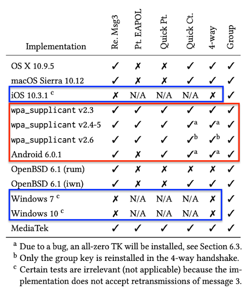](https://papers.mathyvanhoef.com/ccs2017.pdf)

---

## 为什么苹果的 iOS 和微软的 Windows 不受 KRACK 影响？ {id="why-ios-windows-not-affected"}

因为他们的程序员没有按照 `IEEE 802.11i` 规范去开发代码 🤷 

> the implementation does not accept retransmissions of message 3.

---

如果想要了解关于 `KRACK` 的更多利用方式细节，一定要仔细阅读作者发表在 CCS 17 上的论文。

[Vanhoef, M., & Piessens, F. (2017, October). Key reinstallation attacks: Forcing nonce reuse in WPA2. In Proceedings of the 2017 ACM SIGSAC Conference on Computer and Communications Security (pp. 1313-1328).](https://papers.mathyvanhoef.com/ccs2017.pdf)

---

## 受漏洞影响客户端的补丁信息

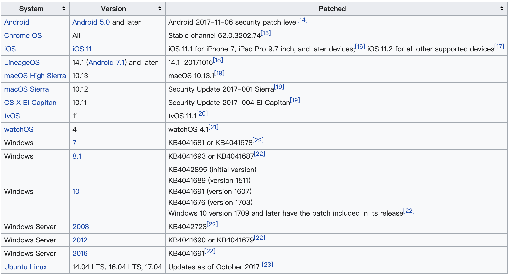

---

## 当前 Kali 上自带的 wpa_supplicant {id="wpa_supplicant-on-kali"}

```bash
# lsb_release -a
# No LSB modules are available.
# Distributor ID: Kali
# Description:    Kali GNU/Linux Rolling
# Release:        2020.4
# Codename:       kali-rolling
# date
# Sun 17 Jan 2021 02:12:47 PM CST
wpa_supplicant -v
# wpa_supplicant v2.9
# Copyright (c) 2003-2019, Jouni Malinen <j@w1.fi> and contributors
```

---

## KRACK 带给我们的启示 {id="krack-inspiration-1"}

[](https://blog.cryptographyengineering.com/2017/10/16/falling-through-the-kracks/)

> Two unit tests, 0 integration tests

---

## KRACK 带给我们的启示 {id="krack-inspiration-2"}

* 上图是 `KRACK` 作者在 `Blackhat Europe` 做报告时用的一张图：单元测试只能保证组件可以独立工作，一旦集成测试就会暴露出「协作」漏洞
    * `KRACK` 就是一个典型的「组件协作漏洞」

---

## 防御 KRACK {id="defense-against-krack"}

* <del>抱紧无线路由器上网（不是🤷 </del>
* 设备和软件升级


# 上行有线接入网络通信 [WEAK-3-1]

---

> Rogue Access Point, Rogue AP

---

## 广义 Rogue AP {id="generalized-rogue-ap"}

* 这是许多基于 `AP` 方式专门攻击无线客户端行为的笼统称谓
    * `Evil Twin`
    * `KRACK` 中使用到的「跨信道中间人攻击」技术

---

> 本节要介绍的是一种「后门」方式实现的 `Rogue AP` 

---

## 狭义 Rogue AP {id="specific-rogue-ap"}

在未经有线网络管理员允许/授权情况下，悄悄接入目标有线网络并开启无线网络功能的 `AP` 。

* 硬件方式：使用便携式无线路由器直接接入有线网络
* 软件方式：员工用自己连入有线网络的个人电脑私开无线热点

---

## 对于企业网络的主要威胁

* 增加了若干新的风险暴露面
    * 非授权的访问可以绕过已有的有线网络安全接入控制，通过不受监管控制的无线网络接入方式访问到企业内网
    * `Rogue AP` 本身如果还具备远程控制能力，则相当于在企业内网直接建立了一个「远程攻击跳板」

---

## 防御狭义 `Rogue AP`

* 防范硬件形式的 `Rogue AP`
    * 部署严格的有线网络端口接入访问控制，例如启用有线交换机所有暴露端口的 `802.1X` 认证，避免任何设备只要连入网线即可访问企业内网
* 防范软件形式的 `Rogue AP`
    * 员工终端电脑配置统一的软件安装和配置管理策略，禁止电脑开启无线热点
    * 部署无线入侵检测设备，第一时间发现并报告工作场所中存在未备案的无线热点

# 上行有线接入网络通信 [WEAK-3-2]

---

> 回顾 《网络安全》第 4 章 网络监听 一节提到的所有局域网攻防手段

> 对于企业级认证来说，可以对 Radius 协议进行『中间人攻击』

---

## 防御加固方法

参见《网络安全》第 4 章局域网安全加固方法和建议。

# 其他似是而非的无线安全机制

---

> 禁用 DHCP，采用静态地址配置

---

* 监听 `ARP` 广播
* `ARP` 广播的发生场景
    * 同一局域网下客户端相互之间首次访问
    * 客户端要访问外网，寻找网关地址

---

> 无加密无线网络中使用的明文 Portal 认证

---

## 明文 Portal 认证无法抵御 {id="portal-risks-in-open-network"}

* 重放和仿冒
    * `http` 会话中的身份认证 `cookie` 提取和重放
    * 已通过认证的无线 `STA` 的 `MAC` 地址被克隆
    * 搭建起钓鱼门户认证页面，套取客户端的认证凭据
* 监听
    * 应用层协议分析与还原

# WPA3 安全性初探 {id="wpa3-vulnerabilities"}

---

## 主要安全性改进 {id="wpa3-enhancements-1"}

* [Wi-Fi Enhanced Open™](https://www.wi-fi.org/beacon/dan-harkins/wi-fi-certified-enhanced-open-transparent-wi-fi-protections-without-complexity)
    * [Opportunistic Wireless Encryption, OWE - RFC 8110](https://www.wi-fi.org/download.php?file=/sites/default/files/private/Opportunistic_Wireless_Encryption_Specification_v1.1.pdf), 免认证的开放无线网络也能自动协商加密密钥并加密整个无线通信会话
* SAE 升级替代了 PSK 模式用于个人及家庭无线网络的访问控制机制
    * `Simultaneous Authentication of Equals` ，一种 **在线计算** 的「零知识证明」算法
    * 每次认证前均通过 `SAE` 过程协商出一个 **随机认证用共享秘钥** ，代替 `PSK` 模式时的「预共享静态秘钥」

---

## 主要安全性改进 {id="wpa3-enhancements-2"}

* 默认强制开启了 `PMF`
* 完美前向安全性
    * Perfect Forward Secrecy (PFS)
    * `SAE` 保证了即使捕获到了无线数据包、拥有预共享的无线网络入网口令，但由于每个无线会话均使用了“不可预测”（$\frac{1}{2^{128}}$ ~ $\frac{1}{2^{256}}$ 几率重复）的随机会话秘钥，使得解密抓包数据在 **可爆破计算意义上** 没有可能

---

## 延伸课外学习

* [Dragonblood](https://wpa3.mathyvanhoef.com/)
    * CERT ID #VU871675: 针对 WPA3-Transtition 模式的降级攻击使得离线字典攻击恢复网络认证口令成为可能
    * CERT ID #VU871675: 针对 `SAE` 握手过程的加密算法降级攻击
    * CVE-2019-9494: `hostapd` 和 `wpa_supplicant` 实现缺陷导致的侧信道信息泄露
    * CERT ID #VU871675: 针对 `SAE` 握手过程的计算资源消耗型拒绝服务攻击

# 小结

---

| 威胁/漏洞类型            | WPA3 是否已经解决 | 备注                                     |
| :-                       | :-                | :-                                       |
| SSID 信息泄露            | ❌                |                                          |
| Evil Twin                | ❌                | 企业级认证模式里启用双向证书认证可解决   |
| SSL Stripping            | ❌                | 应用层风险                               |
| DNS 欺骗                 | ❌                | 应用层风险                               |
| Rogue AP                 | ❌                |                                          |
| ARP 欺骗等               | ❌                |                                          |
| 悄无声息的监听           | ⚠️  部分解决       | `OWE` 保证了不再有明文无线通信网络       |
| STA 地址泄露             | ⚠️  大部分已解决   | 无线设备厂商和操作系统厂商共同努力       |
| SSID 滥用与 Evil SSID    | ⚠️  大部分已解决   | 无线设备厂商和操作系统厂商共同努力       |
| 解密数据                 | ✅                |                                          |
| 离线字典破解握手认证报文 | ✅                |                                          |
| PMKID 离线破解           | ✅                |                                          |
| DeAuth Attack            | ✅                | WPA2 + PMF 也能做到                      |
| KRACK                    | ✅                |                                          |

# 构建安全的无线局域网

---

## 层次化的安全加固策略

* 人
* 应用层
* 网络层
* 链路层
* 物理层

---

### 人的安全意识教育指南

* 避免使用 `Wi-Fi 分享类应用`
* 定期更换共享密钥
* 谨慎使用公共或陌生 `Wi-Fi`
    * 避免使用高安全等级业务：重要账户登录、金融类业务在线操作等
    * 尽可能使用额外的 VPN 措施保护所有联网行为
* 所有具备 `Wi-Fi` 功能的设备在不使用 `Wi-Fi` 功能时关闭无线开关（软开关或硬件开关）
    * 避免 `Evil Twin` 攻击套取到你连过的 `AP` 的 `EAPOL Packet` 用于离线破解 `WPA/WPA2 PSK` 密码
    * 避免设备主动连入开放认证的恶意 `AP`
        * 监听、中间人攻击

---

### 个人用户的应用层安全加固指南

* 无线路由器默认设置的安全加固
    * 修改默认的管理员密码
    * 修改默认的管理员用户名
    * 启用登录管理界面的图形化验证码
    * 更新到最新版固件

---

### 个人用户的网络层安全加固指南

* 启用客人/访客网络
    * 仅提供互联网访问，禁止访问有线局域网
    * 使用独立密码
* 启用 `AP` 隔离功能
    * 禁止无线网络中的客户端相互直接访问，杜绝局域网内的攻击

---

### 个人用户的链路层安全加固指南

* 仅使用 `WPA3-SAE`
    * 从协议兼容性角度，可以配置 `WPA3-SAE/WPA2-PSK only` ，禁用 `WPA` 兼容模式
* 使用强健口令
    * 大小写字母、数字、特殊字符组合，口令长度建议 16 位以上
* 禁用 `WPS` 功能
* 避免使用常见 `SSID` 名
    * 例如：dlink、NetGear等

---

### 个人用户的物理层安全加固指南

* 根据信号覆盖范围需求，合理设置无线路由器的信号发射功率
    * 「穿墙」模式按需开启

---

### 企业用户的网络层安全加固指南

* 子网划分与隔离
* 按业务需求、安全等级设置无线局域网、有线局域网和互联网之间的访问控制机制

---

### 企业用户的链路层安全加固指南

* 启用 `WPA/WPA2/WPA3-企业级` 身份认证
    * 实名制、独立账号接入
    * 有 `IT` 技术能力的企业强烈建议配置 `EAP-TLS`
        * **双向证书验证**
* 部署无线入侵检测与防护系统
    * 检测：通过监听模式配合白名单比对发现 `Rogue AP` 并告警
    * 防护
        * 对 `Rogue AP` 构建的无线网络实施 `DeAuth Attack`
        * 有线网络全部启用 `802.1X` 端口认证，避免 `Rogue AP` 物理接入

---

### 企业用户的物理层安全加固指南

* 缩窄发射天线覆盖范围
* 墙面信号反射涂料
* 使用定向天线

# 附录

---

* [v1s1t0r1sh3r3/airgeddon 全功能综合无线网络安全风险评估工具集](https://github.com/v1s1t0r1sh3r3/airgeddon)
* [wifiphisher/wifiphisher Evil Twin 自动化攻击工具集](https://github.com/wifiphisher/wifiphisher)
* [s0lst1c3/eaphammer WPA2-企业级认证无线网络 Evil Twin 自动化攻击工具集](https://github.com/s0lst1c3/eaphammer)

