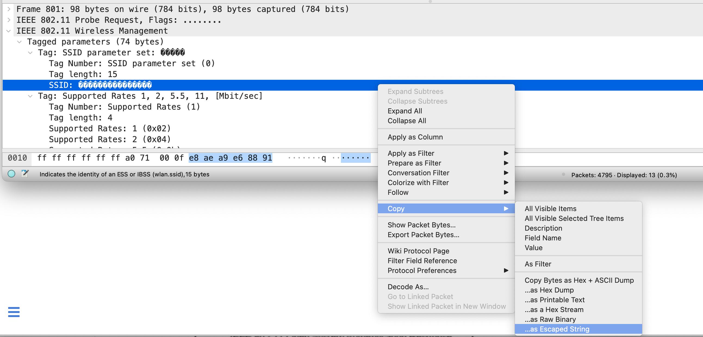
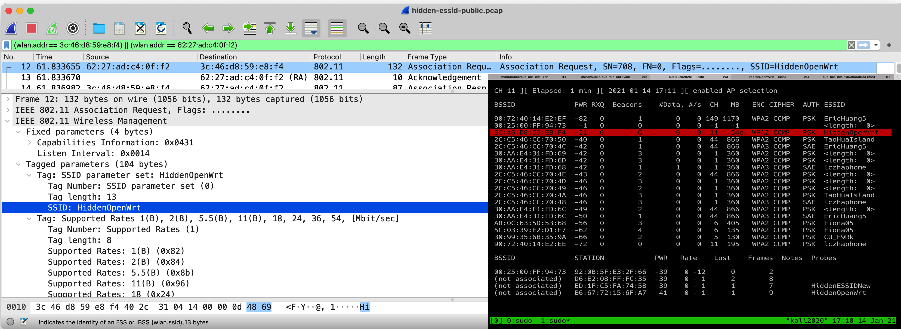
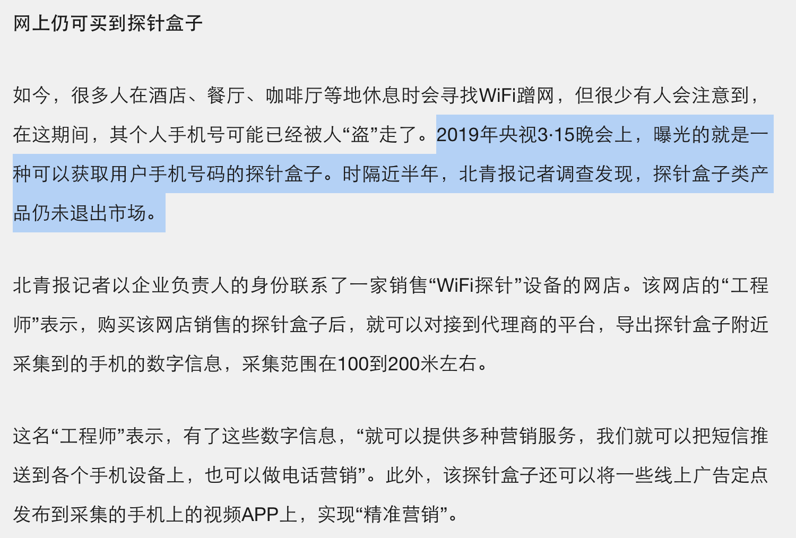
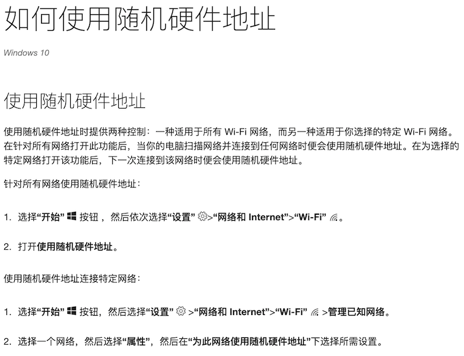
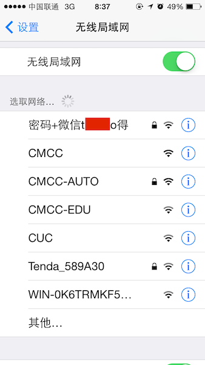
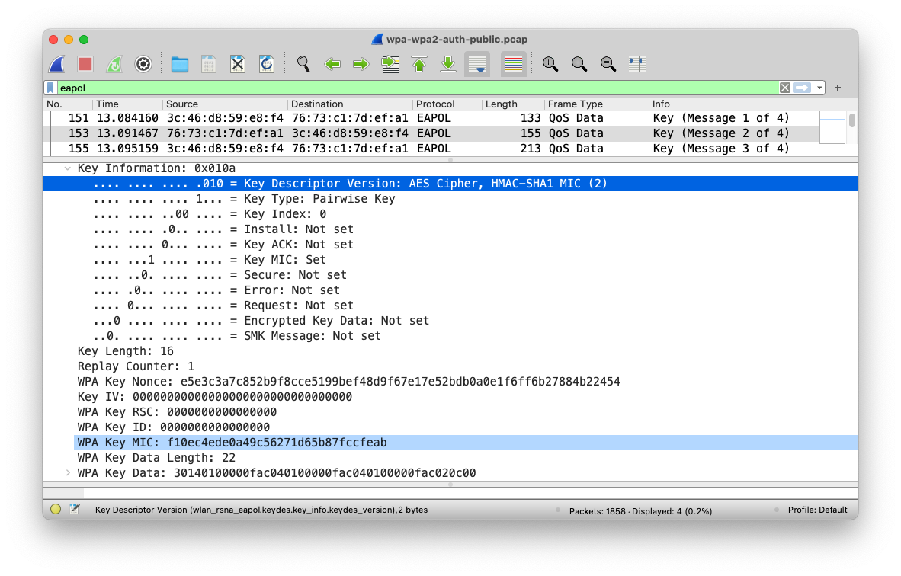
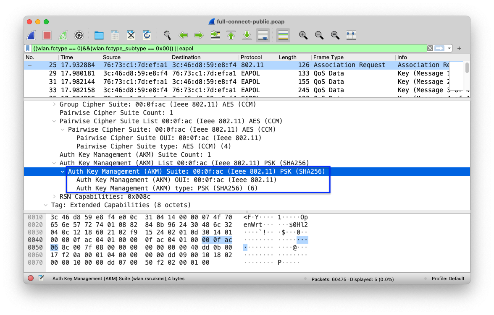
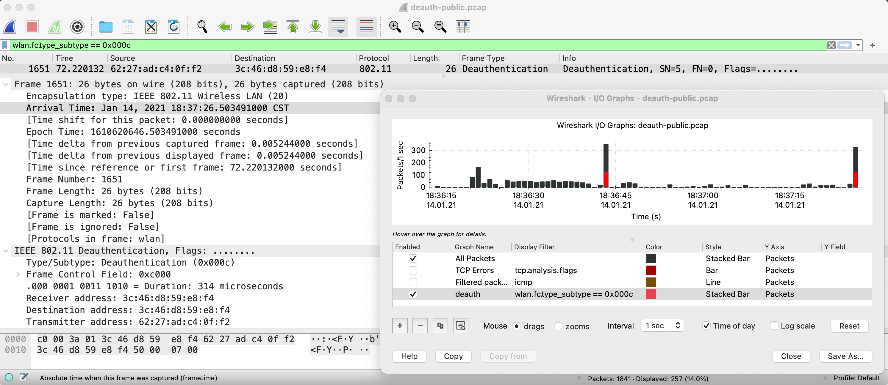
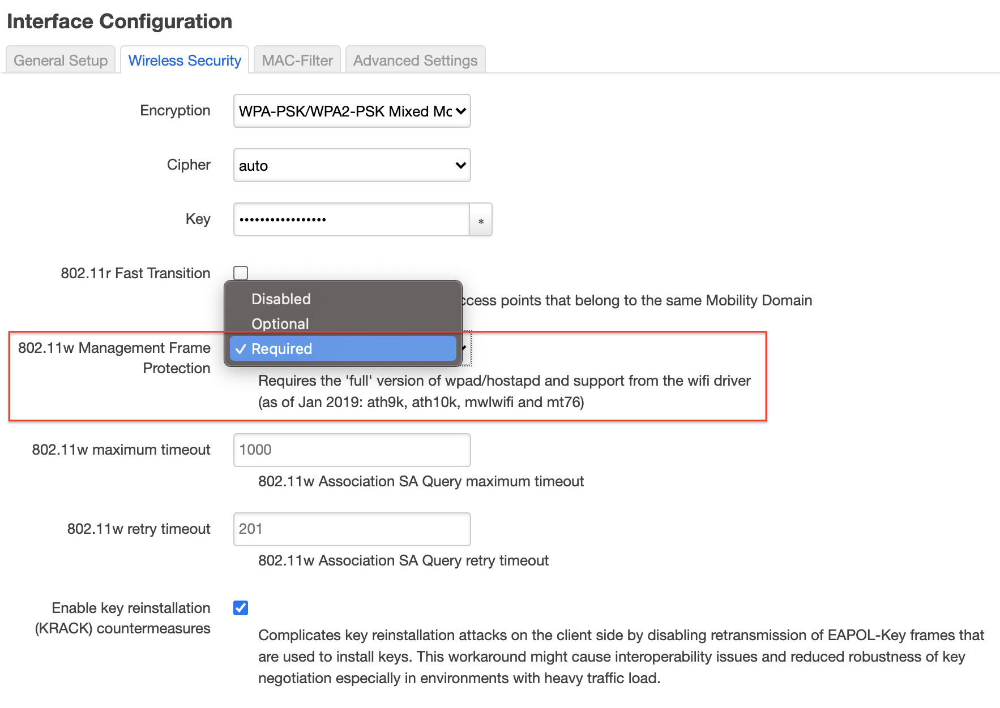

# 第三章 无线接入网入侵与防御

---

## 温故

* 无线网络全生命周期包括哪些阶段
* [Wireshark 的 802.11 PSK 解密功能](https://c4pr1c3.github.io/cuc-mis/chap0x02/exp.html#wireshark%E7%9A%8480211-psk%E8%A7%A3%E5%AF%86%E5%8A%9F%E8%83%BD)

---

## 知新

* SSID 隐藏与发现
* Evil Twin 攻击与防御
* 花式中间人攻击与防御
* WLAN 认证机制攻防
* 基于 Scapy 的无线网络编程实践

# 实战回顾无线网络全生命周期

---

* [本章演示使用到的 pcap 样例数据文件一](exp/chap0x03/full-connect-public.pcap)
* [本章演示使用到的 pcap 样例数据文件二](exp/chap0x03/utf8-ssid-full-beacons-public.pcap)
* [本章演示使用到的 pcap 样例数据文件二](exp/chap0x03/hidden-essid-public.pcap)

---

## 无线 AP 配置信息 {id="ap-configure-info"}


---


---

## 一个典型的无线网络完整生命周期

* 加入无线网络前
* 加入无线网络
* 加入无线网络后
* 上行有线接入网络通信

# 加入无线网络前 [WEAK-0-0]

---

> 悄无声息的「监听」模式

* 无加密的无线网络通信就是在“裸奔”
* 有加密的无线网络通信数据逃不过被获取原始通信数据的命运

---

> 动手准备好自己的无线「监听」环境

# 加入无线网络前 [WEAK-0-1]

---

> SSID 信息泄露

---

## 回顾：SSID包含在哪些类型的802.11帧？

* Beacon Frame
* Probe Request
* Probe Response
* Association Request
* Re-Association Request （样例数据文件中不包含）

---

## Tshark 小技巧示范 {id="tshark-tricks-1"}

```bash
echo "SA\t\t\tEnc\tType\tESSID"
tshark -r full-connect-public.pcap -Y "wlan.fc.type_subtype==0x08 || wlan.fc.type_subtype==0x04 || wlan.fc.type_subtype==0x05 || wlan.fc.type_subtype==0" -T fields -e frame.number -e wlan.sa -e wlan.fixed.capabilities.privacy -e wlan.fc.type_subtype -e wlan.ssid | sort -u
# 3c:46:d8:59:e8:f4	1	5	OpenWrt
# 3c:46:d8:59:e8:f4	1	8	OpenWrt
# 76:73:c1:7d:ef:a1		4	OpenWrt
# 76:73:c1:7d:ef:a1	1	0	OpenWrt

# 包含中文的 ESSID 怎么办？
echo "SA.Addr\t\t\tEnc\tFC_TS\tESSID"
tshark -r utf8-ssid-full-beacons-public.pcap -Y "wlan.fc.type_subtype==0x08 || wlan.fc.type_subtype==0x04 || wlan.fc.type_subtype==0x05 || wlan.fc.type_subtype==0" -T fields -e wlan.sa -e wlan.fixed.capabilities.privacy -e wlan.fc.type_subtype -e wlan.ssid | sort -u
```

---

## Wireshark 中查看中文 ESSID {id="essid-in-wireshark"}



---

```bash
echo -e "\xe8\xae\xa9\xe6\x88\x91\xe5\xba\xb7\xe5\xba\xb7\xe4\xbd\xa0"
# 让我康康你
```

---

## 交给 Scapy 来自动化完成这个任务 {id="scapy-decode-essid"}

```python
#!/usr/bin/env python

import os
import sys
from scapy.all import Dot11Elt, rdpcap


pcap = sys.argv[1]

if not os.path.isfile(pcap):
    print('input file does not exist')
    exit(1)

pkts = rdpcap(pcap)

i = 0
output = {}

print("{:5} {:18} {:18} {:18}".format("No.", "SA", "Type", "ESSID"))
for pkt in pkts:
    i += 1
    if not pkt.haslayer(Dot11Elt) or pkt.info.decode('utf8').strip('\x00') == '':
        continue
    if pkt.subtype == 0:  # Association Req
        output["{:18} {:18} {:18}".format(pkt.addr2, "Assoc Req", pkt.info.decode('utf8'))] = "{:5} {:18} {:18} {:18}".format(i, pkt.addr2, "Assoc Req", pkt.info.decode('utf8'))
    if pkt.subtype == 4:  # Probe Req
        output["{:18} {:18} {:18}".format(pkt.addr2, "Probe Req", pkt.info.decode('utf8'))] = "{:5} {:18} {:18} {:18}".format(i, pkt.addr2, "Probe Req", pkt.info.decode('utf8'))
    if pkt.subtype == 5:  # Probe Resp
        output["{:18} {:18} {:18}".format(pkt.addr2, "Probe Resp", pkt.info.decode('utf8'))] = "{:5} {:18} {:18} {:18}".format(i, pkt.addr2, "Probe Rep", pkt.info.decode('utf8'))
    if pkt.subtype == 8:  # Beacon Frame
        output["{:18} {:18} {:18}".format(pkt.addr2, "Beacon", pkt.info.decode('utf8'))] = "{:5} {:18} {:18} {:18}".format(i, pkt.addr2, "Beacon", pkt.info.decode('utf8'))

for key in output.keys():
    print(output[key])
```

---

## 隐藏 ESSID 发现实验 {id="hidden-essid-1"}


---

## 隐藏 ESSID 发现实验 {id="hidden-essid-2"}


---

## 隐藏 ESSID 发现实验 {id="hidden-essid-3"}



# 加入无线网络前 [WEAK-0-2] 

---

> STA Mac Address 信息泄露

---

## Wi-Fi 探针有关的新闻 {id="wifi-collector-news"}

[](https://finance.sina.cn/chanjing/gsxw/2019-08-29/detail-ihytcern4346376.d.html)

---

## Probe Request 泄露你的行踪 {id="how-probe-req-leakage-happens"}


---

## 协议标准化组织在行动

[IEEE group recommends random MAC addresses for Wi-Fi security - 2015.7](https://www.csoonline.com/article/2945044/ieee-groups-recommends-random-mac-addresses-for-wi-fi-security.html)

> We have tried it on 802.11n, on 802.11g and 802.11ac," he said. "This is something that can be done by a firmware update, if manufacturers decide to do so.

---

## 设备厂商在行动 - Apple {id="apple-against-weak2"}

* [iOS 8+ 设备在扫描 Wi-Fi 时系统会使用的 MAC 地址来防止设备被跟踪，只有在连接成功后才会使用物理网卡地址 - 2014](https://support.apple.com/zh-cn/guide/security/secb9cb3140c/web)
* [iOS 14+ / iPadOS 14+ / watchOS 7+ 会在每个无线局域网中使用不同的 MAC 地址（私有地址） - 2020](https://support.apple.com/zh-cn/HT211227)

---

### macOS Big Sur 11.1 不支持 MAC 地址随机化功能

[](https://developer.apple.com/documentation/devicemanagement/wifi)

---

### macOS 用户自己手动修改网卡 MAC 地址

```bash
# 使用「随机」MAC 地址
sudo ifconfig en0 ether $(openssl rand -hex 6 | sed 's/\(..\)/\1:/g; s/.$//')

# 使用「指定」MAC 地址 aa:bb:cc:dd:ee:ff
sudo ifconfig en0 ether aa:bb:cc:dd:ee:ff
```

---

## 设备厂商在行动 - Microsoft {id="microsoft-against-weak2-1"}

[](https://huitema.wordpress.com/2015/12/31/mac-address-randomization-in-windows-10/)

---

## 设备厂商在行动 - Microsoft {id="microsoft-against-weak2-2"}

[](https://support.microsoft.com/zh-cn/windows/%E5%A6%82%E4%BD%95%E4%BD%BF%E7%94%A8%E9%9A%8F%E6%9C%BA%E7%A1%AC%E4%BB%B6%E5%9C%B0%E5%9D%80-ac58de34-35fc-31ff-c650-823fc48eb1bc)

---

## Android 社区在行动 {id="android-against-weak2"}

* [从 Android 8.0 开始，Android 设备在未连接到网络的情况下探测新网络时，会使用随机分配的 MAC 地址 - 2017](https://source.android.com/devices/tech/connect/wifi-mac-randomization#:~:text=In%20Android%2010%2C%20MAC%20randomization,and%20Wi%2DFi%20RTT%20operations.)
    * 从 Android 6 开始，设备扫描无线网络时使用的是随机化的 MAC 地址 - 2015 
    * 在 Android 9 中，用户可以启用一个开发者选项（默认处于停用状态），使设备在连接到 WLAN 网络时使用随机分配的 MAC 地址 - 2018
    * 在 Android 10 中，默认为客户端模式、SoftAp 和 WLAN 直连启用随机分配 MAC 地址功能 - 2019

---

## Linux 社区在行动 {id="linux-against-weak2"}

[2015-03-15 wpa_supplicant v2.4](https://w1.fi/cgit/hostap/plain/wpa_supplicant/ChangeLog)

> add support for MAC address randomization in scans with nl80211

---

⚠️  不仅是 Probe Request 泄露你的行踪

---

## Beacon Frame 暴露你（家）的位置 {id="how-beacon-leakage-happens-1"}

[](https://www.wifimap.io/633-beijing-free-wifi/map)

---

## Beacon Frame 暴露你（家）的位置 {id="how-beacon-leakage-happens-2"}


---

## Beacon Frame 暴露你（家）的位置 {id="how-beacon-leakage-happens-3"}

> kismet wifi wardriving

# 加入无线网络前 [WEAK-0-3]

---

> SSID 滥用与 Evil SSID

---

## SSID 字段定义 {id="evil-ssid-1"}

| 唯一标识 | 长度  | ESSID    |
| :-       | :-    | :-       |
| 1byte    | 1byte | 0~32byte |

* 唯一标识：广播的 `SSID` ，此字段设置为0
* 长度：`SSID` 字段的长度
* `SSID`：人类可读、可识别的无线网络名称
    * `IEEE 802.11-2012` 允许字符集范围未定义（未限制）

---

## Evil SSID {id="evil-ssid-2"}

* 格式化字符串注入
* 广告：传播垃圾信息
* XSS
* CSRF

[ref: Deral Heiland, Practical Exploitation Using A Malicious Service Set Identifier (SSID) , Blackhat EU 2013](https://media.blackhat.com/eu-13/briefings/Heiland/bh-eu-13-practical-exploitation-heiland-slides.pdf)

---

### 广告：传播垃圾信息



---

### XSS 成功示例 {id="xss-ok-case"}


---

### 使用 aireplay-ng 创建一个广播 XSS 攻击向量的假 AP {id="aireplay-ng-xss-1"}


---

### 使用 aireplay-ng 创建一个广播 XSS 攻击向量的假 AP {id="aireplay-ng-xss-2"}

```bash
sudo airbase-ng --essid "<script>alert(/hacked/)</script>" -a "23:33:33:33:33:33" -c6 wlan0
```


---

### XSS 失败示例 {id="xss-failed-case"}


# 加入无线网络 [WEAK-1-0]

---

## Evil Twin

* [公开资料最早见于 2001 年的技术白皮书：Wireless LAN Security](http://www.packetnexus.com/docs/wireless_LAN_security.pdf)

> **Access Point Clone (`Evil Twin`) Traffic Interception** – An attacker fools legitimate wireless clients into connecting to the attacker’s own network by placing an unauthorized access point with a **stronger signal in close proximity** to wireless clients. Users attempt to log into the substitute servers and unknowingly give away passwords and similar sensitive data.

---

## Evil Twin 常见分类 {id="evil-twin-variants"}

* [KARMA Attack - 2004~2006](http://theta44.org/karma/) | [Simple Karma Attack (Tool)](https://github.com/Leviathan36/SKA)
* [MANA Attack - 2014](https://github.com/sensepost/hostapd-mana/wiki/KARMA---MANA-Attack-Theory)
* [Lure10 Attack - 2017](https://census-labs.com/news/2017/05/11/lure10-exploiting-windows-automatic-association-algorithm/)
    * 影响 [Windows 10 version 1703 以前版本](https://support.microsoft.com/zh-cn/windows/在-windows-10-中连接到开放-wlan-热点-bcec4e8b-00e7-4930-d3ff-5349a3e70037)
* [Known Beacon Attack - 2018](https://census-labs.com/news/2018/02/01/known-beacons-attack-34c3/)

---

## KARMA Attack {id="karma-attack-1"}


---

## KARMA Attack {id="karma-attack-2"}

* 攻击目标是「无线客户端」
* 攻击条件不依赖于「被克隆/伪装 AP 在附近」
    * 「无线客户端」会在后台静默广播检测附近是否存在历史加入过的无线网络 SSID

---

## 已有的针对 KARMA Attack 防御措施 {id="defense-against-karma"}

* 减少主动后台静默广播 Probe Request 或干脆只依赖于被动监听 Beacon Frame
* 客户端保存「历史加入过的无线网络」（`Preferred Network List, PNL`）时，同时保存 {ESSID, BSSID} ， **自动连接** 历史网络时同时校验 ESSID 和 BSSID
    * 攻击者除非能准确伪造出 BSSID ，否则无法强制客户端连入陷阱网络
* 移动客户端在保存 `PNL` 时，甚至可以同时保存 {ESSID, BSSID, Location} 。超出历史无线网络所在定位范围过大时，拒绝 **自动加入** 目标无线网络
* 不需要使用无线网络时，关闭无线网卡硬件开关

---

## MANA Attack

* 现代无线设备在第一次探测 `Probe Request` 没有得到响应之后，就会认为目标无线网络当前不在附近，后续的 `Probe Response` 会在一段时间之内被自动忽略
* `MANA Attack` 会通过网络嗅探自动保存所有「看到」的 `STA` 网络连接请求和通信会话形成一个本地 `PNL` ，后续再收到 `Probe Request` 后会对本地 `PNL` 中存在的 `STA` 发送匹配的 `Probe Response`
* 已有的针对 `KARMA Attack` 的防御措施也能用来防御 `MANA Attack`

---

## Lure10 Attack

* `Windows 10 build 1703 之前版本` 默认启用的 `Wi-Fi Sense` 功能会自动连入系统内置的所谓「高质量热点名单中热点」
* 剩下的攻击原理同 `KARMA Attack` 
* 已有的针对 `KARMA Attack` 的防御措施也能用来防御 `Lure10 Attack`

---

## Known Beacon Attack

* 攻击者主动基于一个「常见热点名单」进行 `Beacon Frame` 广播
* 客户端一旦认定其中 `Beacon Frame` 有 `SSID` 包含在自己的 `PNL` ，则会自动发起连接
* 剩下的攻击原理同 `KARMA Attack` 
* 已有的针对 `KARMA Attack` 的防御措施也能用来防御 `Known Beacon Attack`

---

## 动手实验

* 本节 `Evil Twin` 实验指南详见[课本](https://c4pr1c3.github.io/cuc-mis/chap0x03/exp.html)
* 第一章课后实验搭建的 `OpenWrt` 也可以用于 `Evil Twin` 实验


# 加入无线网络 [WEAK-1-1]

---

> 恢复/破解认证凭据

* WEP
* WPA/WPA2 PSK
* WPA/WPA2 EAP

---

## 短命的 WEP {id="short-life-of-wep"}

* **W**ired **E**quivalent **P**rivacy (1997-2004) ，属于早期 `IEEE 802.11` 协议的组成部分
* `IEEE` 随后在 2004.7.23 的 `IEEE 802.11i-2004` 报告中同时包含了 `TKIP` 和 `CCMP` 
    * 废止了 `WEP` 协议
    * `Wi-Fi 联盟` 接受了 `IEEE` 的上述相关报告并冠以 `WPA2` 这个 **商业名称** 发布

---

## 临时救火队员 TKIP {id="temporary-tkip"}

* 2002.10.31，`Wi-Fi 联盟` 提出 `TKIP` 协议，归类于 `WPA` 标准的一部分
    * `TKIP` - Temporal Key Integrity Protocol，临时密钥完整性协议
    * 用于升级 `WEP` 的 **临时过渡** 解决方案，保留了 `WEP` 的基本架构与过程方式
* `TKIP` 随后由于安全性原因于 2009 年 1 月被 `IEEE` 废弃
* 自 2012 年的 `IEEE 802.11` 标准中，`TKIP` 已不再视为安全，目前已经处于废弃状态

---

## WEP 的已知经典密钥恢复相关漏洞 

* [`FMS` attack on WEP RC4 - 2001](http://www.cs.cornell.edu/People/egs/615/rc4_ksaproc.pdf)
* [KoreK 改进了 `FMS` attack - 2006](https://infoscience.epfl.ch/record/113785)
* [`PTW` Attack - 2007](https://eprint.iacr.org/2007/120.pdf) 
    * 基于 2005 年发布的 `Klein's attack on RC4`

---

## 回顾 WPA/WPA2 PSK 四次握手认证过程 {id="review-of-wpa-psk-flow"}

```
PTK = PRF(PMK||A-nonce||S-nonce|| AP Mac || STA Mac)
PMK = PBKDF(Passphrase, SSID, ssidLength, 4096, 256)
```

* 上述公式里的 `PRF` 通常使用 `Hash` 函数来实现
    * PRF = Pseudo-Random Function
* `A-nonce` 在 4 次握手消息中的第 1 个 EAP 包；
* `S-nonce` 在 4 次握手消息中的第 2 个 EAP 包；
* 剩下的变量在 `AP` 的 `beacon frame` 广播包、`STA` 和 `AP` 之间的 `probe request`、`probe response`、`association request` 和 `association response` 中都可以提取到；

---

> 如果我们可以恢复/破解出上述公式中的 Passphrase 就可以加入目标网线网络

---

> ⚠️ 我们在嗅探获得的数据包中并不能得到 `PTK`

---

> 实际上我们能够提取到的是 `PTK` 的组成部分之一：校验和字段 `MIC` 值

---

## PMK 与 MIC 的关系 {id="pmk-and-mic"}


---

### TKIP 声明 {id="tkip-in-beacon"}


---

### TKIP EAPOL 中的 MIC {id="tkip-in-eapol"}


---

### CCMP 声明 {id="ccmp-in-beacon-1"}


---

### CCMP EAPOL 中的 MIC {id="ccmp-in-eapol-1"}



---

### CCMP 声明 {id="ccmp-in-beacon-2"}


---

### CCMP with SHA256 {id="ccmp-in-wpa3"}



---

### CCMP EAPOL 中的 MIC {id="ccmp-in-eapol-2"}


---

### 使用 OpenWrt 自行组合以下安全策略 {id="openwrt-security-config-1"}

* WPA/WPA2 Mixed
* WPA/WPA2 TKIP
* WPA/WPA2 CCMP
* WPA CCMP
* WPA TKIP
* WPA2 TKIP
* WPA2 CCMP

---

### 使用 OpenWrt 自行组合以下安全策略 {id="openwrt-security-config-2"}


---

### 在 Wireshark 中筛选不同安全策略组合

```bash
# CCMP
wlan.rsn.pcs.type==4 && wlan.rsn.pcs.count==1

# TKIP
wlan.rsn.pcs.type==2 && wlan.rsn.pcs.count==1

# CCMP && TKIP mixed
wlan.rsn.pcs.type==2 && wlan.rsn.pcs.type==4

# ex: exp/chap0x03/wpa-wpa2-auth-public.pcap
# CCMP 条件下协商使用 AES Cipher, HMAC-SHA1 MIC (2) 
# 只看 AP 的 Beacon Frame 中声明的安全信息
wlan_rsna_eapol.keydes.key_info.keydes_version == 2 || (wlan.rsn.pcs.type==4 && wlan.fc.type_subtype==8)

# ex: exp/chap0x03/full-connect-public.pcap
# CCMP 条件下协商使用 AES Cipher, AES-128-CMAC MIC (3)
# 只看 AP 的 Beacon Frame 中声明的安全信息
wlan_rsna_eapol.keydes.key_info.keydes_version == 3 || (wlan.rsn.pcs.type==4 && wlan.fc.type_subtype==8)

# ex: exp/chap0x03/wpa2-tkip-public.pcap
# TKIP 条件下协商使用 RC4 Cipher, HMAC-MD5 MIC (1)
# 只看 AP 的 Beacon Frame 中声明的安全信息
wlan_rsna_eapol.keydes.key_info.keydes_version == 1 || (wlan.rsn.pcs.type==2 && wlan.fc.type_subtype==8)
```

---

### WPA/WPA2 PSK 秘钥恢复的关键 {id="key-to-key-recovery-in-wpa-wpa2-1"}

* 无论 `TKIP` 还是 `CCMP` 加密模式，均是「数据机密性」保护算法，与身份认证无关
* WPA 和 WPA2 的 PSK 认证机制均是 `AP` **单向** 通过 `挑战-响应` 模式验证客户端身份，且挑战算法均使用了「消息签名算法」来生成 **随机数挑战值**
    * HMAC 或 [AES-CMAC](https://tools.ietf.org/html/rfc4493) 的区别而已

---

### WPA/WPA2 PSK 秘钥恢复的关键 {id="key-to-key-recovery-in-wpa-wpa2-2"}

* 上述身份验证算法在设计时没有考虑 **防重放** 攻击
* 攻击者只要通过网络嗅探，拿到了以下关键参数
    * `A-nonce` 在 4 次握手消息中的第 1 个 EAP 包；
    * `S-nonce` 在 4 次握手消息中的第 2 个 EAP 包；
    * `SSID`, `AP MAC` 和 `STA MAC`
* 遍历寻找 `TargetPassphrase` 代入 `PMK` 公式
    * `TargetPMK = PBKDF(TargetPassphrase, SSID, ssidLength, 4096, 256)`

---

### WPA/WPA2 PSK 秘钥恢复的关键 {id="key-to-key-recovery-in-wpa-wpa2-3"}

* 根据 `EAPOL` 包中的签名算法信息（例如 `AES-128-CMAC` 或 `HMAC-SHA1` 或 `HMAC-MD5`）即可计算出对应的 `TargetPTK` 
* 再根据 `EAPOL` 中的 `MIC` 算法信息计算出 `TargetMIC` 与 `EAPOL` 握手消息中的第 2 个消息中包含的 `MIC` 进行比较
* 如果 `TargetMIC == MIC` ，则说明找到了 `Passphrase = TargetPassphrase`。否则，继续遍历尝试下一个 `TargetPassphrase` ，直到找到或穷举完口令字典

---

> 等等，目标客户端已经连接上目标 AP 了怎么抓取到认证 4 次握手中的前 2 个数据包？

---

> 请看稍候即将登场的 Deauthentication Attack

---

> 目标 AP 不在附近也能恢复出目标 AP 的入网认证口令？

---

使用 `Evil Twin` 去攻击附近曾经连接过 `目标 AP` 的无线客户端。

---

## 使用工具完成上述秘钥恢复算法

```bash
aircrack-ng -w /usr/share/wordlists/rockyou.txt -e OpenWrt exp/chap0x03/full-connect-public.pcap
```

# 加入无线网络 [WEAK-1-2]

---

> 绕过 AP 的 MAC 地址过滤

---

## 绕过原理 {id="random-client-mac-against-mac-filtering-2"}

* 客户端 MAC 地址可以「任意伪造」
* 客户端 MAC 地址在无线通信过程中是明文
* 无线网络流量可以被「悄无声息」地监听

> ⚠️  基于 MAC 地址过滤功能的是「纸老虎」安全机制 

---

## 无线客户端地址随机化功能对 MAC 地址过滤功能的影响 {id="random-client-mac-against-mac-filtering-1"}

* 已有的无线客户端 MAC 地址随机化功能均支持按照指定 BSSID 固定「私有地址」功能
* 已有的无线客户端 MAC 地址随机化功能均可以按需关闭该功能
* 如果无线网络 MAC 地址过滤功能发生在无线客户端完成加入目标无线网络相关的身份认证流程
    - 之后，则 MAC 地址过滤功能可以正常工作
    - 之前，则需要先关闭无线客户端的地址随机化功能，连接成功后再开启客户端地址随机化功能

# 加入无线网络 [WEAK-1-3]

---

> 脆弱的 WPS 认证机制

* 离线破解认证凭据：WPS Pixie Dust Attack
* 在线破解认证凭据：WPS Brute Force Attck

# 加入无线网络 [WEAK-1-4]

---

> KRACK Attack against WPA/WPA2

# 加入无线网络后 [WEAK-2-0]

---

> 回顾 《网络安全》第 4 章 网络监听 一节提到的所有局域网攻防手段

* ARP 欺骗
* DNS 投毒
* SSL Stripping

# 加入无线网络后 [WEAK-2-1]

---

> Deauthentication Attack

---

## Deauthentication 攻击原理 {id="deauth-attack-internals"}

* 公开资料可查最早描述该攻击方法的文章: [R. Bidou, “Denial of service attacks,” 2000](http://www.iv2-technologies.com/DOSAttacks.pdf)
* 伪造目标客户端 `MAC 地址`、类型为 `Deauthenticaion(subtype=12)` 的 `管理帧` 不断发往目标 `AP`

---

## DeAuthenticaion 攻击可视化 {id="deauth-attack-visualization"}

> Statistics -> I/O Graphs

---



---

## aireplay-ng

```bash
sudo aireplay-ng --deauth 1 -a  3C:46:D8:59:E8:F4 -c 62:27:AD:C4:0F:F2 wlan0 --ignore-negative-one
# 18:36:35  Waiting for beacon frame (BSSID: 3C:46:D8:59:E8:F4) on channel 11
# 18:36:43  Sending 64 directed DeAuth (code 7). STMAC: [62:27:AD:C4:0F:F2] [44|39 ACKs]
# sudo aireplay-ng --deauth 1 -a  3C:46:D8:59:E8:F4 -c 62:27:AD:C4:0F:F2 wlan0 --ignore-negative-one
# 18:37:18  Waiting for beacon frame (BSSID: 3C:46:D8:59:E8:F4) on channel 11
# 18:37:26  Sending 64 directed DeAuth (code 7). STMAC: [62:27:AD:C4:0F:F2] [31|30 ACKs]
```

---

## 防御 deauthentication-attack {id="in-defense-of-deauth-1"}

* 在 AP 上启用 [IEEE 802.1w-2009](https://standards.ieee.org/standard/802_11w-2009.html) 引入的 `Protected Management Frames (PMF)` 机制
    * 对管理帧启用了机密性、完整性、来源真实性和重放保护机制

---

## 防御 deauthentication-attack {id="in-defense-of-deauth-2"}



# 加入无线网络后 [WEAK-2-2]

---

> 解密流量

* WPA/WPA2-PSK 在拿到 PSK 情况下直接解密历史和进行中通信数据
* [Hole196 Vulnerability - 2010](http://securedsolutions.com.my/pdf/WhitePapers/WPA2-Hole196-Vulnerability.pdf)

# 上行有线接入网络通信 [WEAK-3-1]

---

> Rogue AP

# 上行有线接入网络通信 [WEAK-3-2]

---

> 回顾 《网络安全》第 4 章 网络监听 一节提到的所有局域网攻防手段

> 对于企业级认证来说，可以对 Radius 协议进行『中间人攻击』

# 其他似是而非的无线安全机制

---

> 禁用 DHCP，采用静态地址配置

---

* 监听 `ARP` 广播
* `ARP` 广播的发生场景
    * 同一局域网下客户端相互之间首次访问
    * 客户端要访问外网，寻找网关地址

---

> 无加密无线网络中使用的明文 Portal 认证

---

## 明文 Portal 认证无法抵御 {id="portal-risks-in-open-network"}

* 重放和仿冒
    * `http` 会话中的身份认证 `cookie` 提取和重放
    * 已通过认证的无线 `STA` 的 `MAC` 地址被克隆
    * 搭建起钓鱼门户认证页面，套取客户端的认证凭据
* 监听
    * 应用层协议分析与还原

# WPA3 安全性初探 {id="wpa3-vulnerabilities"}

---

* [Dragonblood](https://wpa3.mathyvanhoef.com/)

# 附录

---

* [v1s1t0r1sh3r3/airgeddon 全功能综合无线网络安全风险评估工具集](https://github.com/v1s1t0r1sh3r3/airgeddon）
* [wifiphisher/wifiphisher Evil Twin 自动化攻击工具集](https://github.com/wifiphisher/wifiphisher)
* [s0lst1c3/eaphammer WPA2-企业级认证无线网络 Evil Twin 自动化攻击工具集](https://github.com/s0lst1c3/eaphammer)

