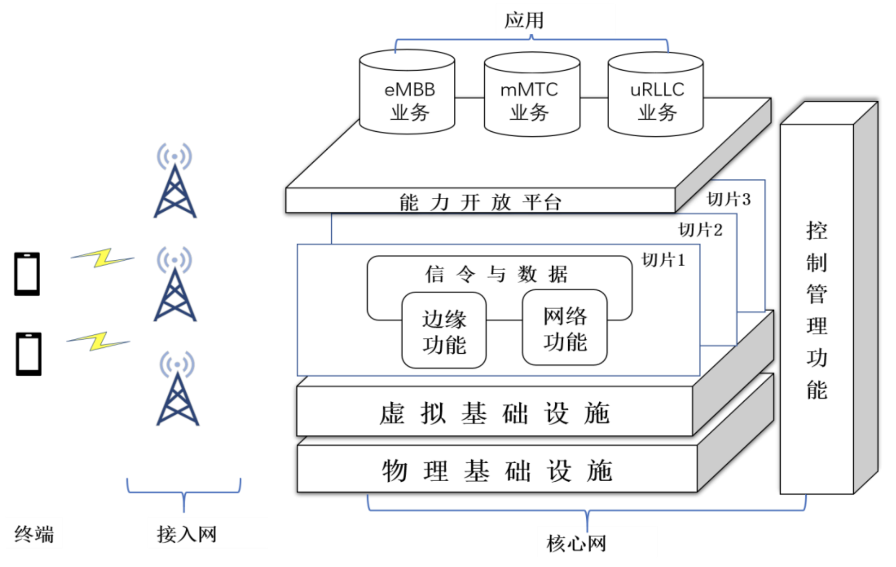
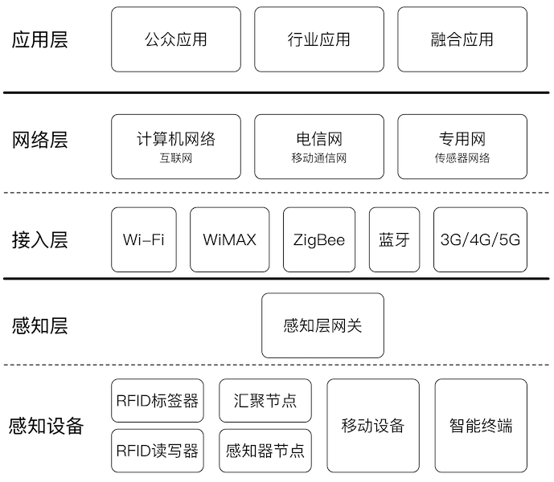
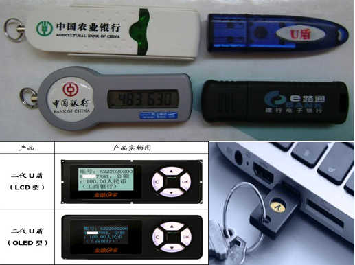
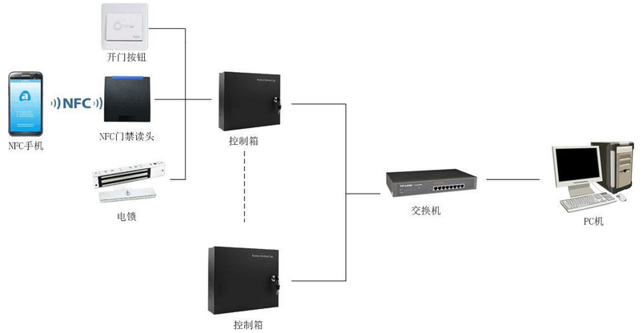
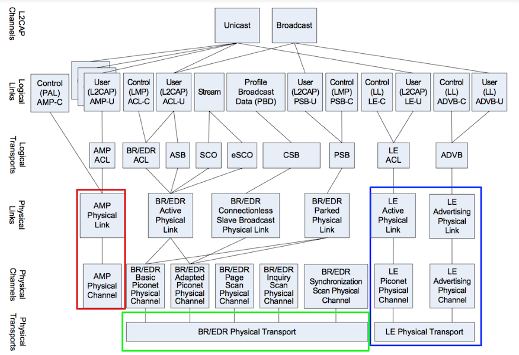
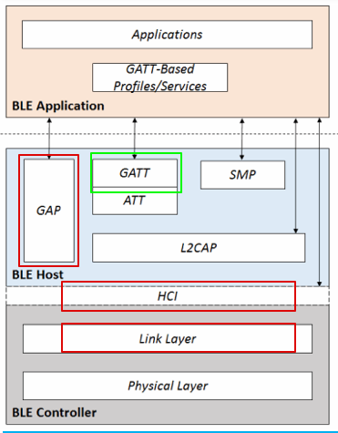
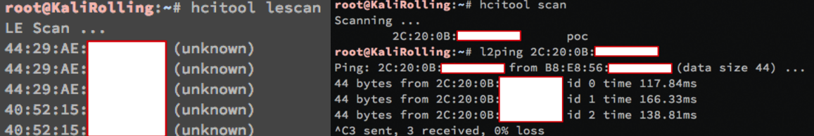
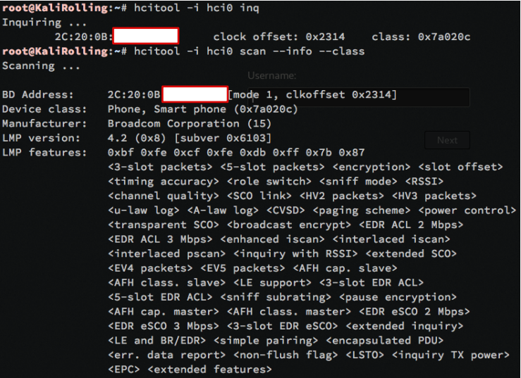

# 第四章 移动通信与物联网安全概述

---

## 温故

* WPA/WPA2/WPA3 个人版和企业版面临的安全威胁主要有哪些
    * 无线网络全生命周期不同阶段面临的不同威胁
* `Evil Twin` 和 `Rogue AP` 是无线网络威胁顽疾
* `WPA2` ---> `WPA3` 演进过渡阶段，降级攻击是新安全机制的主要威胁
* 对于个人版无线网络安全协议来说，口令安全是重中之重
* 对于企业版无线网络安全协议来说，`802.1X` 配置、用户安全意识教育是重中之重

---

## 知新

* 移动通信安全的昨天、今天和明天
* 物联网威胁模型
* 蓝牙安全案例
* “智能”硬件安全案例

# 移动通信安全的昨天、今天和明天

---

## 移动通信极简史

* 1G/2G/3G/4G/5G 中的 G : Generation ，第几 **代** 移动通信技术，属于人为定义
* 每 10 年左右更新迭代一个大版本
* 当前 2021 年进行中的是 5G 通信技术

---

### 第一代移动通信技术 {id="generation-1"}

* 1986 年，第一代移动通讯系统（1G）在美国芝加哥诞生，采用 **模拟** 信号传输
* 1G 通信技术并没有实现全球统一标准
    * 全球主要有 2 种制式：美洲的 `AMPS` 和来自欧洲的 `TACS`
* 传输容量小，仅能传输语音信号和少量文本短信，且话音质量低、安全性差（串号和盗号事件时有发生）

---

### 第二代移动通信技术 {id="generation-2"}

* 1994 年，前中国邮电部长吴基传用诺基亚 2110 拨通了中国移动通信史上第一个 GSM 电话，中国开始进入 `2G` 时代
* 依然没有全球统一标准化组织的统一标准
    * 全球主要的制式也是 2 种，分别是来自欧洲 `ETSI` 组织的 `GSM(GPRS/EDGE)` 和来自美洲以高通公司为主力的 `TIA` 组织的 `CDMA IS95/CDMA2000 1x`
* 手机首次实现上网，但带宽极其有限（9.6~14.4kb/s）。GPRS/EDGE 等 2.5G 技术使得传输带宽提升到了 64kb/s
* 虽然协议设计支持加密技术，但在市场化实现时普遍未开启加密功能

---

### 经典的 `2G时代` 漏洞

* 伪基站
    * 只有基站认证用户，缺少用户对基站的认证
        * `WPA-个人` 同样也是此类单向认证，因此饱受 `Evil Twin` 危害
* 明文网络传输链路
    * 监听
    * （匿名）查询HLR/AuC
* $K_c$ 更新周期太长
    * 算法和 $K_i$ 均存储在 `SIM` 卡中，存在复制 `SIM` 卡的风险

> 更多内容（包括3G/4G安全概述）请查阅 [2017版课件](https://c4pr1c3.github.io/cuc-wiki/courses/2017/misLecture0x04.pdf)

---

### 第三代移动通信技术 {id="generation-3"}

* 1996 年在 `ITU` 带领下，建立了全球 `3G` 技术标准框架：`IMT-2000`，并明确命名了 `4G` 技术标准框架：`IMT-Advanced` ，`5G` 技术标准框架：`IMT-2020`
* 1998 年 `3GPP` 成立，在其主导下制定了全球 3G 技术主要标准和后续的 4G, 5G 技术标准
* 2007 年乔布斯发布 `iPhone` ，智能手机时代到来
* CDMA 2000, WCDMA, TD-SCDMA, WiMax 等一度同台竞技

---

### 第四代移动通信技术 {id="generation-4"}

* 全球统一的 `LTE(Long Term Evolution)` 技术标准
* 2013 年 12 月，工信部向我国三大电信运营商颁发了 TD-LTE 经营许可，标志我国的 4G 商用时代开始
* 以 `iPhone` 为代表的智能终端设备的全球快速普及促使移动通信技术发展方向进一步聚焦
    * 移动网络用于传送数据，移动终端集成一切电子设备
* 2009 年，物联网概念出现，且终端数量增长速度远远超过了移动互联网终端

# 第五代通信技术

---

## 第五代移动通信技术愿景

> 信息随心至，万物触手及

---

## 应用场景 {id="generation-5-1"}


---

### 5G 三大应用场景

* 增强移动宽带：eMBB (enhanced Mobile Broadband) 
* 海量机器通信：mMTC (massive Machine Type Communications
    * 专门针对物联网场景的适配
* 超可靠低时延通信：URLLC (Ultra Reliable Low Latency Communications) 

---

## 关键指标改善 {id="generation-5-2"}


---

## 5G 网络架构 {id="net-arch-of-5g"}

[](http://www.caict.ac.cn/kxyj/qwfb/bps/202002/P020200204353105445429.pdf)

---

## 第五代移动通信技术的关键特征

* 软件定义一切
    * 服务化架构
    * 网络功能虚拟化（NFV）
    * 网络（拓扑）切片：基于软件定义网络（SDN）技术，在共享资源上实现逻辑隔离
    * 边缘计算：分布式节点的安全管控
    * 网络能力开放
    * 可按需扩展的接入网关键技术

---

## 第五代移动通信技术的网络与系统安全面临的风险关键特征

* 继承了以虚拟化为代表的软件与系统安全风险
* 继承了 IP 网络、云计算相关安全风险
* 继承了以物联网为代表的分布式功耗敏感型计算架构的安全风险
* 继承了以互联网为代表的开放服务安全风险

---

## 第五代移动通信技术安全框架

* 5G 继承了 4G 网络分层分域的安全架构
    * 分层：传送层、归属层/服务层和应用层，各层间相互隔离
    * 分域：接入域安全、网络域安全、用户域安全、应用域安全、服务域安全、安全可视化和配置安全六个域
        * 其中，服务域安全是 5G 安全框架新增

---

## [第五代移动通信技术在安全方面的主要改进](http://www.jos.org.cn/html/2018/6/5547.htm) {id="sec-enhancements-of-5g-1"}

* 延续 4G 安全需求（确保至少提供与4G同等的安全性，<del>像极了 `WEP` 的愿景？</del>）
    (1) 用户和网络的双向认证
    (2) 基于USIM卡的密钥管理
    (3) 信令消息的机密性和完整性保护
    (4) 用户数据的机密性保护
    (5) 安全的可视性和可配置性

---

## [第五代移动通信技术在安全方面的主要改进](http://www.jos.org.cn/html/2018/6/5547.htm) {id="sec-enhancements-of-5g-2"}

* 新增 4G 缺失的安全机制
    (1) 防 IMSI 窃取的保护
    (2) 用户数据的完整性保护
    (3) 服务请求的不可否认性
    (4) 支持多样化身份认证和认证凭据全生命周期管理方式

# [第六代移动通信技术愿景](https://arxiv.org/pdf/1905.04983.pdf)

---

> 一念天地，万物随心

---

## 第六代移动通信技术展望

* 预计 2030 年后商用
* 智慧连接：智能响应（5G 时代是 `5G+AI`，`AI` 技术主要用于优化 `5G` 网络架构和应用；6G 时代是 `AI+6G` ，`6G` 网络架构和应用将构建在 `AI` 技术基础之上）
* 深度连接
* 全息连接：沉浸式全息交互体验
* 泛在连接：空天地海一体化

---

### 智慧连接之于 6G 安全的意义

* 现在以及可以预计的未来，智慧落地实现的途径必然是「代码」
* 从硬件底层到业务应用顶层， **可编程** 将无处不在
* 网络与系统安全的核心就是「代码」安全

---

### [The danger of complexity: More code, more bugs](https://www.techrepublic.com/blog/it-security/the-danger-of-complexity-more-code-more-bugs/)

* 「代码」行数越多，「缺陷（`bug`）」越多
* [`bug ≠ vulnerability`](https://ieeexplore.ieee.org/document/7180086) | `缺陷 ≠ 安全漏洞` 
    * 对于一个确定的软件、确定的源代码文件来说，缺陷数量高不一定代表着其中的安全漏洞数量也多
        * 但是对于一个确定的软件、确定的源代码文件来说，「代码」行数越多，「漏洞」越多这个经验趋势是普遍成立的

---

### 为什么本课程不再展开移动通信安全内容

* 缺少实验条件
    * 硬件设备相比较于无线网络安全实验所需要的 `USB 无线网卡` <del>价格更高、获取渠道受限</del>
* 技术复杂度更高
    * `Software Defined Radio, SDR`
* 危害性更大
    * 无线网络可以禁用或使用有线网络替代，蜂窝通信在民用长距离通信方面无可替代技术

---

### 硬件设备关键词举例


---

### 物联网是未来网络安全绝对的主战场

* 根据中国信息通信研究院 [物联网白皮书（2020年）](http://www.caict.ac.cn/kxyj/qwfb/bps/202012/t20201215_366162.htm) 的统计数据
    * 2019年全球物联网总连接数达到120亿，预计到2025年，全球物联网总连接数规模将达到246亿，年复合增长率高达13% 。
    * 2019年我国物联网连接数全球占比高达 30% ，其中移动物联网连接数占比接近 1/3
    * 预计到 2025 年，我国物联网连接总数将达到 80.1 亿，年复合增长率14.1%
        * “设备数量” 远超 “人口数量”

# 物联网概述

---

## 术语与关键特性 {id="iot-1"}

* 物联网（`Internet of Things`，`IoT`）是互联网、传统电信网等信息承载体，让所有能行使独立功能的普通物体实现互联互通的网络
* `Machine To Machine`, `M2M`
    * 依赖于“通信技术”
* 智能
    * 自动化（`Autonomous`）
    * 智能化（`人工智能`, `Artificial Intelligence`, `AI`）

---

## 术语与关键特性 {id="iot-2"}

* 泛在（`Ubiquitous`）网络: 具备 `4A` 级别通信能力
    * 4A：Anytime, Anywhere, Anyone, Anything
* 继承了IP网络基本组网和通信模型
    * 通信架构
        * 分层结构
    * 通信模式
        * 点对点，组播，广播，任播

---

## 物联网总体架构



---

## 回顾第一章内容：无线网络是什么？

> 无线局域网（WLAN）是使用 `射频（Radio Frequency, RF）` 技术建立的 **不** 依赖 **可见物理传输介质** 的无线通信局域网络

- 不可见物理传输介质：电磁波

---

## 物联网接入层常见通信协议

* 蓝牙 (`IEEE 802.15.1`)
* NFC (`ISO 13157等`)
* ZigBee (`IEEE 802.15.4`)
* NB-IoT

---

## 物联网感知层常见设备

* RFID 读写器 (物联网的基础设施技术之一，可以通过蓝牙、NFC技术来实现）
* 红外
* 激光
* 定位（例如 GPS、北斗定位等）
* 温度
* 湿度
* 摄像头（音频、图像和视频采集，条形码、物体识别等）

---

## 电子标签（RFID） {id="rfid-brief"}

* Radio Frequency Identification, 射频标识
* 属于无线通信技术范畴
* 通过无线电信号识别特定目标并读写相关数据，无需识别系统与特定目标之间建立机械或光学接触

---

## RFID 工作原理 {id="rfid-internals"}

* 无线电的信号是通过调成无线电频率的电磁场，把数据从附着在物品上的标签上传送出去，以自动辨识与追踪该物品
    * 无源 RFID: 某些标签在识别时从识别器发出的电磁场中就可以得到能量，并不需要电池
    * 有源 RFID: 也有标签本身拥有电源，并可以主动发出无线电波（调成无线电频率的电磁场）
    * 标签包含了电子存储的信息，数米之内都可以识别。与条形码不同的是，射频标签不需要处在识别器视线之内，也可以嵌入被追踪物体之内

---

## RFID 技术现状和趋势 {id="rfid-state-of-the-art"}

* 越来越多的应用
    * 原本只是以条形码的替代者面目出现
* 飞快的发展速度
* 小型化,低成本化
* 协议和标准泛滥
    * 各国可以制定本国 RFID 标准，不同应用、不同频段

---

## RFID 使用的频段 {id="bands-in-use-of-rfid"}


---

## RFID 的应用领域 {id="applications-of-rfid"}

* 钞票及产品防伪技术
* 身份证、通行证（包括门票）
* 电子收费系统，如公交卡
* 家畜或野生动物识别
* 病人识别及电子病历
* 物流管理
* 行李分类
* 门禁系统

---

## RFID 分类：是否可写？ {id="rfid-readable-or-writable"}

* 可读写卡( `RW` )
    * `Read Write` , 相当于 `CDRW`
        * 第二代身份证
* 一次写入卡( `WORM` )
    * `Write Once, Read Many`, 相当于 `CDR`
        * 航空行李标签、特殊身份证件标签等
* 只读卡( `RO` )
    * `Read Only`, 相当于 `CD` 
        * 门禁

---

## RFID 分类：不带电源 {id="rfid-without-power-supply"}

* 无源 `RFID` ( `Passive RFID`，`被动 RFID`)
    * 依靠和阅读器的电磁耦合供能
    * 读取距离取决于
        * 阅读器耦合线圈的尺寸
    * 工作频率: 0.5W：0.7m  、 4W：2m 、30W：5.5m
    * 成本低,应用广泛

---

## RFID 分类：带电源 {id="rfid-with-power-supply"}

* 有源 `RFID` (`Active RFID`，`主动RFID`) 
    * 自带电源供能
        * 使用锂电池通常可工作3~10年 
    * 读取距离 10 米 ~ 30 米或更远
    * 目前的应用数量相比 `无源 RFID` 要少 
        * 需要远距离识别的场合：如高速公路 `ETC`

---

## 我们身边的 RFID {id="rfid-in-use"}

* 门禁
* 第二代身份证
    * 无源读写卡
    * ISO 14443 TYPE B
    * 载波频率 13.56 MHz、副载波频率 847 KHz
    * 身份证号、姓名、性别、居住地址、照片 
* 食堂饭卡、水卡、校园一卡通

---

## RFID 的安全风险 {id="risks-of-rfid"}

* 伪造、假冒和非法篡改 
* 泄露隐私
    * 我的口红里有 `RFID` 吗? 
* 植入人体?
    * 技术上已经成熟
    * [美国国会于 2004 年已通过了相关法律](https://www.fda.gov/regulatory-information/search-fda-guidance-documents/cpg-sec-400210-radiofrequency-identification-feasibility-studies-and-pilot-programs-drugs)

---

## 无线键盘和无线鼠标

* 红外键盘鼠标
    * 唯一的访问控制就是红外设备的距离特性
* 无线鼠标键盘(不包括蓝牙鼠标/键盘)
    * 27 MHz
    * 256 个 ID + 2个频道就是所有识别措施
* 蓝牙键盘鼠标
    * 安全性优于无线键盘鼠标

---

## 电磁辐射泄露

* [Van Eck phreaking: CRT/LCD 显示器画面还原](https://en.wikipedia.org/wiki/Van_Eck_phreaking)
    * 1985 年验证了 CRT 显示器画面还原
    * 2004 年验证了 LCD 显示器画面还原
* 普通键盘和鼠标的电磁泄露问题 

---

### [TempestSDR](https://github.com/martinmarinov/TempestSDR)

[](https://www.bilibili.com/video/BV1Vt4y1X7rF)


# 智能卡

---

## “智能”体现在

* 内置“存储器”，对存储的数据可以进行访问控制，阻止未授权访问
* 内置“微处理器”和RAM
    * 密码学计算
    * **可编程计算**
* 支持组件式架构
    * 指纹识别
    * OTP
    * 传感器

---

## 智能卡与读卡器之间的通信方式


接触式 VS. 非接触式（RFID 为主）

---

## USB 令牌 {id="usb-tokens"}

* 除了接口和外观形状不同，其他物理和软件技术架构和智能卡无差异
    * 接口：使用 USB，无需专用的“读卡设备”



---

## 智能卡主要应用场景 

* 信息存储卡
    * 通常用于保存个人（隐私）信息，例如个人医疗记录卡
* 储值卡
    * 代替小额现金支付场景，无需在线联网校验，直接读写卡内余额（次数）
        * 自动贩卖机卡、预付费一次性电话卡、公交卡
* 认证令牌卡
    * 内置加密芯片，提供散列值、数字签名和加解密能力
* 多功能卡
    * 内置操作系统（Windows for Smart Cards, MULTOS, Java Card）
    * 支持灵活丰富的应用场景

---

## 智能卡威胁分析

* 差分功耗分析（`Differential Power Analysis`）
    * 基于密码学计算过程中的功耗变化统计数据来推导卡片上存储的密钥
* 计时攻击（`Timing Attacks`）
    * 类似的攻击手段我们已在 `SQL 盲注攻击` 中见识过
* 芯片逆向（`Reverse Engineering of the Chips`）
    * 专家/富人/国家级研发能力和成本投入
* 设计/实现缺陷
    * 通用/缺省加密口令/密钥

---

## 智能卡威胁建模

* 人：遗失、外借、设置PIN码等
* 软件：软件设计与实现漏洞
* 操作系统
    * 固定文件系统 VS. 动态文件系统
* 网络：明文传输风险，`MITM`，嗅探器调试
* 硬件：直接读取或破坏（改变电压/温度/酸碱度/电路板重新焊接搭线等）`EEPROM`
* 环境: 钓鱼风险

---

## 智能卡操作系统安全 {id="smart-card-sec-1"}

* 固定文件系统
    * 通常只被用于可信安全计算环境
    * 所有文件权限都是出厂时设置好无法修改的：例如员工信息卡
* 动态文件系统
    * `JavaCard®` 和 `MULTOS` ，操作系统和应用软件解耦
    * `GSM` 的 `SIM` 卡，支持 `OTA` 更新
    * 适用于频繁需要更新数据/软件的场景，例如密钥协商

---

## 智能卡操作系统安全 {id="smart-card-sec-2"}

```
								MF (Master File)          
                                       |
                          -------------+--------------
                          |            |             |
               EF (Elementary File)    EF   DF (Dedicated File)
                                                     |
                                            ---------+--------
                                            |        |       |
                                            EF       DF      EF
                                                     |
                                                     EF
```


---

## 智能卡操作系统安全 {id="smart-card-sec-3"}

* `MF(Master File)` 和 `DF(Dedicated File)` 相当于“目录”，但 `DF` 依然可以独立存储数据
* `EF(Elementary File)` 相当于“文件”
* `MF`/`DF`/`EF`的文件头包含安全属性（相当于访问控制信息）
    * 只要有“权限”就
可以遍历所有文件
    * 5类安全属性（权限）

---

## 智能卡文件系统安全属性

* `Always`(`ALW`)
* `Card holder verification 1` (`CHV1`)
    * 使用 `PIN1` 验证，用户设置的
* `Card holder verification 2` (`CHV2`)
    * 使用 `PIN2` 验证，设备商设置的用于解封设置（`PIN1` 和 `PIN2`是相互独立的 `PIN`）
* `Administrative` (`ADM`)
* `Never` (`NEV`)

---

## 智能卡操作系统的 PIN 码安全机制

* 防暴力破解锁定机制
    * 触发锁定的错误尝试认证次数和锁定时间取决于操作系统设置
    * `PIN2` 用于解封 `PIN1` 被锁定状态
    * `PIN2` 被锁定通常就只能返厂维修了
    * `PIN1` 被锁定时所有文件均被设置 `CHV1` 属性，禁止访问

---

### 《一部手机失窃引发的惊心动魄的战争》 {id="sim-pin1-demo-1"}

* 脆弱的信任根：手机短信验证码、手机开机/锁屏密码、被（风控系统）信任的旧手机
* 脆弱的隐私信息保护
    * XX 社保 App: 使用手机短信验证码即可获得社保绑定的真实姓名、身份证号
* 服务提供商的业务逻辑漏洞
    * XX电信: 只要对方能提供服务密码，正常就是可以「解除挂失」手机号通信服务
    * 形同虚设的大数据风控: 凌晨4点的贷款申请、绑定银行卡操作等被 **自动审批通过**
    * 有争议的“快捷绑卡”逻辑
        * 允许用不同的手机号码注册相同实名认证的支付账号
        * 允许两个账号绑定相同的银行卡

---

### 《一部手机失窃引发的惊心动魄的战争》 {id="sim-pin1-demo-2"}

* 安全建议：给自己的手机 SIM 卡设置一个新的 PIN 码

---

> 以上安全建议真的足够安全了吗？

---

### 《一部手机失窃引发的惊心动魄的战争》 {id="sim-pin1-demo-3"}


---

### 《一部手机失窃引发的惊心动魄的战争》 {id="sim-pin1-demo-4"}

* PUK 码就是 `PIN2` 码，用来解封 `PIN1` 的锁定状态  
    * 通常是 8 位数字，印刷在 SIM 实体卡上（刮开涂层可见）
* 某运营商的手机 App（ ***2021-01-26 验证*** ）可以直接查询到当前登录手机号的 **原始** `PUK` 码和 `PIN` 码
    * `PIN` 码允许用户通过手机自行修改，修改后不会同步到该 App
    * 但 `PUK` 码用户是无法自行修改的
    * 通过 **手机号** + **服务密码** 即可登录手机 App

---

### 《一部手机失窃引发的惊心动魄的战争》 {id="sim-pin1-demo-5"}

* `ICCID`: Integrate Circuit Card IDentity, 集成电路卡识别码。手机 `SIM` 卡上的 `ICCID` 即为 `SIM` 卡的全球唯一编号，相当于手机号码的身份证
* 根据 `ICCID` 可以查询到对应的 **手机号**


---

### 《一部手机失窃引发的惊心动魄的战争》 {id="sim-pin1-demo-6"}

* 自己手机号对应的 **服务密码**   一定要妥善 **牢记**
    * 不要将查询服务密码的短信保留在手机的短信收件箱
* SIM 实体卡要妥善保管，不要随手丢弃，不要随身携带
    * 避免 `ICCID` 和 `PUK 码` 泄露
* 在以上基础之上修改 SIM 卡的默认 PIN 码才是 **更安全** 的
    * SIM 卡的默认 PIN 码建议自行联系运营商确认

---

## MIFARE

* `MIFARE` 是恩智浦半导体公司（NXP Semiconductors）在非接触式智能卡及近场感应卡领域的注册商标
* `MIFARE` 是依循 `ISO/IEC 14443-A` 规格创建的非接触式智能卡，利用无线射频识别（频率为 13.56MHz）来完成验证
* 近年来 `MIFARE` 已经普遍在日常生活当中使用，如大众运输系统付费、商店小额消费、门禁安全系统、借书证等

---

## MIFARE Classic

* `Unique Identifier(UID)` 只读
* 读取设备和卡片双向认证通过之后使用协商出的会话秘钥加密通信数据
* 使用私有的 `CRYPTO1` 加密算法（依赖于算法保密来“提升”密码学算法的安全性）
* 奇偶校验位信息混淆
* 仅硬件实现（依赖于硬件化“提升”防逆向能力）

---

## MIFARE 的黑历史 {id="dark-history-of-mifare"}

* 2007 年 12 月两个德国人 `Nohl` 和 `Plötz` 在 `Chaos Communication Congress` 上展示了通过 `Crypto-1` 的一些缺陷部分逆向了其算法
* 2008 年 3 月来自荷兰 `Radbond` 大学的研究者完全逆向了 `Crypto-1` 算法并予以公开
* `NXP` 试图通过法律途径禁止上述公开行为，但在 2008 年 7 月被当地法庭以言论自由原因驳回了申诉
* 2008 年 10 月 `Radbond` 大学以 `GNU GPL v2` 协议开源了` Crypto-1` 算法代码
* 大量针对 `MIFARE Classic` 卡的黑客工具被公开

---

## Proxmark3

* `Jonathan Westhues` 设计并且开发的 **开源硬件** ，其主要用 `RFID` 的嗅探、读取以及克隆等的操作
    * 低频(125kHz)～高频(13.56MHz)
* 可类比 `IEEE 802.11` 类嗅探和注入实验
* 内置了对 Crypto-1 算法的 [破解支持](https://github.com/Proxmark/proxmark3/tree/master/common/crapto1)

---

## 开放式讨论

* 接触式智能卡比非接触式智能卡更安全？更不安全？
    * 调试和逆向工具的完备性、成本
    * 卡片设计安全性
    * 卡片制造与实现安全性
* 类似的：无线网络和有线网络谁更安全？

---

## 案例：[基于智能卡的应用系统风险](https://www.freebuf.com/news/topnews/80786.html)



# 智能硬件

---

## 概述

* 没有一个公认的统一定义
* 本课程接下来要介绍的“智能”硬件其“智能”主要体现在至少具备其一特性
    * 具备通用或专用计算能力
    * 具有可编程性，支持软件定义硬件
    * 具备感知外界的能力
    * 低功耗或节能型

---

## 代表产品

* DIY 硬件
* 机器人、无人机
* 智能家电
* 豆浆机，热水器，空调，净水器，电源开关，电源插座，电视，摄像机等等
* 智能家居
* 可穿戴设备（健康医疗、VR/AR等等）

---

### DIY 硬件

* Raspberry Pi
    * 微尺寸、全功能 Linux 主机
    * 英国剑桥大学出品，原设计用于教学计算机硬件维修实验对象：满足物美价廉、可定制的全功能计算机硬件特性
    * [基于 Raspberry Pi 通过 USB 接口连接 Hack 掉一台电脑 - samyk/poisontap](https://github.com/samyk/poisontap)
* Arduino
    * 微控制器
    * 意大利一所交互设计专业教师出品，原设计同样用于教学：快速硬件产品原型构建

---

## 再看 Rogue Access Point

* 通过物理联入的一个无线热点实现远程接入一个安全隔离的有线网络
    * 有线网络的安全性可以通过物理安全保障，但恶意 `AP` 的接入打破了原有的物理隔离和限制措施
    * 一个可编程的恶意 `AP` 可以实现自动化的局域网攻击
    * 智能手机、使用开源路由器固件（例如 `OpenWrt` 等）的无线路由器/ `AP` / `Raspberry Pi`

---

## 智能路由器风险 {id="vulnerabilities-of-smart-router-1"}

* 路由器厂商预留的“调试”后门
    * [关于多款路由器设备存在预置后门漏洞的情况通报 2014.02.10 from CNCERT](https://www.cert.org.cn/publish/main/9/2014/20140210091555248367162/20140210091555248367162_.html)
* 固件更新设计与实现缺陷
    * 仅使用简单的 `Hash` 算法校验下载文件完整性，未使用数字签名算法鉴别文件真实性
* 配置信息保存不当（明文）
* 固件防逆向能力的高低

---

## 智能路由器风险 {id="vulnerabilities-of-smart-router-2"}

* 不安全的默认设置
    * `WPS` 功能未默认关闭
    * 默认 SSID
    * 默认 WEB 管理界面的缺省管理员密码
* WEB 管理系统安全性
    * [CVE-2019-12272 实验](https://c4pr1c3.github.io/cuc-mis/chap0x04/cve-2019-12272.html)

# 蓝牙安全

---

## 概述 {id="bluetooth-intro"}

* WPAN 实现技术之一
* 支持服务能力描述/声明配置文件
    * 声明蓝牙设备所具备的应用能力
        * 输入（键盘、鼠标）、输出（音频、文件传送、打印机）
    * 设备和能力发现
* 越来越多的物联网应用采用蓝牙（特别是蓝牙低功耗）作为底层通信协议
    * 例如各种智能锁、智能家居产品等

---

## 蓝牙设备功耗等级分类

| 设备类型   | 功耗       | 最⼤功耗等级    | 设计通信距离 | 典型设备                           |
| :--------- | :--------- | :---------      | :---------   | :---------                         |
| Class 1    | ⾼         | 100 mW (20 dBm) | &lt; 100⽶   | USB适配器、接⼊点                  |
| Class 2    | 中         | 2.5 mW(4 dBm)   | &lt; 10⽶    | 移动设备、蓝⽛适配器、智能卡读卡器 |
| Class 3    | 低         | 1 mW (0 dBm)    | &lt; 1⽶     | 蓝⽛适配器                         |

---

## 蓝牙协议栈

[](https://www.bluetooth.org/DocMan/handlers/DownloadDoc.ashx?doc_id=286439&_ga=1.139498554.805272089.1452604944)

---

## 蓝牙技术基础

* 使用 `2.4 GHz` `ISM` 频段的 `2400~2483.5 MHz`
    * [Industrial Scientific Medical Band](https://zh.wikipedia.org/wiki/ISM频段)
* `Basic Rate(BR)` 721.2Kbps
    * optional `EDR (Enhanced Data Rate)` 2.1Mbps
    * `AMP (Alternate MAC and PHY layer extension)` 54Mbps
        * “借用”802.11协议的物理层和MAC层规范
    * `BR/EDR` 和 `AMP` 必须二选一
* `Low Energy (LE)`

---

## 使用 AMP 标准的蓝牙与 IEEE 802.11

| 特性       | 蓝⽛                                       | IEEE 802.11                                        |
| :---       | :----                                      | :----                                              | 
| ⽹络拓扑   | 对称（点对点）                             | ⾮对称（以AP为中⼼），也支持点对点的非基础设施模式 |
| ⼯作频段   | 2.4 GHz                                    | 2.4 GHz / 5 GHz                                    |
| 传输速率   | 1~24 Mbps                                  | 5.5~1000 Mbps                                      |
| 传输距离   | 1～300⽶蓝牙5.0                            | 室外最⼤250⽶左右                                  |
| 协议兼容性 | 3.0+版本兼容802.11n (物理层使⽤802.11协议) | -                                                  |

---

## 蓝牙系统逻辑组成

* `Host` 在负责逻辑链路的基础上为上层蓝牙应用提供更易使用的封装 
* `Controller` 负责定义 `RF`、`Baseband` 等偏硬件的规范在此基础之上抽象出用于通信的逻辑链路

---

## 蓝牙 ISM 频段划分方法 {id="bluetooth-ism-division"}

* `BR/EDR` 控制器，[分成79个频率，每个为1 MHz](https://en.wikipedia.org/wiki/List_of_2.4_GHz_radio_use#Bluetooth)
    * 跳频(`Frequency Hopping`)，1 秒至多改变 1600 次
    * 物理信道（`Physical Channel`）是由跳频图谱（`Hopping Pattern`）决定的
    * 跳频图谱是一种规则，规定了蓝牙RF在某一时刻需要跳到 79 个频率中的哪个频率上通信
* `LE` 控制器，分成 40 个频率，每个为 2 MHz
    * 3  个频率为广播信道（`Advertising Channel`）
    * 37 个频率为数据信道（`Data Channel`）

# BLE

---

## BLE - Bluetooth Low Energy

* 别名：Bluetooth Smart
* 经典蓝牙协议的一个轻量级子集（另一个是 `Basic Rate`），但 **不能与经典蓝牙协议互通**
* 蓝牙 4.0 核心规范的组成部分
* 面向现代移动终端平台设计
    * iOS5+ (iOS7+ preferred)
    * Android 4.3+ (numerous bug fixes in 4.4+)
    * Apple OS X 10.6+
    * Windows 8 (XP, Vista and 7 only support Bluetooth 2.1) 
    * GNU/Linux Vanilla BlueZ 4.93+ 

---

## 典型 BLE 协议栈



---

### [GAP - Generic Access Profile](https://www.bluetooth.com/specifications/assigned-numbers/generic-access-profile)

* 一个基础的蓝牙 `profile`，用于提供蓝牙设备的通用访问功能，包括设备发现、连接、鉴权、服务发现等等
* 通过定义设备角色来控制蓝牙连接和广播通信，实现不同设备的互操作
    * 中心设备(`Central Device`)，主动发现的设备
        * 计算能力更强，耗电量更大，例如手机、平板电脑等
    * 周边设备(`Peripheral Device`)，被发现的设备
        * 体积小、功耗低，通常需要连入中心设备。例如心率监控设备

---

### [GATT - Generic Attribute Profile](https://www.bluetooth.com/specifications/gatt)

* 定义了 2 个 `BLE` 设备数据交换的方式
    * 服务 Services
    * 特性 Characteristics
* ATT - Attribute Profile
    * 存储服务、特性和相关数据于一个简单的查找表，使用 `16-bit` 唯一编号在表中查找匹配
* 一个BLE周边设备一次只能连接一个中心设备
    * 连接一旦建立，广播通信立刻停止，其他设备就无法发现它所以无法再建立新连接了

---

### GATT - 服务和特性 {id="gatt-service-charateristic"}

* Profile 由 [蓝牙标准委员会](https://www.bluetooth.com/specifications/gatt) 或周边设备生产商预定义的一个服务集合 
* Service `BLE` 标准委员会官方采纳的服务采用 `16-bit UUID` 进行标识，最多允许包含 3 个特性，私有自定义服务采用 `128-bit` 唯一标识
* Characteristic
    * `BLE` 标准委员会官方采纳的特性采用 `16-bit UUID` 进行标识，私有自定义特性采用 `128-bit` 唯一标识
    * 一个特性字段存一个独立数据（可以是复合数据结构）

---

### GATT 会话 {id="gatt-conversation"}

* 周边设备：`GATT Server`
    * 持有 `ATT` 查找数据、服务和特性定义
* 中心设备：`GATT Client`
    * 向 `Server` 发起请求
* 连接间隔
    * `Server` 设置建议值，`Client` 不一定照办（并发处理多个会话带来的可能延迟）


---

### BLE 核心组件角色

* `GATT` 提供多种认证机制
    * (1)静态口令/秘钥 (2)挑战-响应（最常见）(3)PKI
* `SMP`（`Security Manager Protocol`）
    * 点对点的协议，基于专用的 `L2CAP channel`，用于生成加密和识别用的密匙
    * `SM` 控制包括配对、认证和加密等过程
* `L2CAP` 包括两个子模块
    * `Channel Manager` 主要负责创建、管理、释放 `L2CAP channel`
    * `L2CAP Resource Manager` 负责统一管理、调度 `L2CAP channel` 上传递的 `PDU`，以确保那些高 `QoS` 的 `packet` 可以获得对物理信道的控制权

---

## 蓝牙安全概述

* [蓝牙协议设计存在的安全问题](https://css.csail.mit.edu/6.858/2012/projects/echai-bendorff-cathywu.pdf)
    * 劫持配对过程
    * 窃听、伪造蓝牙通信，重放和中间人攻击
    * 隐私问题：标识追踪
* 蓝牙协议栈实现存在的安全问题
    * 无线网络绑定的是硬件层和协议层
    * 配对验证码 PIN 是默认值或弱 PIN 码
    * 蓝牙直接绑定应用相对复杂

---

### [BlueBorne](https://www.armis.com/blueborne/)

* CVE-2017-1000250 Linux bluetoothd进程信息泄露
* CVE-2017-1000251 Linux 内核栈溢出
* CVE-2017-8628 微软蓝牙协议栈欺骗漏洞
* CVE-2017-0785 Android com.android.bluetooth进程信息泄露
* CVE-2017-0781 Android com.android.bluetooth进程堆溢出
* CVE-2017-0782 Android com.android.bluetooth进程堆溢出
* CVE-2017-14315 LEAP (Low Energy Audio Protocol)协议堆溢出漏洞导致的远程代码执行漏洞

---

#### BlueBorne 钓鱼 App


---

### BlueBorne 和 BlueBorne 钓鱼 App 带给我们的启示 {id="blueborne-phishing-implies"}

* 移动互联时代，官方应用商店提供的 `app` 同样可能存在仿冒和钓鱼应用
* 物联网时代，物联网设备和协议漏洞将会成为安全事件的新常态

---

### 蓝牙标识伪造


---

### 蓝牙设备存活性探测



> 在蓝牙(Bluetooth®)4.2核心规范当中，支持一项新的特性，可以通过周期性地改变蓝牙设备的随机地址帮助蓝牙设备的使用者来保护自身的隐私，避免其设备被窃听者通过射频侦听以及对数据分析的方式得以窃取。

---

### 蓝牙设备信息探测



---

## 蓝牙通信数据嗅探

* 工具软件
    * btmon / hcidump / wireshark
    * nRF Connect for Mobile (Android App)
    * [Android 4.4+: Bluetooth HCI snoop log](https://source.android.com/devices/bluetooth/verifying_debugging)
* 数据存储格式
    * [BTSnoop](https://www.fte.com/webhelp/bpa600/Content/Technical_Information/BT_Snoop_File_Format.htm)
* 注意事项⚠️  没有专用硬件支持则只能嗅探到本机收发的蓝牙数据，无法捕获其他设备之间的蓝牙通信数据
    * 类比 `IEEE 802.11` 网络的“监听”模式与有线网卡的“混杂”模式的区别

---

## 蓝牙数据构造和发送

* [Linux上的蓝牙协议栈——BlueZ](http://www.bluez.org/)

---

## 蓝牙通信协议逆向

* 重放攻击
    * [智能灯泡逆向与控制实例](http://www.guillier.org/blog/2015/04/reverse-engineering-of-a-ble-bulb/)
    * [Blue picking - hacking Bluetooth Smart Locks](https://conference.hitb.org/hitbsecconf2017ams/materials/D2T3 - Slawomir Jasek - Blue Picking - Hacking Bluetooth Smart Locks.pdf)

# NFC

---

## NFC - Near Field Communication

* 短距离高频无线通信技术，由 `RFID` 演变而来
* `NFC` 仅限 `13.56MHz` 高频段，`RFID` 有较多频段选择
* `NFC` 的有效通信距离大多在 `10 厘米` 以内，`RFID` 的通信距离范围从几厘米到几十米都有
* `NFC` 是一种“集成”RFID技术，单芯片内置非接触读卡器、非接触卡和点对点功能，`RFID` 通常使用独立的阅读器和标签
* `RFID` 多用于生产、物流、资产管理等，`NFC` 则更多用于公交、门禁、手机支付等

---

## NFC 与蓝牙的关系 {id="nfc-vs-bluetooth"}

| 特性           | NFC                | 蓝⽛             | 低功耗蓝⽛(BLE)       |
| :---------     | :------            | :------          | :------               |
| 标签是否耗能   | 否                 | 是               | 是                    |
| 标签成本       | 10美分             | 5美元            | 5美元                 |
| RFID兼容性     | ISO 18000-3        | 有源（主动）     | 有源（主动）          |
| 标准化组织     | ISO/IEC            | Bluetooth SIG    | Bluetooth SIG         |
| ⽹络协议标准   | ISO 13157 etc.     | IEEE 802.15.1    | IEEE 802.15.1         |
| ⽹络拓扑类型   | 点对点             | WPAN             | WPAN                  |
| 加密           | 基于RFID技术的没有 | 可选             | 可选                  |
| 通信距离       | &lt; 0.2m          | ~ 100m (class 1) | ~50m                  |
| 频段           | 13.56 MHz          | 2.4-2.5GHz       | 2.4-2.5GHz            |
| 传输(⽐特)速率 | 424 kbps           | 2.1/24 Mbps      | 1 Mbps                |
| (⽹络)建⽴时间 | &lt; 0.1s          | &lt; 6s          | &lt; 0.006s           |
| 功耗           | &lt; 15 mA(读)     | 不同级别有差异   | &lt; 15 mA (读和传输) |

# 物联网安全小结

---

## 物联网安全的特殊性与一般性

| 特性           | 物联网安全 | 计算机网络安全 | 移动互联网安全 |
| :-             | :-         | :-             | :-             |
| 设备寿命       | 10~15年    | 5~10年         | 3~5年          |
| 泛在连接       | 普遍       | 不普遍         | 普遍           |
| 功耗敏感       | 高         | 低             | 中             |
| 人机交互频率   | 低         | 高             | 中             |
| 人机交互复杂度 | 低         | 高             | 中             |
| 物理安全风险   | 高         | 低             | 中             |
| 调试经济成本   | 高*        | 低             | 中             |

> 以蓝牙安全为例，ellisys 公司提供的商业化蓝牙全频段监听设备售价高达数万美元。基于开源硬件的 SDR 相关协议分析装备售价也高达人民币千元以上。

# 广义无线网络安全

---

## 《中华人民共和国无线管理条例》- 知法守法 {id="know-laws-then-conform"}

* 第十四条 使用无线电频率应当取得许可，但下列频率除外
    * （一）业余无线电台、公众对讲机、制式无线电台使用的频率
    * （二）国际安全与遇险系统，用于航空、水上移动业务和无线电导航业务的国际固定频率
    * （三）国家无线电管理机构规定的微功率短距离无线电发射设备使用的频率
* 第十五条 取得无线电频率使用许可，应当符合下列条件
    * （一）所申请的无线电频率符合无线电频率划分和使用规定，有明确具体的用途
    * （二）使用无线电频率的技术方案可行
    * （四）**对依法使用的其他无线电频率不会产生有害干扰**

---

## 延伸学习推荐

[《HackRf与GnuRadio⼊门指南》](http://www.hackrf.net/hackrf%E4%B8%8Egnuradio%E5%85%A5%E9%97%A8%E6%8C%87%E5%8D%97/)

# 无线网络安全小结

---


* 无线网络主要解决的是终端设备接入网络的问题，有线网络主要解决的是骨干网络互联互通以及为无线网络提供广域网络传输的接入
* WPAN、WLAN和蜂窝网络的物理信号覆盖范围逐渐增大

---

## 无线网络安全加固——蜂窝通信 {id="wireless-harden-1"}

* 尽快升级你的移动通信网络制式到最新主流制式标准
* 不要依赖 `2G` 网络的短信传送机密信息
* 服务提供商要正确的实现验证码短信功能
    * 不要在短信中同时出现完整帐号和验证码
    * 验证码有效周期尽可能短，建议重要验证码 1 分钟过期
* 遇到疑似 **伪造来源号码** 的电话和短信，回拨可验证真伪
    * 更换另一个手机号、固定电话，逐个号码输入方式回拨

---

## 无线网络安全加固——蓝牙 {id="wireless-harden-2"}

* 默认不启用设备的蓝牙功能，除非需要用到
* 尽可能使用最低等级的蓝牙默认功耗，限制蓝牙传输距离
* 关闭蓝牙的“可被发现”能力
* 使用动态、健壮的PIN码
* 尽可能使用高版本的蓝牙协议支持设备
* 关闭不需要的蓝牙功能
* 建议开启蓝牙配对设备的双向认证功能

---

## 无线网络安全加固——RFID {id="wireless-harden-3"}

* 给你口袋/钱包里的 `RFID` 卡增加一个 `RFID` 屏蔽卡套，防止近距离复制
* 避免使用 `Mfiare Classic` 芯片卡，而采用更强加密算法的芯片卡，比如 `CPU` 卡
* 涉及金额等敏感数据应进行加密处理，禁止明文存储
* 读卡器与后端主机数据库实行线上作业，采用即时连线的方式进行系统核查
* 结合 `uid` 进行加密，并设置 `uid` 白名单，提高攻击者破解成本，但可能被特殊卡绕过
* 对全扇区采用非默认密码加密，提高破解成本，但可能通过 `DarkSide` 方式暴力破解

# 附录

---

* Neshenko, N., Bou-Harb, E., Crichigno, J., Kaddoum, G., & Ghani, N. (2019). Demystifying IoT security: an exhaustive survey on IoT vulnerabilities and a first empirical look on internet-scale IoT exploitations. IEEE Communications Surveys & Tutorials, 21(3), 2702-2733.
* `iot security awesome`

