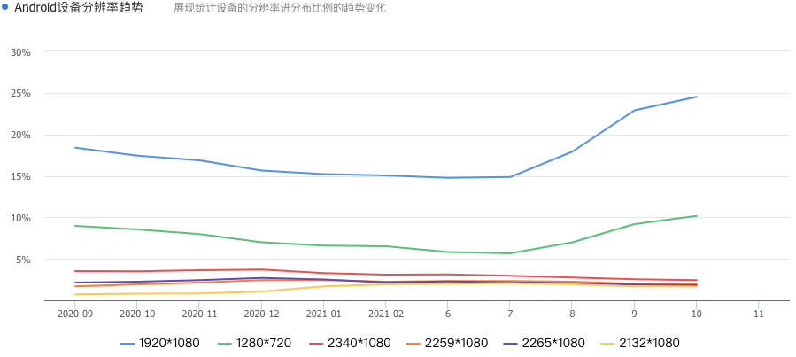
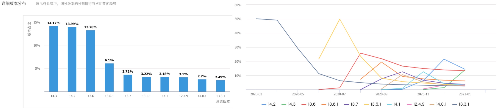
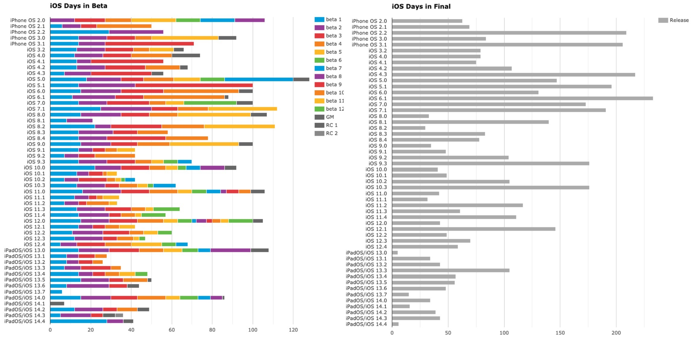
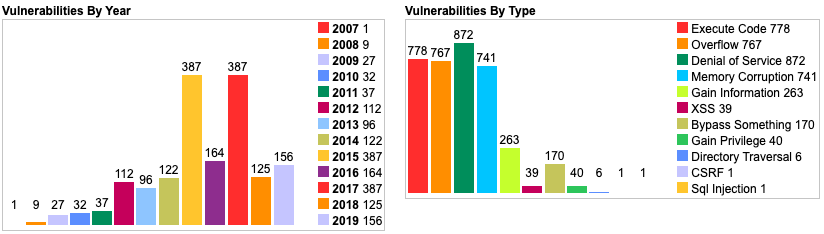
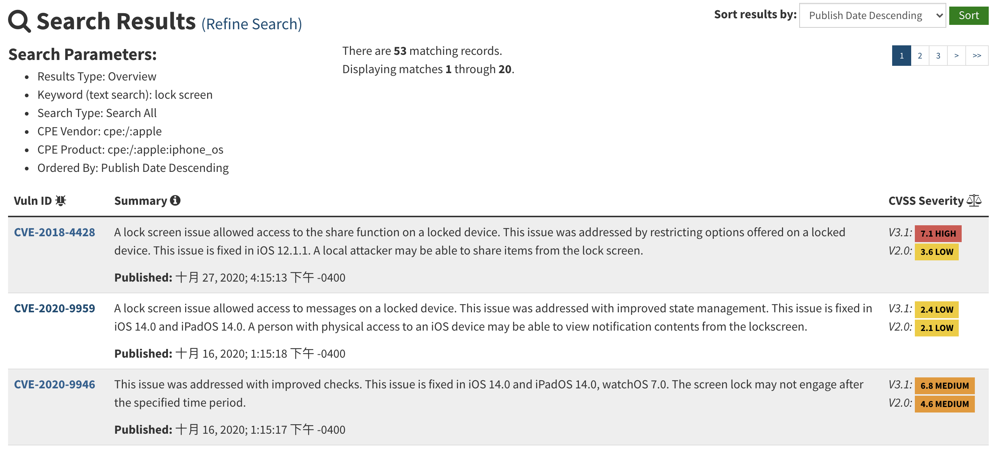
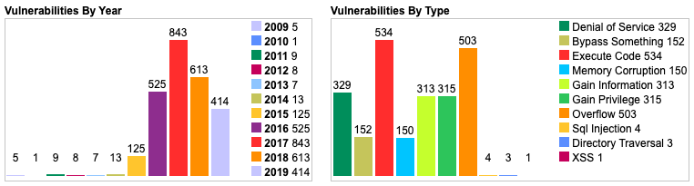
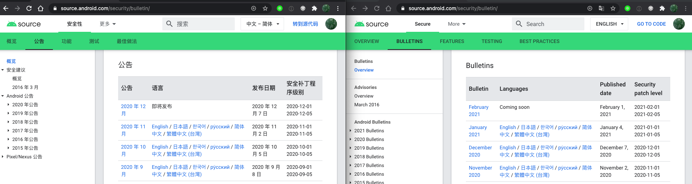
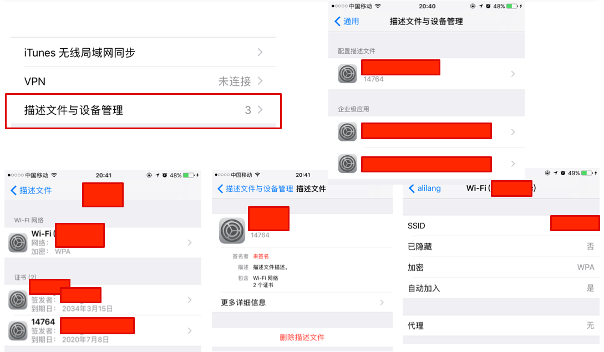

# 第五章 智能终端操作系统安全基础

---

## 温故

* 移动通信安全简史
* 物联网总体架构与典型威胁
* 蓝牙与智能硬件安全案例

---

## 知新

* 智能终端概述
* 以史为镜
    * iOS 系统安全历史概述
    * Android 系统安全历史概述
* Android 应用安全实验环境搭建

# 智能终端概述

---

## 智能终端早期定义

根据 `中国电子技术标准化研究院` 发布的 [智能终端白皮书（2014年修订版）](http://www.cac.gov.cn/files/pdf/baipishu/ITwhitepaper.pdf)

> 智能终端主要表现形式有：智能电视、智能机顶盒、智能手机、平板电脑等

> 智能终端包含的主要要素：高性能中央处理器、存储器、 **操作系统** 、应用程序和网络接入

---

## 智能终端内涵发展

根据 IDC 中国在 2020 年 12 月 10 日发布的 [《“颠覆”，IDC发布2021年中国智能终端市场10大预测》](https://www.idc.com/getdoc.jsp?containerId=prCHC47146720) 

> 连接、交互、屏幕等一系列新兴技术正逐渐应用于智能终端设备

* 连接：5G, `Wi-Fi 6`, 蓝牙等
* 交互：多模交互，例如体感控制、语音控制、触摸控制等
* 屏幕：AR/VR/MR, 投影为代表的大屏, 可穿戴设备为代表的小屏幕等

---

## 智能终端的百花齐放

* 老三样依然主流：智能电视、智能手机、平板电脑
* 物联网大发展带来智能终端百花齐放
    * 智慧教育：支持丰富互动能力的电子白板、3D 打印
    * 商用终端：无人售货柜、移动办公解决方案
    * 智能家居：基于声光红外等传感装置和无线网络连接能力的智能化家电终端
        * 空调、冰箱、洗衣机、电饭锅、豆浆机、窗帘、照明等

---

## 全平台操作系统市场占有率统计

[](https://gs.statcounter.com/os-market-share)

---

## 智能手机操作系统全球市场占有率统计

[](https://www.idc.com/promo/smartphone-market-share/os)

---

本课程要深入展开讲解的智能终端设备为智能手机平台。

# Android

---

## Android 生态圈——设备 {id="android-devices"}


---

## Android 生态圈——设备（全球） 2020.8 {id="android-devices-global-current"}


---

## [Android支持设备屏幕尺寸规范](https://developer.android.com/guide/practices/screens_support.html?hl=zh-cn)（1/3） {id="android-devices-resolution-1"}

* 屏幕尺寸
    * 按屏幕对角测量的实际物理尺寸
        * 为简便起见，Android 将所有实际屏幕尺寸分组为四种通用尺寸：小、 正常、大和超大
* 屏幕密度
    * 屏幕物理区域中的像素量；通常称为 dpi（每英寸 `像素点数`）。例如， 与“正常”或“高”密度屏幕相比，“低”密度屏幕在给定物理区域的像素较少。
        * 为简便起见，Android 将所有屏幕密度分组为六种通用密度： 低、中、高、超高、超超高和超超超高。

---

## [Android支持设备屏幕尺寸规范](https://developer.android.com/guide/practices/screens_support.html?hl=zh-cn)（2/3） {id="android-devices-resolution-2"}

* 方向
    * 从用户视角看屏幕的方向，即 `横屏` 还是 `竖屏`，分别表示屏幕的纵横比是宽还是高。请注意， 不仅不同的设备默认以不同的方向操作，而且 方向在运行时可随着用户旋转设备而改变
* 分辨率
    * 屏幕上物理像素的总数。添加对多种屏幕的支持时， 应用不会直接使用分辨率；而只应关注通用尺寸和密度组指定的屏幕 尺寸及密度。

---

## [Android支持设备屏幕尺寸规范](https://developer.android.com/guide/practices/screens_support.html?hl=zh-cn)（3/3） {id="android-devices-resolution-3"}

* 密度无关像素 (dp - density-independent pixels)
    * 在定义 UI 布局时应使用的虚拟像素单位，用于以密度无关方式表示布局维度或位置
    * 1 dp 约等于中密度屏幕（160dpi；“基准”密度）上的 1 像素。对于其他每个密度，Android 会将此值转换为相应的实际像素数

---

## Android 生态圈——设备（国内） 2021.2 {id="android-devices-domestic-current"}



---

## Android 版本分布情况（全球） 2021.2 {id="android-distributions-global-1"}


---

## Android 版本分布情况（全球） 2021.2 {id="android-distributions-global-2"}

* 以 Android 4.4 `KitKat` 为例，发布于 2013 年 10 月，截止 2017 年 11 月，全球范围内仍然有 13.8% 的设备还在运行着 4 年前的“旧”系统
* 以 Android 7.0 `Nougat` 为例，发布于 2016 年 8 月，截止 2021 年 2 月，全球范围内仍然有 11.2% 的设备还在运行着 4 年前的“旧”系统
    * `11.2% = 84.9% - 73.7%`

> 新版本系统更新部署到终端设备周期较长

---

## Android 版本号基础知识 {id="android-codename-version-tips"}

* 平台代号 `Codename` 从 2014 年 `Android 5 (Lollipop)` 开始，每年一个新版本代号发布
* 版本 `Version`
* API 级别 `API level`

---

## Android Open Source Project (AOSP) 

* AOSP 包括 Android 开源项目的开发者、工作流程和源代码
* [大部分 Android 组件源代码都采用 Apache License, Version 2.0](https://source.android.com/setup/start/licenses) ，但也有部分用到的组件采用的其他开源授权协议。例如 Linux 内核补丁相关源代码就采用的 GPLv2 授权协议
* 根据上述 AOSP 的授权协议，第三方设备厂商可以自由使用 Android 开源代码于自己的设备
* `Android Compatibility Program` 用于不同厂商生产的设备可以兼容 Android 应用程序的一个认证标准，只有认证设备才可以使用 `Android` 商标
* 只有获得 `Android 兼容计划` 认证的设备才能向 Google **申请使用** `Google Play` 服务和随设备分发 `Google Mobile Services`
    * `Google Play` 和 `Google Mobile Services` 均是 Google 的 **私有闭源软件**

---

## [经认证支持 GMS 的设备清单](https://storage.googleapis.com/play_public/supported_devices.html)

* `GMS`: Google Mobile Services
    * 包含 `Google Play Services`（也被称为 `GmsCore`）, `Google Play Store`（应用商店）, `Google Search`, `Chrome` 等 `Google` 预置应用
* 支持包含 `GMS` 的 `Android` 系统才可以使用以上基础设施服务
    * 定位
    * 统一消息推送

---

## Android 生态圈——厂商 {id="android-manufactures"}

* 设备
    * 根据 `AOSP` 授权协议可以制造所有类型设备
    * 如果需要获得 `Android 兼容性认证` ，则需要对照认证标准配备必要硬件
* 系统
    * 基于开源授权协议标准自行修改和使用
* 分发渠道
    * 设备厂商自主控制

---

## Android 版本分布情况（国内） 2021.2 {id="android-distributions-domestic"}

[](https://mta.qq.com/mta/data/device/os)

---

## Android 系统软件技术栈 {id="android-software-stack"}


---

## Android 生态圈——总结

* Google 主导的全面开放生态圈
* 以 `Android` 操作系统为核心的全面多行业发展
* 多样化的设备、系统与应用
* 开发者要面临碎片化应用运行平台
* 国内消费者只能使用定制化的安卓系统
    * 是否能及时升级系统，安装系统级别的安全更新完全取决于设备厂商
    * 部分设备厂商只知道每年推出多款新设备，却普遍忽视对已有设备上系统的持续更新维护

# iOS

---

## Apple 生态圈 {id="apple-ecosystem"}

* 移动端、平板、桌面计算平台、可穿戴设备- [iOS + iPadOS + macOS + watchOS = continuity](https://www.apple.com/macos/continuity/)
    * 软硬一体 by Apple
* 智能电视 - [tvOS](https://developer.apple.com/tvos/)
* 物联网 - 智能家居 - [Apple HomeKit](https://www.apple.com/ios/home/)
    * 通信接口标准 by Apple ， **终端硬件设备第三方生产**
    * 智能音箱 - [HomePod](https://www.apple.com/homepod/) , 软硬一体 by Apple
* 智能无线耳机 - [AirPods 系列](https://www.apple.com/ae/airpods/) ：『计算音频』代表作
* 智能驾驶
    * [控制软件 CarPlay](https://www.apple.com/ae/ios/carplay/)  -> 无人驾驶 -> Apple Car

---

## iOS 版本分布情况（官方数据） 2020.12 {id="ios-distributions-official"}

[](https://developer.apple.com/support/app-store/)

---

## iOS 版本号基础知识 {id="ios-version-tips"}

* 2010 年 6 月正式发布的 iOS 4 开始，原 `iPhone OS` 正式重命名为 `iOS`
* 2015 年 9 月正式发布的 iOS 9 开始，原用于 `AppleTV` 的系统被正式命名为 `tvOS`
* 2019 年 9 月正式发布的 iOS 13 开始，用于 `iPad` 的 `iOS` 被重命名为 `iPadOS`
* 每年发布一次 iOS 大版本更新

---

## iOS 版本分布情况（国内） 2021.2 {id="ios-distributions-domestic"}

[](https://mta.qq.com/mta/data/device/os)

---

## macOS vs. iOS 内核架构 {id="macos-ios-kernel-arch"}

[](https://developer.apple.com/library/archive/documentation/MacOSX/Conceptual/OSX_Technology_Overview/SystemTechnology/SystemTechnology.html)

> Cocoa --> Cocoa Touch

---

## iOS 系统组成与开源

* `Core OS`
    * 基于 `FreeBSD` 和 `Mach` 所改写的 `Darwin`，是开源、符合 `POSIX` 标准的一个 `Unix` 核心
    * 提供了整个 `iOS` 的一些基础功能
        * 例如：硬件驱动, 内存管理，程序管理，线程管理（`POSIX`），文件系统，网络（`BSD Socket`），以及标准输入输出等等
        * 所有这些功能都会通过 `C` 语言的 `API` 来提供。
* `Core OS` 层的驱动也提供了硬件和系统框架之间的接口。然而，由于安全的考虑，只有有限的系统框架类能访问内核和驱动

---

## iOS 版本迭代周期 —— 怎一个快字了得 {id="ios-version-release-date-history"}

[](http://www.thinkybits.com/blog/iOS-versions/)

---

## iOS 生态圈——厂商 {id="ios-manufactures"}

* 设备
    * `Apple` 官方授权允许汽车、智能家居领域厂商
* 系统
    * `Apple` 官方唯一维护
        * 智能家居领域通过 `HomeKit` 只定义通信接口标准
* 分发渠道
    * `Apple` 官方未授权允许任何第三方应用商店，仅允许企业级应用的自行分发和授权模式

---

## iOS 生态圈——总结 {id="ios-ecosystem-summary"}

* `Apple` 强势主导的有限开放生态圈
* 应用多样性发展逐渐落后于 `Android` 生态圈
    * 电视、盒子、投影设备、智能家居等

# iOS 系统安全概述 {id="ios-sys-security"}

---

> 过期警告 ⚠️ 本课件使用的 CVE 统计数据服务提供商 [https://www.cvedetails.com/](https://www.cvedetails.com/vulnerability-list.php?vendor_id=0&product_id=0&version_id=0&page=1&hasexp=0&opdos=0&opec=0&opov=0&opcsrf=0&opgpriv=0&opsqli=0&opxss=0&opdirt=0&opmemc=0&ophttprs=0&opbyp=0&opfileinc=0&opginf=0&cvssscoremin=0&cvssscoremax=0&year=0&month=0&cweid=0&order=1&trc=123454&sha=3cf9994d68386594f1283fc226cf51dad5fe72b8) 自从 2019 年下半年后就停止了和上游 CVE 数据源的同步更新。

---

## 最新 CVE 统计数据获取方法

- [以 iOS 系统为例 by nvd.nist.gov](https://nvd.nist.gov/vuln/search/statistics?form_type=Advanced&results_type=statistics&search_type=all&cpe_vendor=cpe%3A%2F%3AApple&cpe_product=cpe%3A%2F%3Aapple%3Aiphone_os)
- [以 iOS 系统为例 by vuldb.com](https://vuldb.com/?product.apple:ios)
- [以 FreeBSD 系统为例 by vuldb.com](https://vuldb.com/?product.freebsd)
- [以 Android 系统为例 by vuldb.com](https://vuldb.com/?product.google:android)
- [以 Linux 内核为例 by vuldb.com](https://vuldb.com/?product.linux:kernel)

---

## iOS 历年 CVE 统计 {id="history-cve-of-ios"}

[](https://www.cvedetails.com/product/15556/Apple-Iphone-Os.html?vendor_id=49)

---

## iOS 历年 CVE 统计 {id="history-cvss-of-ios"}

[](https://www.cvedetails.com/cvss-score-charts.php?fromform=1&vendor_id=&product_id=15556&startdate=2007-01-01&enddate=2021-01-01)

---

> 由于 `iOS` 底层的 `Core OS` 是基于 `FreeBSD` 和 `Mach` 所改写的 `Darwin` ，所以 `FreeBSD` 的相关漏洞在某些条件下也会影响到 `iOS` 

---

## FreeBSD 历年 CVE 统计 {id="history-cve-of-freebsd"}

[](https://www.cvedetails.com/product/7/Freebsd-Freebsd.html?vendor_id=6)

---

## FreeBSD 历年 CVE 统计 {id="history-cvss-of-freebsd"}

[](https://www.cvedetails.com/cvss-score-charts.php?fromform=1&vendor_id=&product_id=7&startdate=1999-01-01&enddate=2021-02-01)

---

## iOS 系统安全特性发展变迁简史 {id="history-of-ios-security-1"}

* 以史为镜，从「操作系统」的版本变更历史学习「系统」与「软件」版本迭代过程中「安全机制」的优先级规划
* 通过比较不同产品的安全加固路径，了解移动终端面临的主要安全威胁，学习不同的加固策略与机制

---

### iOS 4

* 禁止第三方程序访问所有通话历史
* 禁止第三方程序拦截呼入和呼出的通话
* GPS定位功能需要用户明确授权
* <del>限制后台联网程序种类（只允许音乐、VoIP类应用在后台运行）</del>，iOS 7 开始系统放宽后台静默和联网程序的限制
* 限制后台静默运行程序（音乐、GPS 、VoIP 、消息推送守护程序以及周边配件附属的程序）
* 系统相机拍摄的照片默认包含GPS位置信息，如果图片未经处理上传到第三方网站或发送给他人，会暴露照片的拍摄位置信息；

---

### iOS 5

* 禁止第三方程序访问短信收件箱和后台静默发送短信
* 推出了iMessage服务，并且很快被黑产盯上，用来群发垃圾信息（通过手机号或电子邮件地址，只要接收者启用了iMessage并绑定了手机号或电子邮件地）；

---

### iOS 6

* 第三方程序访问通讯录、日历、照片需要用户明确授权

---

### iOS 7

* iphone5s引入Touch ID，支持指纹解锁
* 设备激活强制使用Apple ID并联网认证身份，防止设备被盗、恶意清空数据和设置等
* USB首次连接时双向身份认证，只有用户处于屏幕解锁状态时，才可以点击信任当前USB连接的电脑（无需输入锁屏密码），杜绝通过USB植入恶意代码
* 原生通讯录支持设置电话号码黑名单

---

### iOS 8 (2014.9) {id="ios8-1"}

* 开放系统全局的第三方输入法，在此之前，系统没有给第三方输入法开放编程接口
* 允许第三方程序使用Touch ID来进行身份认证
* iOS 8 设备在扫描WiFi 时，系统会使用随机的 MAC 地址来防止设备被跟踪，只有在连接成功后才会使用真正的设备物理MAC地址
* 系统相册在删除照片时，默认是将照片移动到“最近删除”的相册并保留30天后再自动真删除。避免用户误删除照片的同时，可能会导致一些秘密和隐私照片没有被及时删除，其他人一旦可以物理接触到手机，就可以从“最近删除”的相册中恢复出照片。这是一个典型的产品机密性和可用性矛盾调和、妥协的设计与实现；

---

### iOS 8 (2014.9) {id="ios8-2"}

黑产利用新增的 **iOS日历邀请** 功能群发垃圾信息，这种日历弹窗小广告，不显示来源，仅仅显示广告内容、发送人和一个时段。我们往往会下意识地点击「拒绝」，但没想到这个小动作就能把自己的个人名字泄露了给对方。保留iCloud日历同步功能的同时，防止垃圾邀请充斥日历的操作方法如下：

---

### 拒绝 iOS 日历邀请垃圾信息的正确方法 {id="ios8-3"}

1. 登录 iCloud
2. 左下角齿轮-偏好设置-高级：邀请，选择发送电子邮件给XXX邮箱，保存
3. 点击编辑，点击＋ 完成
4. 选择想删除的事件，在弹出框标题旁的颜色点上单击，选择新建的分类，保存
5. 点击编辑，点击新建分类旁边的－，删除分类，确定这样垃圾事件就被删除了，以后的事件邀请会发送到邮箱，然后使用邮箱的垃圾邮件屏蔽设置即可。

---

### iOS 10 (2016.9)

* iOS 10.3推出了iCloud照片分享功能，黑产利用该功能强制推送包含广告和垃圾信息的相册，其基本原理和iMessage垃圾信息类似。除了系统内置反垃圾信息功能并持续改进之外，普通用户如果深受垃圾信息骚扰只能选择禁用“iCloud照片分享”功能；

---

### iOS 11 (2017.9) {id="ios11-1"}

* 位置信息访问控制更精细，iOS 10 上的App开发者可以选择向用户隐藏“使用应用时访问位置信息”选项，iOS 11 开始这个选项无法再被隐藏
* 照片库访问控制允许开发者申请只读访问授权
* 手机即使处于解锁状态通过数据线缆连接到一台陌生电脑时依然需要 **输入设备解锁口令** 才能信任这台电脑（原先只需要在解锁的手机上点击“允许”按钮）
* 强制已有的iCloud账户启用 **双因素认证** 来代替原先的 “ **两步认证** ”

---

### iOS 11 (2017.9) {id="ios11-2"}

* 通过控制中心“关闭”Wi-Fi开关并不是真的关闭Wi-Fi功能，只是让当前设备从当前连接的任何网络断开
* 当通过控制中心停用 Wi-Fi 后，自动加入附近任何 Wi-Fi 网络的功能也会被停用，直到：**您步行或驾车到新位置** 和 **当地时间凌晨 5 点** 。这就意味着，`EvilTwin` 类攻击对于iOS手机用户将有更多机会得手，因为用户手机的Wi-Fi功能将会随着用户位置的变化、系统时间的变化而自动被系统强制开启
* Safari 浏览器更新了禁止追踪功能，默认阻止第三方 Cookie

---

### iOS 12 (2018.9)

* Safari 浏览器更新了禁止追踪功能。新增对社交媒体共享图标和评论框等的反跟踪功能
* 新增对 USB 连接的精细化授权保护。当系统锁定超过一小时后，需要先解锁设备才能允许 USB 配件连接
* 新增「自定数字密码」功能，允许设置复杂度更高的解锁口令
* 系统内置的「密码」保管箱新增「口令安全建议」：可以检测已泄露的密码

---

### iOS 13 (2019.9) {id="ios13-1"}

* 系统会每隔一段时间在应用启动后告知该应用最近使用了多少次「位置访问」权限并且询问用户是否需要修改其「位置访问」的授权范围。避免一些应用一旦获得了长期访问位置信息的权限后，滥用该功能。除此之外，还允许用户对应用授权「仅限本次允许应用访问位置信息」的能力
* 应用访问蓝牙功能需要获得用户的明确授权
* 通讯录的备注字段被禁止第三方应用访问

---

### iOS 13 (2019.9) {id="ios13-2"}

* 新增「使用 Apple 登录(`Sign in with Apple`)」功能，苹果会为用户随机生成一个「中转邮箱账号」来规避应用服务提供商对用户数据进行收集和追踪
* 分享照片时可以选择「去除照片元数据里的位置信息」功能
* Safari 浏览器更新了禁止追踪功能

---

### Sign in with Apple 的优点 {id="sign-in-with-apple-gains"}

* 相比较于其他「第三方授权」登录功能，`Sign in with Apple` 更注重用户的隐私保护
    * 用户可以选择向第三方网站提供自己的「假名」和[「匿名电邮地址」](https://support.apple.com/zh-cn/HT210425)
    * 苹果通过 `私密电子邮件中转服务` 帮助用户的「匿名电邮地址」依然可以正确接收到通知邮件

> “通过 Apple 登录”功能既不会跟踪您，也不会分析您的特征。Apple 只会保留必要的信息，以确保您能够登录和管理自己的帐户。

> “通过 Apple 登录”功能内建了具有双重认证的安全保护机制。如果您在使用 Apple 设备，则可以随时通过面容 ID 或触控 ID 进行登录和重新认证。 

---

### [Sign in with Apple 漏洞被苹果奖励了 $100k](https://bhavukjain.com/blog/2020/05/30/zeroday-signin-with-apple/) {id="signin-with-apple-1"}

> 只要知道你在第三方网站登录使用的 **邮箱账号名** 即可通过「Sign in with Apple」功能登录进入你在第三方网站的账号。

---

### [Sign in with Apple 漏洞被苹果奖励了 $100k](https://bhavukjain.com/blog/2020/05/30/zeroday-signin-with-apple/) {id="signin-with-apple-2"}


---

### [Sign in with Apple 漏洞被苹果奖励了 $100k](https://bhavukjain.com/blog/2020/05/30/zeroday-signin-with-apple/) {id="signin-with-apple-3"}

* 苹果在「交换 JWT」时遵循了「最佳安全实践」，对 `JWT` 又是加密又是签名
    - 可以防御第三方窃听和篡改 JWT 交换过程中的数据
    - 但无法防御「攻击者」使用合法用户身份进行正常的「JWT 交换」过程
        * 苹果认证服务器的认证逻辑认为：既然第一步授权请求检查已经通过，证明了当前和我进行「JWT 交换」的请求端是 **已授权用户** ，那么他提供的「JWT 请求数据」我就不需要再进行 **数据校验** 了

---

### [Sign in with Apple 漏洞被苹果奖励了 $100k](https://bhavukjain.com/blog/2020/05/30/zeroday-signin-with-apple/) {id="signin-with-apple-4"}

根据上述 **数据校验** 缺陷：收到的请求数据中的 email 字段和前一步身份认证时使用的 email **未进行匹配验证** ，攻击者只需要篡改「交换 JWT」步骤中的请求数据中的 email 字段为任意目标邮箱，苹果服务器均会签发一个「合法 JWT」给攻击者。

```json
// （伪造电邮地址）请求消息示例
POST /XXXX/XXXX HTTP/1.1
Host: appleid.apple.com
 
{"email":"contact@bhavukjain.com"}

// 响应消息示例

{
  "authorization" : {
    "id_token" : "eyJraWQiOiJlWGF1bm1MIiwiYWxnIjoiUlMyNTYifQ.XXXXX.XXXXX",
    "grant_code" : "XXX.0.nzr.XXXX",
    "scope" : [ "name", "email" ]
  },
  "authorizedData" : {
    "userId" : "XXX.XXXXX.XXXX"
  },
  "consentRequired" : false
}
```

---

### 上述漏洞的启示

* 「**系统** 安全」是一个整体，我们在研究「移动终端」系统安全时，并不代表不需要研究协议相关的「网络安全」
    * 闪回《网络安全》`第七章 Web 安全` —— **1. 未验证的用户输入**
* 以 `JWT` 为代表的第三方授权协议本身设计是安全的，但在 **实现** 阶段依然可能引入 **安全漏洞**
    * 加密和签名并不是系统与网络安全的「银弹」，解密后数据依然需要 **数据校验** ： **防止内部作恶**
* `单点登录` 和 `开放授权登录` 从功能设计上就是典型的[「牺牲安全性」（风险集中在一个账号上）「换取便利性」](https://www.schneier.com/blog/archives/2020/06/sign_in_with_ap.html)
    * 类似「遍历」功能设计： **记住登录** ， **保存登录凭据** 

---

### iOS 14 (2020.9) {id="ios14-1"}

* 摄像头和麦克风访问通知。每当应用访问摄像头或麦克风时，信号强度格上面就会出现一个点。绿色的点表示摄像头被访问，橙色的点表示麦克风正在被访问。并且在访问控制中心时，会有通知显示最近访问过摄像头或麦克风的APP。需要注意的是，这个隐私提示功能是无法被关闭的
* 系统剪贴板访问通知。当有数据被复制和粘贴时会在屏幕上出现吐司弹出形式的通知，告知用户哪个应用正在访问系统剪贴板。同样，这个隐私提示功能是无法被关闭的

---

### iOS 14 (2020.9) {id="ios14-2"}

* 应用是否可以获取当前精确位置信息成为一个用户可控开关选项。用户可以选择允许应用访问粗略位置信息而非精确位置信息，可以在系统设置中的设置——隐私——位置服务中设置
* 应用请求本地网络访问需要用户明确同意。例如有些应用需要控制蓝牙或 Wi-Fi 工具时，需要用户明确允许才可放行应用继续操作

---

### iOS 14 (2020.9) {id="ios14-3"}

* 允许用户自主选择是否允许 Wi-Fi 追踪。在系统设置的 Wi-Fi 高级选项设置里，可以找到「私有地址」开关，默认情况下系统是开启「私有地址」功能的，这样可以保证当用户即使连入了无线网络，也依然使用一个随机的 MAC 地址。而在此之前，从 iOS 8 开始的设定是：iOS 8 设备在扫描 Wi-Fi 时，系统会使用随机的 MAC 地址来防止设备被跟踪，只有在连接成功后才会使用真正的设备物理MAC地址。这个功能的一个常见副作用是：如果目标网络启用了「基于 MAC 地址的过滤」功能，则会导致 iOS 14+ 的设备无法连接目标网络。此时，用户可以选择关闭该「私有地址」功能

---

## 千疮百孔，修修补补修不完的「锁屏」漏洞

[截止 2021 年 2 月 2 日，CVE 数据库中可检索到 53 个锁屏相关漏洞](https://nvd.nist.gov/vuln/search/results?form_type=Advanced&results_type=overview&query=+lock+screen&search_type=all&cpe_vendor=cpe%3A%2F%3Aapple&cpe_product=cpe%3A%2F%3Aapple%3Aiphone_os) —— 手机物理安全的保障措施之一



---

### 开放问题

> iOS 目前还存在哪些厂商故意设计的「以牺牲安全性」为代价换来「用户体验提升」的设计？

---

### 开放问题回答示例 2021.2

* iOS 8 (2014.9) 引入的 `日历邀请` 功能依然存在 `垃圾邀请` 风险
* iOS 8 (2014.9) 引入的 `删除照片进入垃圾箱并保留 30 天` 功能存在敏感信息残留风险
* iOS 11 (2017.9) 引入的 `控制中心软关闭 Wi-Fi 功能`

---

## 从 iOS 安全特性变更历史看趋势 {id="ios-security-trend"}

* 从 **完整性保护** 到 **软/硬件安全** ，再到 **隐私保护** ，这是系统安全的一个新热门研究方向

# Android 系统安全概述 {id="android-sys-security"}

---

## Android 历年 CVE 统计 {id="history-cve-of-android"}

[](https://www.cvedetails.com/product/19997/Google-Android.html?vendor_id=1224)

---

## Android 历年 CVE 统计 {id="history-cvss-of-android"}

[](https://www.cvedetails.com/cvss-score-charts.php?fromform=1&vendor_id=&product_id=19997&startdate=1999-01-01&enddate=2021-01-01)

---

## Linux 内核历年 CVE 统计 {id="history-cve-of-linux"}

[](https://www.cvedetails.com/product/47/Linux-Linux-Kernel.html?vendor_id=33)

---

## Linux 内核历年 CVE 统计 {id="history-cvss-of-linux"}

[](https://www.cvedetails.com/cvss-score-charts.php?fromform=1&vendor_id=&product_id=47&startdate=1999-01-01&enddate=2021-01-01)

---

## Android 系统安全特性发展变迁简史 {id="history-of-android-security-1"}

* Cupcake 1.5，基于ProPolice防止缓冲区溢出攻击，增强内存管理的安全性；
* Froyo (冻酸奶) 2.2，引入安卓设备管理API，支持企业级安全策略实现；
* Gingerbread （姜饼）2.3，引入mmap_min_addr机制防御权限提升类攻击；
* Honeycomb 3.0，文件系统加密。用户口令存储使用更安全的加盐散列算法，对抗暴力破解和还原口令类攻击；

---

## Android 系统安全特性发展变迁简史 {id="history-of-android-security-2"}

* Ice Cream Sandwich 4.0，实现地址空间随机化（ASLR），对抗内存破坏类攻击。引入KeyChain机制，改进用户密钥存储和证书管理；
* Jelly Bean 4.2，APP使用短信发送权限需要得到用户的显式授权同意。支持应用验证API，安全类APP可以基于此API对APK的下载、安装进行检查和拦截。4.2.2版本引入了“安全USB调试”机制（真机ADB连接强制 **单向身份认证** ：手机认证PC机身份）；
* KitKat 4.4，禁止第三方APP获取电池使用量信息，避免恶意程序恶意消耗手机电量；

---

## Android 系统安全特性发展变迁简史 {id="history-of-android-security-3"}

* Lolipop 5.0，使用ART 运行时取代 Dalvik 成为平台默认设置。通知现在显示在用户的锁定屏幕上。用户可以选择保护敏感信息不被公开，此时系统会自动删减通知显示的文本。引入了对 64 位系统的支持，64 位支持也可改进用于加密的 OpenSSL 的性能。WebView默认情况下，系统会阻止混合内容和第三方 Cookie。TLSv1.2 和 TLSv1.1 协议现已启用。MD5、3DES、导出和静态密钥 ECDH 加密套件现已停用。首选使用前向保密性（ Forward Secrecy ）加密套件（ECDHE 和 DHE）。

---

## Android 系统安全特性发展变迁简史 {id="history-of-android-security-4"}

* Marshmallow 6.0，用户可直接在运行时管理应用权限。这种模式让用户能够更好地了解和控制权限，同时为应用开发者精简了安装和自动更新过程。用户可为所安装的各个应用分别授予或撤销权限。对于使用 WLAN API 和 Bluetooth API 的应用，Android 移除了对设备本地硬件标识符的编程访问权。``WifiInfo.getMacAddress()`` 方法和 ``BluetoothAdapter.getAddress()`` 方法现在会返回常量值 ``02:00:00:00:00:00`` 。当运行 Android 6.0（API 级别 23）的设备发起后台 WLAN 或蓝牙扫描时，在外部设备看来，该操作的发起来源是一个 **随机化 MAC 地址**。

---

## Android 系统安全特性发展变迁简史 {id="history-of-android-security-5"}

* **2016 年 8 月发布的** Nougat 7.0，移除了三项隐式广播，以帮助优化内存使用和电量消耗。
* 为了提高私有文件的安全性，面向 Android 7.0 或更高版本的应用私有目录被限制访问(``0700``)。
    * [2021 年 4 月发布的 Ubuntu 21.04 开始，默认用户家目录权限设置为 `0750`](https://discourse.ubuntu.com/t/private-home-directories-for-ubuntu-21-04-onwards/19533)
        * 5 年时间，桌面版操作系统对待用户隐私的态度终于“快赶上”移动端
* 名为 Crypto 的 JCA 提供程序已弃用，因为它仅有的 SHA1PRNG 算法为弱加密。应用无法再使用 SHA1PRNG（不安全地）派生密钥。对于面向 Android 7.0 的应用，Android 框架执行的 StrictMode API 政策禁止在应用外部公开 ``file:// URI``。

---

## Android 系统安全特性发展变迁简史 {id="history-of-android-security-6"}

* Oreo 8.0，后台执行限制（默认情况下，这些限制仅适用于针对 O 的应用。不过，用户可以从 Settings 屏幕为任意应用启用这些限制，即使应用并不是以 O 为目标平台）。后台应用接收位置更新频率被降低。
* 实现 HttpsURLConnection 时不会执行不安全的 TLS/SSL 协议版本回退，不再支持 SSLv3。使用安全计算 (``SECCOMP``) 过滤器来过滤所有应用。允许的系统调用列表仅限于通过 ``bionic`` 公开的系统调用。
* 应用的 ``WebView`` 对象将在多进程模式下运行。网页内容在独立的进程中处理，此进程与包含应用的进程相隔离，以提高安全性。

---

## Android 系统安全特性发展变迁简史 {id="history-of-android-security-7"}

* Oreo 8.0，在相同设备上运行但具有不同签署密钥的应用将不会再看到相同的 Android ID（即使对于同一用户来说，也是如此）。
* 只要签署密钥相同（并且应用未在 OTA 之前安装到某个版本的 O），``ANDROID_ID`` 的值在软件包卸载或重新安装时就不会发生变化。即使系统更新导致软件包签署密钥发生变化，``ANDROID_ID`` 的值也不会变化。
* 查询 ``net.hostname`` 系统属性返回的结果为空，系统属性 ``net.dns1``、``net.dns2``、``net.dns3`` 和 ``net.dns4`` 不再可用。
* 如果应用请求 ``READ_CONTACTS`` 权限，查询联系人的使用情况数据得到的是 **近似值** 而不是精确值。

---

## 我们为什么推荐大家少看「翻译版」技术资料

[](https://source.android.com/security/bulletin/)

> 中文翻译版滞后 2 个月!!!

---

## 安卓 vs. Android 面临的威胁

* 无法及时安装已知的系统安全漏洞补丁：类似上述中英文翻译滞后的例子， **需要时间移植和测试兼容性**
* 第三方安卓应用市场数量大且良莠不齐，规模较大的第三方市场的 APP 上架审查机制不严格
* 每天新增待审核 APP 数量巨大，人工审查存在疏漏，自动化审查存在技术局限性
* 山寨机在出厂时、销售环节被『刷入』恶意代码

---

### [无法及时安装已知的系统安全漏洞补丁](https://source.android.com/security/bulletin/)

> Fixes listed in the public bulletin come from various different sources: the Android Open Source Project (AOSP), the upstream Linux kernel, and system-on-chip (SOC) manufacturers. For device manufacturers:

* Android platform fixes are merged into AOSP 24–48 hours after the security bulletin is released and can be picked up directly from there.
* Upstream Linux kernel fixes are linked to directly from the bulletin on release and can be picked up from there.
* **Fixes from SOC manufacturers are available directly from the manufacturers**.

# Android vs. iOS 面临的威胁 {id="android-vs-ios-threats"}

---

## 解读分析历年 CVE 统计数据 {id="cve-history-explained"}

|                 | iOS   | Android   | FreeBSD | Linux 内核 |
| :-              | :-    | :-        | :-      | :-         |
| 高危漏洞占比    | 17.3% | **32.3%** | 7.2%    | 5.7%       |
| CVSS 平均分     | 6.7   | **7.4**   | 6.3     | 5.9        |
| 3年前CVSS平均分 | 6.8   | **8**     | 6.2     | 5.9        |
| 近3年CVSS平均分 | 6.5   | 6.6       | **7.2** | 6          |

- 高危漏洞：CVSS 评分大于 9 分

---

## 解读分析历年 CVE 统计数据附录 {id="cve-history-refs"}

* [iOS 2018-01-01 ~ 2021-01-01 CVSS 评分统计](https://www.cvedetails.com/cvss-score-charts.php?fromform=1&vendor_id=&product_id=15556&startdate=2018-01-01&enddate=2021-01-01)
* [Android 2018-01-01 ~ 2021-01-01 CVSS 评分统计](https://www.cvedetails.com/cvss-score-charts.php?fromform=1&vendor_id=&product_id=19997&startdate=2018-01-01&enddate=2021-01-01)
* [FreeBSD 2018-01-01 ~ 2021-01-01 CVSS 评分统计](https://www.cvedetails.com/cvss-score-charts.php?fromform=1&vendor_id=&product_id=7&startdate=2018-01-01&enddate=2021-01-01)
* [Linux 2018-01-01 ~ 2021-01-01 CVSS 评分统计](https://www.cvedetails.com/cvss-score-charts.php?fromform=1&vendor_id=&product_id=47&startdate=2018-01-01&enddate=2021-01-01)
* [iOS 2018-01-01 以前 CVSS 评分统计](https://www.cvedetails.com/cvss-score-charts.php?fromform=1&vendor_id=&product_id=15556&startdate=2018-01-01&enddate=2021-01-01)
* [Android 2018-01-01 以前 CVSS 评分统计](https://www.cvedetails.com/cvss-score-charts.php?fromform=1&vendor_id=&product_id=19997&startdate=1999-01-01&enddate=2018-01-01)
* [Linux 内核 2018-01-01 以前 CVSS 评分统计](https://www.cvedetails.com/cvss-score-charts.php?fromform=1&vendor_id=&product_id=47&startdate=1999-01-01&enddate=2018-01-01)
* [FreeBSD 2018-01-01 以前 CVSS 评分统计](https://www.cvedetails.com/cvss-score-charts.php?fromform=1&vendor_id=&product_id=7&startdate=1999-01-01&enddate=2018-01-01)

---

## 从漏洞利用工具“价格”看两个平台的安全性

[](https://vuldb.com/?product)

> 价格从 **短期** 来看是由 **供需** 决定， ***长期*** 来看是围绕 ***价值*** 上下波动的。

> iOS 和 Android 总体安全性「不相上下」，目前 iOS 稍占上风。

---

## 具体威胁比较

| 威胁                                       | iOS | Android |
| ------                                     | --- | ---     |
| 钓鱼及鱼叉式(定向)钓鱼，(邮件、网页、文件) | √   | √       |
| 短信欺诈 (钓鱼)                            | √   | √       |
| 应用欺诈 (钓鱼)                            | √   | √       |
| 盗取上传通讯录                             | √   | √       |
| 越狱、root、越狱伪装                       | √   | √       |
| SSL漏洞利用                                | √   | √       |
| 恶意配置文件                               | √   | -       |
| 邮件附件未加密                             | √   | √       |
| 勒索软件                                   | √   | √       |
| 备份(数据)劫持                             | √   | √       |
| 系统(设备)碎片化                           | -   | √       |
| 非官方应用(恶意捆绑)                       | √*  | √       |
| 通话和短信记录上传                         | -   | √       |

---

## 关于iOS上非官方应用风险与威胁 {id="ios-unofficial-apps"}

* 苹果的应用分发授权模式主要有2种
    * 个人应用
        * 必须且仅允许通过 `App Store` 审核通过后允许消费者下载安装使用
    * 企业级应用
        * 无需 `App Store` 审核，消费者可以直接下载安装使用
        * **如果企业作恶或者企业的分发证书被盗取滥用呢？**

---

## iOS 上的恶意配置文件 {id="evil-profile-on-ios-1"}



---

## iOS 上的恶意配置文件 {id="evil-profile-on-ios-2"}


通过钓鱼邮件「诱骗」用户安装恶意配置文件。

---

## iOS 上的恶意配置文件 {id="evil-profile-on-ios-3"}

* 攻击者利用配置文件绕过 `iOS` 的安全机制
    * 配置文件可以重新定义各种系统功能参数，如运营商、MDM（移动设备管理）和网络设置
    * 用户可能被诱骗下载这样的恶意配置文件，从而在不知情的情况下被导向攻击者控制的服务器，进一步被安装恶意软件，甚至被解密通信

---

## 系统安全与网络安全密不可分

* 系统与系统之间的通信过程时刻存在着监听、劫持等中间人攻击风险
    * Wi-Fi 钓鱼
    * Wi-Fi 口令破解
    * Wi-Fi 中间人攻击
    * GSM 监听
    * GSM 伪基站
    * …

---

## 越狱？root？ {id="jailbreak-and-root"}

* 本质上都是利用「系统级别」的 **权限提升漏洞** 获得系统的 `root` 权限代码执行权限
    * 如果 **越狱** 或 **root** 程序在提升权限后“夹带私货”呢？

# 课后思考题

---

* 智能终端操作系统与桌面终端操作系统安全问题与形势的区别与联系，请给出你的分析思路和具体案例配合说明你的评价观点。

