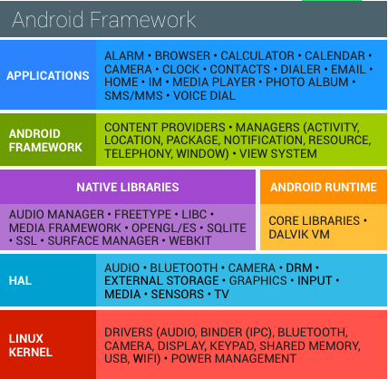
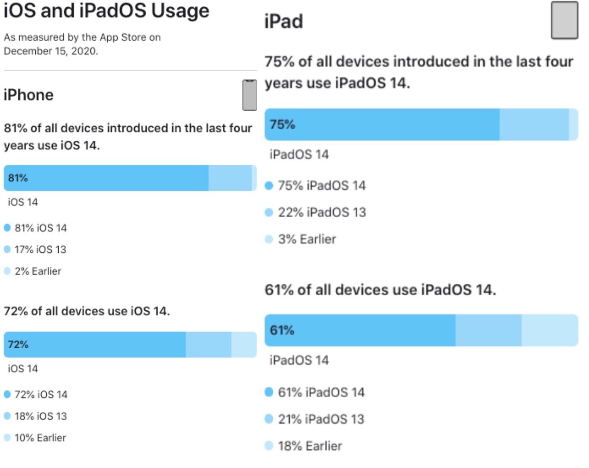
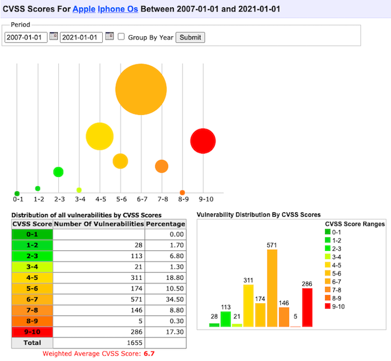
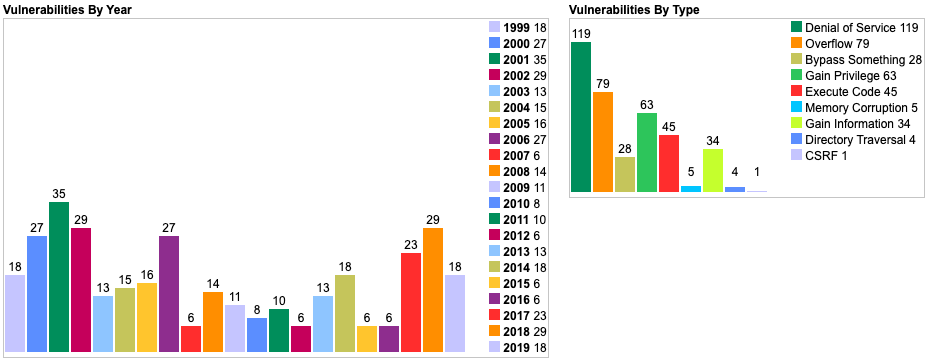
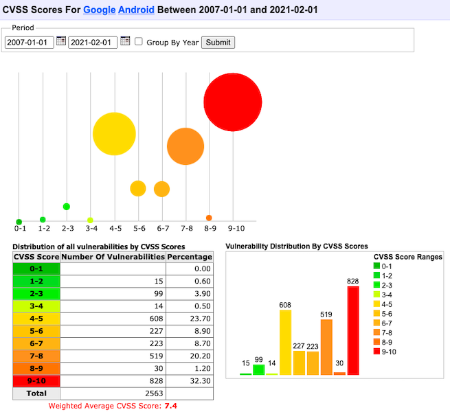
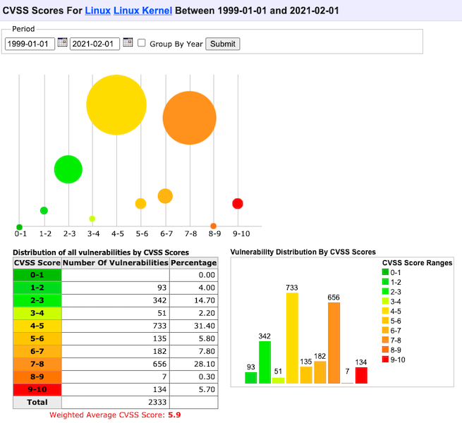

# 第五章 智能终端操作系统安全基础

---

## 温故

* 移动通信安全简史
* 物联网总体架构与典型威胁
* 蓝牙与智能硬件安全案例

---

## 知新

* 智能终端概述
* 以史为镜
    * iOS 系统安全历史概述
    * Android 系统安全历史概述
* Android 应用安全实验环境搭建

# 智能终端概述

---

## 智能终端早期定义

根据 `中国电子技术标准化研究院` 发布的 [智能终端白皮书（2014年修订版）](http://www.cac.gov.cn/files/pdf/baipishu/ITwhitepaper.pdf)

> 智能终端主要表现形式有：智能电视、智能机顶盒、智能手机、平板电脑等

> 智能终端包含的主要要素：高性能中央处理器、存储器、 **操作系统** 、应用程序和网络接入

---

## 智能终端内涵发展

根据 IDC 中国在 2020 年 12 月 10 日发布的 [《“颠覆”，IDC发布2021年中国智能终端市场10大预测》](https://www.idc.com/getdoc.jsp?containerId=prCHC47146720) 

> 连接、交互、屏幕等一系列新兴技术正逐渐应用于智能终端设备

* 连接：5G, `Wi-Fi 6`, 蓝牙等
* 交互：多模交互，例如体感控制、语音控制、触摸控制等
* 屏幕：AR/VR/MR, 投影为代表的大屏, 可穿戴设备为代表的小屏幕等

---

## 智能终端的百花齐放

* 老三样依然主流：智能电视、智能手机、平板电脑
* 物联网大发展带来智能终端百花齐放
    * 智慧教育：支持丰富互动能力的电子白板、3D 打印
    * 商用终端：无人售货柜、移动办公解决方案
    * 智能家居：基于声光红外等传感装置和无线网络连接能力的智能化家电终端
        * 空调、冰箱、洗衣机、电饭锅、豆浆机、窗帘、照明等

---

## 全平台操作系统市场占有率统计

---

## 智能手机操作系统全球市场占有率统计

---

本课程要深入展开讲解的智能终端设备为智能手机平台。

# Android

---

## Android 生态圈——设备 {id="android-devices"}

---

## Android 生态圈——设备（全球） 2020.8 {id="android-devices-global-current"}

---

## [Android支持设备屏幕尺寸规范](https://developer.android.com/guide/practices/screens_support.html?hl=zh-cn)（1/3） {id="android-devices-resolution-1"}

* 屏幕尺寸
    * 按屏幕对角测量的实际物理尺寸
        * 为简便起见，Android 将所有实际屏幕尺寸分组为四种通用尺寸：小、 正常、大和超大
* 屏幕密度
    * 屏幕物理区域中的像素量；通常称为 dpi（每英寸 `像素点数`）。例如， 与“正常”或“高”密度屏幕相比，“低”密度屏幕在给定物理区域的像素较少。
        * 为简便起见，Android 将所有屏幕密度分组为六种通用密度： 低、中、高、超高、超超高和超超超高。

---

## [Android支持设备屏幕尺寸规范](https://developer.android.com/guide/practices/screens_support.html?hl=zh-cn)（2/3） {id="android-devices-resolution-2"}

* 方向
    * 从用户视角看屏幕的方向，即 `横屏` 还是 `竖屏`，分别表示屏幕的纵横比是宽还是高。请注意， 不仅不同的设备默认以不同的方向操作，而且 方向在运行时可随着用户旋转设备而改变
* 分辨率
    * 屏幕上物理像素的总数。添加对多种屏幕的支持时， 应用不会直接使用分辨率；而只应关注通用尺寸和密度组指定的屏幕 尺寸及密度。

---

## [Android支持设备屏幕尺寸规范](https://developer.android.com/guide/practices/screens_support.html?hl=zh-cn)（3/3） {id="android-devices-resolution-3"}

* 密度无关像素 (dp - density-independent pixels)
    * 在定义 UI 布局时应使用的虚拟像素单位，用于以密度无关方式表示布局维度或位置
    * 1 dp 约等于中密度屏幕（160dpi；“基准”密度）上的 1 像素。对于其他每个密度，Android 会将此值转换为相应的实际像素数

---

## Android 生态圈——设备（国内） 2021.2 {id="android-devices-domestic-current"}

---

## Android 版本分布情况（全球） 2021.2 {id="android-distributions-global-1"}

---

## Android 版本分布情况（全球） 2021.2 {id="android-distributions-global-2"}

* 以 Android 4.4 `KitKat` 为例，发布于 2013 年 10 月，截止 2017 年 11 月，全球范围内仍然有 13.8% 的设备还在运行着 4 年前的“旧”系统
* 以 Android 7.0 `Nougat` 为例，发布于 2016 年 8 月，截止 2021 年 2 月，全球范围内仍然有 11.2% 的设备还在运行着 4 年前的“旧”系统
    * `11.2% = 84.9% - 73.7%`

> 新版本系统更新部署到终端设备周期较长

---

## Android 版本号基础知识 {id="android-codename-version-tips"}

* 平台代号 `Codename` 从 2014 年 `Android 5 (Lollipop)` 开始，每年一个新版本代号发布
* 版本 `Version`
* API 级别 `API level`

---

## Android Open Source Project (AOSP) 

* AOSP 包括 Android 开源项目的开发者、工作流程和源代码
* [大部分 Android 组件源代码都采用 Apache License, Version 2.0](https://source.android.com/setup/start/licenses) ，但也有部分用到的组件采用的其他开源授权协议。例如 Linux 内核补丁相关源代码就采用的 GPLv2 授权协议
* 根据上述 AOSP 的授权协议，第三方设备厂商可以自由使用 Android 开源代码于自己的设备
* `Android Compatibility Program` 用于不同厂商生产的设备可以兼容 Android 应用程序的一个认证标准，只有认证设备才可以使用 `Android` 商标
* 只有获得 `Android 兼容计划` 认证的设备才能向 Google **申请使用** `Google Play` 服务和随设备分发 `Google Mobile Services`
    * `Google Play` 和 `Google Mobile Services` 均是 Google 的 **私有闭源软件**

---

## Android 生态圈——厂商 {id="android-manufactures"}

* 设备
    * 根据 `AOSP` 授权协议可以制造所有类型设备
    * 如果需要获得 `Android 兼容性认证` ，则需要对照认证标准配备必要硬件
* 系统
    * 基于开源授权协议标准自行修改和使用
* 分发渠道
    * 设备厂商自主控制

---

## Android 版本分布情况（国内） 2021.2 {id="android-distributions-domestic"}

---

## Android 系统软件技术栈 {id="android-software-stack"}

---

## Android 生态圈——总结

* Google 主导的全面开放生态圈
* 以 `Android` 操作系统为核心的全面多行业发展
* 多样化的设备、系统与应用
* 开发者要面临碎片化应用运行平台
* 国内消费者只能使用定制化的安卓系统
    * 是否能及时升级系统，安装系统级别的安全更新完全取决于设备厂商
    * 部分设备厂商只知道每年推出多款新设备，却普遍忽视对已有设备上系统的持续更新维护

# iOS

---

## Apple 生态圈 {id="apple-ecosystem"}

* 移动端、平板、桌面计算平台、可穿戴设备- [iOS + iPadOS + macOS + watchOS = continuity](https://www.apple.com/macos/continuity/)
    * 软硬一体 by Apple
* 智能电视 - [tvOS](https://developer.apple.com/tvos/)
* 物联网 - 智能家居 - [Apple HomeKit](https://www.apple.com/ios/home/)
    * 通信接口标准 by Apple ， **终端硬件设备第三方生产**
    * 智能音箱 - [HomePod](https://www.apple.com/homepod/) , 软硬一体 by Apple
* 智能无线耳机 - [AirPods 系列](https://www.apple.com/ae/airpods/) ：『计算音频』代表作
* 智能驾驶
    * [控制软件 CarPlay](https://www.apple.com/ae/ios/carplay/)  -> 无人驾驶 -> Apple Car

---

## iOS 版本分布情况（官方数据） 2020.12 {id="ios-distributions-official"}

---

## iOS 版本号基础知识 {id="ios-version-tips"}

* 2010 年 6 月正式发布的 iOS 4 开始，原 `iPhone OS` 正式重命名为 `iOS`
* 2015 年 9 月正式发布的 iOS 9 开始，原用于 `AppleTV` 的系统被正式命名为 `tvOS`
* 2019 年 9 月正式发布的 iOS 13 开始，用于 `iPad` 的 `iOS` 被重命名为 `iPadOS`
* 每年发布一次 iOS 大版本更新

---

## iOS 版本分布情况（国内） 2021.2 {id="ios-distributions-domestic"}

---

## macOS vs. iOS 内核架构 {id="macos-ios-kernel-arch"}

> Cocoa --> Cocoa Touch

---

## iOS 系统组成与开源

* `Core OS`
    * 基于 `FreeBSD` 和 `Mach` 所改写的 `Darwin`，是开源、符合 `POSIX` 标准的一个 `Unix` 核心
    * 提供了整个 `iOS` 的一些基础功能
        * 例如：硬件驱动, 内存管理，程序管理，线程管理（`POSIX`），文件系统，网络（`BSD Socket`），以及标准输入输出等等
        * 所有这些功能都会通过 `C` 语言的 `API` 来提供。
* `Core OS` 层的驱动也提供了硬件和系统框架之间的接口。然而，由于安全的考虑，只有有限的系统框架类能访问内核和驱动

---

## iOS 版本迭代周期 —— 怎一个快字了得 {id="ios-version-release-date-history"}

---

## iOS 生态圈——厂商 {id="ios-manufactures"}

* 设备
    * `Apple` 官方授权允许汽车、智能家居领域厂商
* 系统
    * `Apple` 官方唯一维护
        * 智能家居领域通过 `HomeKit` 只定义通信接口标准
* 分发渠道
    * `Apple` 官方未授权允许任何第三方应用商店，仅允许企业级应用的自行分发和授权模式

---

## iOS 生态圈——总结 {id="ios-ecosystem-summary"}

* `Apple` 强势主导的有限开放生态圈
* 应用多样性发展逐渐落后于 `Android` 生态圈
    * 电视、盒子、投影设备、智能家居等

# iOS 系统安全概述 {id="ios-sys-security"}

---

## iOS 历年 CVE 统计 {id="history-cve-of-ios"}

---

## iOS 历年 CVE 统计 {id="history-cvss-of-ios"}

---

## FreeBSD 历年 CVE 统计 {id="history-cve-of-freebsd"}

---

## FreeBSD 历年 CVE 统计 {id="history-cvss-of-freebsd"}

---

## iOS 系统安全特性发展变迁简史 {id="history-of-ios-security-1"}

# Android 系统安全概述 {id="android-sys-security"}

---

## Android 历年 CVE 统计 {id="history-cve-of-android"}

---

## Android 历年 CVE 统计 {id="history-cvss-of-android"}

---

## Linux 内核历年 CVE 统计 {id="history-cve-of-linux"}

---

## Linux 内核历年 CVE 统计 {id="history-cvss-of-linux"}

---

## Android 系统安全特性发展变迁简史 {id="history-of-android-security-1"}

# Android vs. iOS 面临的威胁 {id="android-vs-ios-threats"}

---

# 智能终端操作系统与桌面终端操作系统安全问题与形势的区别与联系

---

# Android 应用安全实验环境搭建 {id="setup-android-security-lab"}

