# 第六章 Android 系统访问控制策略与机制

---

## 温故

* 「开放」的 Android 生态
* 智能终端操作系统的安全问题与形势特点

---

## 知新

* 掌握 Android 平台安全设计思想
* 了解 Android 平台实现关键技术
* 掌握 Android 应用开发基本概念
* 了解 Hello World 程序编写

# Android 平台

---

## 平台包含的主要组件

* 设备硬件：智能手机、平板电脑、手表、汽车、智能电视、OTT 游戏盒和机顶盒等，不包含处理器
* Android 操作系统：来自 `AOSP` 和设备 `OEM` 厂商的定制修改
* Android 应用运行时
    * 预先安装的应用：来自 `AOSP`、`GMS` 和设备 `OEM` 厂商
    * 用户安装的应用

---

## Android 开发团队的「持续」安全改进措施 {id="continuous-devopssec-by-android"}

* 设计审核
* 渗透测试和代码审核
* 开放源代码和社区审核
* 事件响应
* [每月安全更新](https://source.android.com/security/bulletin/)
    * 2015 年 8 月开始
* [Android 各个版本的安全改进汇总](https://source.android.com/security/enhancements/?hl=en)

# Android 平台安全威胁概述 {id="android-platform-threats"}

---

[本章 Android 平台安全相关内容主要基于 Android 官方安全和隐私小组 2020 年 12 月更新的公开论文](https://arxiv.org/abs/1904.05572)

---

## 移动终端区别于 PC 平台的威胁来源 {id="different-threats-to-pc"}

* 物理设备遗失或被盗风险
* 连入不可信网络
* 更多隐私威胁
    * 随身携带的移动终端存储和处理更多用户个人隐私信息（例如位置信息、通讯录、通话和聊天记录历史等）

---

## 物理安全威胁内涵

* 丰富多样化的硬件设备形态：手机、可穿戴设备、物联网终端、汽车、电视等等
* 本课程所指的「物理接触风险」主要包括两种物理接触形式，并统一用 `P` 来指代物理安全相关风险
    * 直接接触： `physical` access ，可以直接通过肢体接触到目标设备
    * 靠近接触： `proximal` access ，距离上在设备开启的 `WPAN` 或 `WLAN` 有效信号覆盖范围内可以访问到目标设备。
        * 通过蜂窝网络 `伪基站` 技术访问到目标设备也属于此类接触类型

---

### 物理安全威胁分类定义 T.P1

* 屏幕处于锁定或解锁状态的设备，无法被 **直接接触**
    * 例如通过蓝牙方式攻击设备
        * [BlueBorne - 2017](https://www.armis.com/blueborne/)
        * [BadBluetooth - 2019 on NDSS](https://www.ndss-symposium.org/ndss-paper/badbluetooth-breaking-android-security-mechanisms-via-malicious-bluetooth-peripherals/)
        * [BlueFrag - CVE-2020-0022](https://insinuator.net/2020/02/critical-bluetooth-vulnerability-in-android-cve-2020-0022/)
        * [BlueRepli - on Blackhat USA 2020](https://i.blackhat.com/USA-20/Wednesday/us-20-Xu-Stealthily-Access-Your-Android-Phones-Bypass-The-Bluetooth-Authentication.pdf)
    * `NFC` 通信虽然传输距离通常很短，但也被归属于此类威胁类型

---

### 物理安全威胁分类定义 T.P2

* 已关机设备，被 **直接接触**
    * 通常需要非常高的攻击技术才能实现漏洞利用的场景
    * 例如：海关或边境安全检查

---

### 物理安全威胁分类定义 T.P3

* 已锁屏设备，被 **直接接触**
    * 例如被盗设备

---

### 物理安全威胁分类定义 T.P4

* 已解锁屏幕设备，被分享给非机主使用
    * 滥用风险

---

### 网络（接入）安全威胁分类 T.N1

* 被动监听和流量分析
    * 本课程第三章主要内容，例如 `Wi-Fi 嗅探`

---

### 网络（接入）安全威胁分类 T.N2

* 主动网络流量控制
    * 本课程第三章主要内容，例如 `Wi-Fi 中间人攻击`
    * 《网络安全》课程 `第四章 网络监听` 提到的 SSL/TLS 中间人劫持攻击
* 和 `T.P1` 的主要区别
    * `T.P1` 依赖于 **距离目标设备较近** ，`T.N2` 可以在目标设备 **通信链路中任意一个环节** 下手
    * `T.P1` 只影响 **目标设备** ，`T.N2` 可以影响通信链路上 **所有设备**

---

## 不可信代码执行

* 不同于 `iOS` 平台对 `App` 的管控机制：集中验证和封闭分发
    * 只要 **用户允许**，用户可以从任意应用分发渠道下载并安装应用（ **A**pplication ）
    * 不同应用分发渠道的应用审核标准和机制 **不统一** ：各自为政、良莠不齐

---

### 不可信代码执行威胁分类 T.A1

* 滥用 **操作系统提供** 的 API 来完成恶意用途
    * 例如：间谍软件

---

### 不可信代码执行威胁分类 T.A2

* 滥用设备上 **其他已安装应用提供** 的 API 来完成恶意用途

---

### 不可信代码执行威胁分类 T.A3

* Web 前端脚本代码执行未经用户明确授权
    * 例如 `JavaScript`

---

### 不可信代码执行威胁分类 T.A4

* 仿冒系统或第三方应用「用户界面」或「交互设计」进行钓鱼
    * 典型如套取用户的口令

---

### 不可信代码执行威胁分类 T.A5

* 通过「用户界面」读取系统或第三方应用中的（敏感）内容
    * 例如「截图应用」

---

### 不可信代码执行威胁分类 T.A6

* 模拟用户交互输入（点击、滑屏、输入等操作）控制系统软件或第三方应用程序的用户界面

---

### 不可信代码执行威胁分类 T.A7

* 系统漏洞利用程序
    * 例如利用操作系统内核、驱动或系统服务漏洞实现「提权」

---

### 不可信内容处理威胁分类 T.D1

* 滥用「唯一标识」用于定向攻击
    * 即使是在受信任网络内，依然可以通过关联手机号、电子邮件地址和位置信息等实现精准垃圾广告推送

---

### 不可信内容处理威胁分类 T.D2

* [操作系统或第三方应用在处理不可信内容时触发漏洞执行代码](https://www.kb.cert.org/vuls/id/924951)
    * 典型的漏洞利用方式是将 `攻击载荷` 嵌入在多媒体文件中，当存在漏洞的播放器打开该恶意多媒体文件时触发漏洞。此类威胁可能导致本地或远程代码执行漏洞
        * [2015 年报告的针对 Android 2.2 系统多媒体组件 StageFright 的漏洞利用](https://resources.infosecinstitute.com/topic/hack-android-devices-using-stagefright-vulnerability/)
        * [CVE-2019–2107 Android 7–9 的多媒体处理框架漏洞利用](https://medium.com/@marcinguy/android-7-9-media-framework-vulnerability-allows-mobile-hacking-6f023881c045)
        * [2019 年 2 月 Android 月度更新修复的 PNG 处理框架漏洞影响 Android 7-9](https://source.android.com/security/bulletin/2019-02-01.html)

# Android 平台安全模型设计 {id="android-platform-security-model-design"}

---

## 安全模型设计指导思想

> **平衡** 用户与应用、平台之间的安全和隐私需求

---

## 安全模型设计基本原则

1. 多方许可
2. 开放生态访问
3. 安全是兼容性需求之一
4. 出厂设置能保证恢复设备到安全状态
5. 应用程序安全为主

---

### 1. 多方许可 {id="multi-party-consent-1"}

* 多方：（终端）用户、（操作系统和硬件驱动）平台、（应用）开发者
    * 不同于传统 PC 平台访问控制的经典「主客体」模型
        * 以自由访问控制模型为例，`谁创建、谁有权限使用`
* 移动终端上的「多方参与」访问控制模型，以数据生命周期为例
    * 共享存储中的数据由用户管理访问（控制授权）
    * 应用私有目录和应用虚拟地址空间中的数据由应用管理访问（控制授权）
    * 在特殊系统目录中的数据由平台管理访问（控制授权）
        * 例如列举应用被授予的权限列表
* 多方许可意味着「任何数据访问行为均需要所有参与方许可授权」才可执行

---

### 1. 多方许可 {id="multi-party-consent-2"}

* 移动终端的「数据所有者」更偏重是一个 **法律** 概念
* 多方许可模型不是一个完备模型，存在多种应用场景违反多方许可原则
    * 数据备份场景中应用私有数据未经应用开发者许可即可被备份
    * VPN 应用可以监视和控制系统全局流量无需应用开发者许可
    * 企业管控场景可以通过定义 `Device Owner (DO)` 或者 `Profile Owner (PO)` 来限制用户在设备上安装和使用软件

---

### 2. 开放生态访问

* 用户和应用开发者可以自由使用不同渠道的应用商店下载安装应用和上传分发应用
* 不限制唯一的应用审核渠道
* 允许应用间的协同和互操作
* 开发者可以自由定义开放给其他应用的 API

---

### 3. 安全是兼容性需求之一

* Android 安全模型本身也是 Android 规范的组成内容
    * 定义包含在 [Compatibility Definition Document (CDD)](https://source.android.com/compatibility/cdd)
        * 例如 [Android 10 兼容性定义的第 9 章就是安全模型兼容性](https://source.android.com/compatibility/10/android-10-cdd#9_security_model_compatibility)
    * 由 Compatibility (CTS, Compatibility Test Suite), Vendor (VTS, Vendor Test Suite) 和其他测试规范来检验和确保兼容
* 不遵循 CDD 且未通过 CTS 的设备不能被称为 Android 
    * `root` 设备由于破坏了原有的沙盒隔离机制，因此不被认证为 Android
    * `booloader` 解锁设备和刷入自定义固件的设备也不被认证为 Android

---

### 4. 出厂设置能保证恢复设备到安全状态

* 为了应对系统被攻陷、篡改的风险，依赖于被保护分区的完整性保护机制，出厂设置就是清除或重新格式化可写数据分区
* 系统软件无需重新安装
* `验证启动` 机制将决定恢复出厂设置会还原设备到哪个“备份”状态

---

### 5. 应用程序安全为主

* 和传统 PC 平台应用是运行在「已登录用户」上下文环境
    * 勒索软件并不需要管理员权限即可感染当前登录用户有权限访问的所有应用和应用数据
* 移动终端应用默认没有获得完全用户授权
    * 沙盒化应用程序的进程间隔离、数据存储隔离等

# Android 平台安全模型实现 {id="android-platform-security-model-implementation"}

---

## 架构设计基本原则

1. 纵深防御 `defense in depth` - `DiD`
2. 设计安全 `safe by design` - `SD`

---

## 纵深防御四大安全策略

1. 隔离和抑制 `isolation and containment`
2. 漏洞利用缓解 `exploit mitigation` 
3. 完整性（保护） `integrity` 
4. 补丁/更新 `patching/updates`

---

## 设计安全三大安全策略

1. 强制许可制 `enforced consent`
2. 用户认证 `user authentication` 
3. 缺省存储和传输加密 `by-default encryption at rest and in transit`

# SD.1 强制许可制

---

## 确保「易于理解」的许可

* `许可`（`授权`）的表达方式应 **易于** 「三方」 **无歧义** 正确理解并执行
    * 用户
    * 开发者
    * Android 平台
* 三方中的任意一方 **不许可** 则目标操作将无法执行成功
* 两个例子
    * 在不同应用间共享数据
    * 变更 `移动网络运营商配置`
        * MNO, Mobile Network Operator

---

### 在不同应用间共享数据——体现「用户许可」 {id="sharing-bt-apps-user"}

* `用户` 在分享对话窗口里「选择」目标应用接受当前分享内容

---

### 在不同应用间共享数据——体现「开发者许可」 {id="sharing-bt-apps-developer"}

* 分享 `来源` 应用的 `开发者` 通过 `UI&UE` 设计，告知 `用户` 当前应用内「哪些内容」 **允许** 被分享出去
* 分享 `目标` 应用的 `开发者` 自行决定是否接收、如何处理接收到的分享数据内容

---

### 在不同应用间共享数据——体现「平台许可」 {id="sharing-bt-apps-platform"}

* 平台通过 `访问控制策略和机制`
    * **判定** 不同组件间的数据访问是否被 **允许**
    * **确保** `目标` 应用只能访问到 `来源` 应用 **显式** 分享的数据内容
        * 除了明确分享出来的数据之外，`来源` 应用的任何其他数据无法被越权访问到

---

### 变更移动网络运营商配置——体现「用户许可」 {id="mno-config-by-user"}

* `用户` 通过在设置对话窗口中的「开关选项」来变更许可

---

### 变更移动网络运营商配置——体现「开发者许可」 {id="mno-config-by-developer"}

* `MNO` 应用的开发者通过编程：查询平台访问控制策略后，借助 `UI&UE` 提供给用户可以进行许可变更的选项

---

### 变更移动网络运营商配置——体现「平台许可」 {id="mno-config-by-platform"}

* 平台确保 `用户` 通过 `MNO 应用` 发起的变更操作是合法、无违规的
    * 不同国家的无线电频率使用管制策略差异
    * 配置变更不会影响到平台或网络稳定性

# 开发者视角的请求用户许可授权

---

## 在 Android 上声明和请求运行时权限的工作流 {id="runtime-user-consent"}

[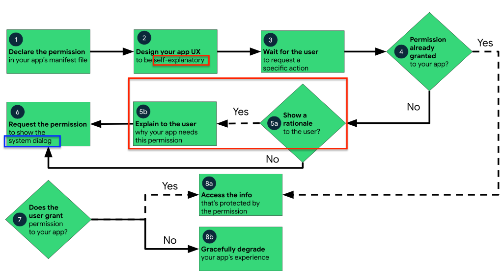](https://developer.android.com/training/permissions/requesting?hl=zh-cn)

---

## 开发者向用户申请代码执行许可 —— 开发阶段 {id="developer-req-consent-from-user-1"}

1. 在应用的清单文件中，[声明应用可能需要请求的权限](https://developer.android.com/training/permissions/declaring?hl=zh-cn)
    * 如果是安装时权限（例如普通权限或签名权限），系统会在用户安装应用时自动为其授予相应权限
    * 如果是运行时权限，并且用户将应用安装在 Android 6.0（API 级别 23）或更高版本的设备上，则应用程序开发者必须自己向用户请求权限
2. 设计应用的用户体验，使应用中的特定操作与特定运行时权限相关联。应当让用户知道哪些操作可能会要求他们为您的应用授予访问用户私人数据的权限。

---

## 开发者向用户申请代码执行许可 —— 用户使用阶段 {id="developer-req-consent-from-user-2"}

3. 等待用户调用应用中需要访问特定用户私人数据的任务或操作
4. 每次执行需要该权限的操作时，应用必须检查自己是否具有该权限。如果已授权，那么该应用可以访问用户私人数据。如果没有，则开始『申请用户授权流程』
5. Android 平台允许开发者的部分权限申请添加一段 **自我解释说明文本** ，目的是 **便于用户理解** 即将授权当前应用获得哪些权限、意味着什么

---

## 开发者向用户申请代码执行许可 —— 平台授权阶段 {id="platform-consent-from-user"}

6. 无论是否使用 **自我解释说明文本** ，`平台` 会使用 **统一** 的 **系统原生** 运行时权限 **提示对话框** 来将最终授权操作交给 `用户`
    * 避免开发者伪造「挂羊头卖狗肉」的权限申请对话框「骗取」用户的过度授权
    * 开发者向用户发起授权请求，用户依赖于 `平台授权` 保障体系确保 **正确无误** 的给予（开发者开发的）应用授权
        * 平台授权依赖于 **不同保护级别** 的 `Android 权限` 体系，详见 `DiD.1 隔离和抑制` 一节的 `访问控制`

---

## 开发者向用户申请代码执行许可 —— 用户完成授权 {id="developer-req-consent-from-user-3"}

7. 应用代码检查用户的响应，用户可能会选择同意或拒绝授予运行时权限
8. 如果用户向当前应用授予权限，则当前应用就可以访问用户私人数据

---

## 开发者向用户申请代码执行许可 —— 用户拒绝授权 {id="developer-req-consent-from-user-4"}

8. 如果用户拒绝授予该权限，Android 官方文档建议开发者适当降低应用体验，使应用在未获得受该权限保护的信息时也能向用户提供功能

---

### 来自 Android 官方开发指南的特别说明 {id="permission-tips-1"}

> 从 Android 11（API 级别 30）开始，在应用安装到设备上后，如果用户在使用过程中多次针对某项特定的权限点按拒绝，那么在当前应用再次请求该权限时，用户将不会看到系统权限对话框。该操作表示用户希望“不再询问”。在之前的版本中，除非用户先前已选中“不再询问”对话框或选项，否则每当应用请求权限时，用户都会看到系统权限对话框

---

### 来自 Android 官方开发指南的特别说明 {id="permission-tips-2"}

> 在某些情况下，系统可能会自动拒绝权限，而无需用户执行任何操作（同样，系统也可能会自动授予权限）

> 如果应用以 Android 11（API 级别 30）或更高版本为目标平台并且数月未使用，系统会通过自动重置用户已授予应用的运行时敏感权限来保护用户数据

---

### 来自 [Android 官方安全和隐私小组 2020 年 12 月更新的公开论文](https://arxiv.org/abs/1904.05572) 建议

> Achieving meaningful user consent is by far the most difficult and nuanced challenge in determining meaningful consent

---

### 来自 [Android 官方安全和隐私小组 2020 年 12 月更新的公开论文](https://arxiv.org/abs/1904.05572) 建议

* 避免过度提醒用户许可：以免用户「弹框疲劳」和「盲目授权」
* 用户许可提示应易于理解：避免使用专家型术语
* 使用「选择器」和「一次性许可」，避免过度索取许可授权
    * 举例：访问通讯录中特定联系人信息
* 操作系统不应将难题丢给用户
* 提供用户「反悔」能力：授权是可以随时被 **撤销** 的

# SD.2 用户认证

---

## 基本需求

* 对于移动终端来说，主要实现方式是系统内置的「锁屏」程序
* 典型的「安全性」与「易用性」平衡设计需求

---

### 多种锁屏认证因素

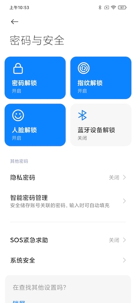

* 口令解锁 - what you know, `knowledge`
    * 图案/数字/混合（支持字符）
* 指纹解锁 - what you are `biometrics`
* 人脸解锁 - what you are `biometrics`
* 蓝牙设备解锁 - what you have

---

### 定期强制输入口令解锁，避免遗忘

* 口令是设备对用户的「**信任根**」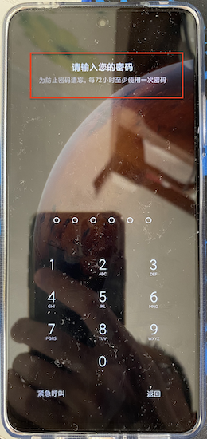
    * user-to-device `U2D`
* 分层认证模型（`tiered authentication model `）
    * 主认证 `Primary` Authentication ，只支持 `knowledge` 因素
    * 辅助认证   `Secondary` Authentication，只支持 `biometrics` 因素
    * 第三方认证 `Tertiary` Authentication

---

### 基于生物认证因素的认证安全性等级划分

* 等级划分依据
    * 抗欺骗性：Spoof Acceptance Rate, SAR
    * 架构安全性：生物特征数据处理的全生命周期抗嗅探和篡改能力
* 依据上述两方面指标划分成[三个安全级别](https://source.android.com/security/biometric/measure)
    * strong vs. weak vs. convenience
* 仅使用基于生物认证因素解锁屏幕后依然无法执行某些特权操作
    * 基于文件或全盘加密的用户数据分区不会被自动解密（第一次启动系统后，需要先进行口令认证才能解锁加密的用户数据分区）

---

### [Android 11 支持基于生物认证因素的精细化授权](https://developer.android.com/about/versions/11/features#biometric-auth)

* Android 11 引入了 [BiometricManager.Authenticators](https://developer.android.com/reference/kotlin/android/hardware/biometrics/BiometricManager.Authenticators) 接口，开发者可用于声明 [应用支持的身份验证类型](https://developer.android.com/training/sign-in/biometric-auth#declare-supported-authentication-types)
* 未来，通过不同安全性等级的身份认证因素解锁设备可以使用到不同安全等级的功能
* 不同安全等级的功能可以强制要求对应安全性等级的身份认证因素

---

### 基于生物因素的身份认证低安全性级别提示

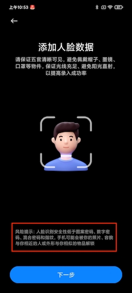

---

## Android 设备本身作为第三方认证因素 {id="android-as-third-auth"}

* 网页端或其他应用可以使用受信任 Android 7+ 设备作为「辅助认证因素」
* 设备间认证凭据：device-to-device, `D2D` authentication

# SD.3 数据加密

---

* 持久化存储数据加密
* 通信数据加密

---

## 持久化存储数据加密 {id="safe-by-rest-1"}

* 当系统内核没有运行或 **被绕过**（例如直接读取持久化存储介质），如何实现 `多方许可` 和 `安全合规`
    * Anroid 5.0 全盘加密技术（Full Disk Encryption, FDE），拟解决 [T.P2] ，但不解密磁盘无法使用紧急呼叫、无障碍访问辅助服务、闹钟等低安全风险功能
    * Android 7.0 引入基于文件的选择加密（File Based Encryption, FBE），解决了上述全盘加密技术的不足之处

---

## 持久化存储数据加密 {id="safe-by-rest-2"}

* 当系统内核没有运行或 **被绕过**（例如直接读取持久化存储介质），如何实现 `多方许可` 和 `安全合规`
    * Android 10.0 新增 [Adiantium](https://source.android.com/security/encryption/adiantum) 支持，可以在缺少 AES 硬件加速功能的设备上以更低的计算资源消耗获得不变的 AES 加密效果
        * Android 9 需要自行手动给内核打补丁并重新编译内核
    * Android 10 起，默认系统所有数据启用全盘加密

---

## 持久化存储数据加密 {id="safe-by-rest-3"}

* 开启全盘加密后，实现 `出厂设置能保证恢复设备到安全状态` 无需再抹除用户数据，只需删除加密用主密钥即可

---

## 通信数据加密改进历程 {id="network-sandboxing-1"}

| 引入版本 | 改进措施                                  | **拟解决** 的威胁 |
| :-       | :-                                        | :-                |
| 6.x      | $^0$ 代码级别明文通信声明                 | [T.N1][T.N2]      |
| 7.x      | 网络安全配置项增加 TLS 和明文通信设置选项 | [T.N1][T.N2]      |

* $^0$ 清单文件中使用 [`usesCleartextTraffic`](https://developer.android.com/guide/topics/manifest/application-element#usesCleartextTraffic) 来显式声明应用是否支持明文通信
    * 对于目标 API 级别为 27 或更低级别的应用，默认值为 `true`。对于目标 API 级别为 28 或更高级别的应用，默认值为 `false`
    * 如果将此属性设为 `false`，平台组件（例如 HTTP 和 FTP 堆栈、DownloadManager 和 MediaPlayer）将拒绝应用要使用明文流量的请求。但这只是一个 `尽力而为` 选项，并非所有组件都遵守该字段声明

---

## 通信数据加密改进历程 {id="network-sandboxing-2"}

| 引入版本 | 改进措施                                                        | **拟解决** 的威胁 |
| :-       | :-                                                              | :-                |
| 9.0      | $^1$ DNS-over-TLS                                               | [T.N1][T.N2]      |
| 9.0      | 所有连接默认使用 TLS                                            | [T.N1][T.N2]      |
| 10       | 客户端模式, SoftAP 和 WiFi Direct 模式均默认使用 MAC 地址随机化 | [T.N1]            |
| 10       | 新增 `TLS 1.3` 支持                                             | [T.N1][T.N2]      |

* $^1$ [DNS-over-TLS](https://android-developers.googleblog.com/2018/04/dns-over-tls-support-in-android-p.html)

# DiD.1 隔离和抑制

---

## 访问控制

* 自由访问控制 Discretionary Access Control (DAC)
    * 开发者许可
* 强制访问控制 Mandatory Access Control (MAC)
    * 平台许可
* Android 权限 [Android permissions](https://developer.android.com/guide/topics/permissions/overview)
    * 用户许可

---

### Android 权限 {id="android-permissions-1"}

* 仅审计权限 `Audit-only` ：应用权限保护级别为 `normal` ，属于 `安装时权限`
* 运行时权限 `Runtime` ：应用权限保护级别为 `dangerous` ，既需要在应用代码的清单文件里声明，也需要在代码里定义如何向用户申请授权许可
* 特殊访问权限 `Special Access` ：用户只能通过 `系统设置` 去变更授权许可，应用代码里无法声明和发起申请

---

### Android 权限 {id="android-permissions-2"}

* 系统级特权 `Privileged` ：只针对 `系统预装` 应用，通常是 `OEM` 通过白名单机制指定特定应用享有的系统级别特权。通常配合 `签名` 级别权限使用
    * `API Level 23` 之前版本，在应用清单文件被声明为 `<permission android:protectionLevel=signature|privileged>`
    * `API Level 23` 及之后版本，在应用清单文件被声明为 `<permission android:protectionLevel=signatureOrSystem>`
* 验证签名权限 `Signature` ：应用权限保护级别为 `signature` ，拥有相同签名的（系统或应用）组件才能相互访问/调用，无需告知或征得用户许可即可自动授权
    * 开发者可以依赖此机制保护自己编写的应用和组件（避免被其他应用或组件非授权访问）

---

### Android 权限 {id="android-permissions-3"}

* [开发者自定义当前应用权限](https://developer.android.com/guide/topics/manifest/permission-element) ，用于限制其他应用访问当前应用的特定组件或功能代码
    * `<permission>`
    * `<permission-group>`
    * `<path-permission>` `内容提供者` 组件专用的访问控制授权声明
* [开发者向用户请求授权许可](https://developer.android.com/guide/topics/manifest/uses-permission-element)
    * `<uses-permission>`
    * `<uses-permission-sdk-23>` `Android 6.0` 开始引入的运行时权限申请专用
* [设备软硬件特性兼容性检查](https://developer.android.com/guide/topics/manifest/uses-feature-element)
    * `<uses-feature>`

---

### Android 权限发展历史上的里程碑 {id="android-permissions-milestones"}

* `Android 6.0` (`API Level 23`) ：新增 `运行时权限` 类别，用户授权不再是安装时「一锤子买卖」，实现了「精细化授权」和「按需授权」
* `Android 10.0`(`API Level 29`) ：新增 `上下文权限` ，在原有二元化的 `允许` 与 `拒绝` 选项基础之上增加了 `仅在使用中允许`
* `Android 11` ：新增 `每次询问权限` 
* `Android 10.0` ：禁止应用直接读取设备唯一标识（`IMEI`）

---

### 国产安卓之荣光 {id="domestic-android-1"}

* `MIUI 12`（基于 `Android 10`）的 `空白通行证`
* `ColorOS 7`（基于 `Android 10`）的 `保护个人信息`
    * 当应用需要读取特定个人信息（通话记录、联系人、短信、日程表）时，系统将提供 **空信息**

---

### 国产安卓之荣光 {id="domestic-android-2"}

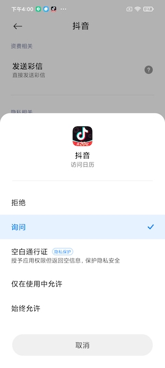

---

### 一点思考：空信息？

* 真的是返回 `空信息` 吗？`仿真信息` 是不是比 `空信息` 更好？

---

## 应用程序沙盒化改进历程 {id="app-sandbox-enhancements-1"}

| 引入版本 | 改进措施                      | **拟解决** 的威胁                            |
| :-       | :-                            | :-                                           |
| ≤ 4.3    | 进程隔离$^0$                  | [T.A3] 导致的 [T.N1][T.A2][T.A5][T.A6][T.A7] |
| 5.x      | SELinux$^1$                   | [T.A7][T.D2]                                 |
| 5.x      | 允许 Webview 组件代码独立更新 | [T.A3]                                       |

* $^0$ `UID 沙盒` 是历史最悠久、最基础的应用沙盒安全技术，是实现用户进程间隔离的最基础访问控制技术，不足之处已经通过后续版本的 SELinux 规则更新逐步完善加固
* $^1$ 用户空间应用程序全部默认启用 SELinux 规则，大幅度改善了用户进程和系统进程的隔离性。用户进程间隔离还是依赖于 UID 沙盒。SELinux 的主要优点在于 `可审计` 和 `可测试` ，从而可以大幅度增加安全需求兼容性测试项目数量

---

## 应用程序沙盒化改进历程 {id="app-sandbox-enhancements-2"}

| 引入版本 | 改进措施                                     | **拟解决** 的威胁 |
| :-       | :-                                           | :-                |
| 6.x      | 允许运行时用户授权                           | [T.A1]            |
| 6.x      | 基于 SELinux 的多用户支持                    | [T.P4]            |
| 6.x      | 应用私有目录缺省目录权限变更 0755 -> 0700    | [T.A2]            |
| 6.x      | 针对 ioctl 增加 SELinux 规则缓解内核漏洞利用 | [T.A7][T.D2]      |
| 6.x      | 移除应用访问 debugfs 权限缓解内核漏洞利用    | [T.A7][T.D2]      |
| 6.x      | 特殊权限类别定义范围变更$^2$                 | [T.A1][T.A4]      |

* $^2$ SYSTEM_ALERT_WINDOW, WRITE_SETTINGS, CHANGE_NETWORK_STATE 变更为特殊权限类别

---

## 应用程序沙盒化改进历程 {id="app-sandbox-enhancements-3"}

| 引入版本 | 改进措施                                                | **拟解决** 的威胁 |
| :-       | :-                                                      | :-                |
| 7.x      | 移除 /proc/<pid> 支持减少侧信道信息泄露                 | [T.A4]            |
| 7.x      | perf事件加固缓解内核漏洞利用                            | [T.A7]            |
| 7.x      | /proc 文件系统缺省访问规则改进                          | [T.A1][T.A4]      |
| 7.x      | OPA/MITM 方式更新加入的证书缺省不被信任                 | [T.N2]            |
| 8.x      | /sys 文件系统缺省访问规则改进                           | [T.A1][T.A4]      |
| 8.x      | 所有用户进程使用相同的 seccomp 过滤规则以缓解内核攻击面 | [T.A7][T.D2]      |
| 8.x      | 所有用户进程使用的 Webview 组件被移入独立进程           | [T.A3]            |
| 8.x      | 应用使用明文网络通信协议需用户知情同意                  | [T.N1]            |

---

## 应用程序沙盒化改进历程 {id="app-sandbox-enhancements-4"}

| 引入版本 | 改进措施                                                             | **拟解决** 的威胁        |
| :-       | :-                                                                   | :-                       |
| 9.0      | 应用可以单独设置独立的 SELinux 沙盒                                  | [T.A2][T.A4]             |
| 10       | 原则上只允许应用在可见活动窗口中启动新Activity且加入到前台“后退堆栈” | [T.A2][T.A3][T.A4][T.A7] |
| 10       | 外部存储上的文件访问仅限于应用拥有的文件                             | [T.A1][T.A2]             |
| 10       | 只有当前输入焦点应用或默认输入法应用才能读取剪贴板数据               | [T.A5]                   |
| 10       | /proc/net 访问控制进一步严格以缓解侧信道攻击                         | [T.A1]                   |
| 11       | 不再支持传统模式下的应用访问外部存储上的其他应用文件                 | [T.A1][T.A2]             |

---

## 系统进程沙盒化改进历程 {id="system-sandboxing-1"}

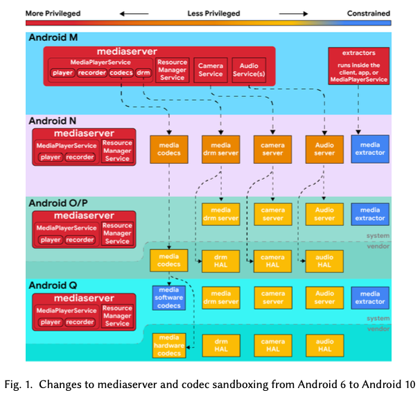

拟解决 [T.D2] 威胁

---

## 系统进程沙盒化改进历程 {id="system-sandboxing-2"}

| 引入版本 | 改进措施                                           | **拟解决** 的威胁  |
| :-       | :-                                                 | :-                 |
| 4.4      | 强制模式的 SELinux$^0$ 被应用于 4 个 root 权限进程 | [T.A1][T.A7][T.D2] |
| 5.x      | 用户态所有进程基于 SELinux 的 `MAC`                | [T.A1][T.A7]       |
| 6.x      | 所有进程基于 SELinux 的 `MAC`                      | [T.A1][T.A7]       |
| 7.x      | 架构层面解耦 `mediaserver` 服务                    | [T.A1][T.A7][T.D2] |
| 7.x      | 系统组件访问 `ioctl` 系统调用被限制                | [T.A1][T.A7][T.D2] |
| 8.x      | `Treble` 架构结构解耦$^1$                          | [T.A1][T.A7][T.D2] |

* $^0$ 4 个 root 权限进程被设置了 `强制访问控制（MAC, Mandatory Access Control）` 规则：installd, netd, vold, zygote
* $^1$ `HAL((Hardware Abstraction Layer)` 组件被拆分为独立进程，减少授权，限制访问硬件驱动

---

## 系统进程沙盒化改进历程 {id="system-sandboxing-3"}

| 引入版本 | 改进措施                                         | **拟解决** 的威胁 |
| :-       | :-                                               | :-                |
| 10       | 多媒体软件编解码器被移入到一个受限制沙盒         | [T.A7][T.D2]      |
| 10       | 引入 `BoundSan`$^2$ ，预防数组越界访问引起的漏洞 | [T.A7][T.D2]      |

* $^2$ [BoundsSanitizer(`BoundSan`)](https://source.android.com/devices/tech/debug/bounds-sanitizer) 将插桩添加到二进制文件，以插入对数组访问的边界检查。如果编译器在 **编译时** 无法证明访问将会是安全的，并且在运行时将会知道数组的大小，便会添加这些检查，以便对数组访问进行检查。Android 10 在蓝牙和编解码器中部署了 `BoundSan`。`BoundSan` 由编译器提供，在整个平台的各个组件中默认启用。

---

## 系统进程沙盒化改进历程 {id="system-sandboxing-4"}

| 引入版本 | 改进措施                                         | **拟解决** 的威胁 |
| :-       | :-                                               | :-                |
| 10       | 引入 `IntSan`$^3$                                | [T.A7][T.D2]      |
| 10       | 引入 `Scudo`$^4$                                 | [T.A7][T.D2]      |

* $^3$ [IntSan](https://source.android.com/devices/tech/debug/intsan) ，Android 7.0 中添加了 Clang 的 UndefinedBehaviorSanitizer (UBSan) 有符号和无符号整数溢出排错程序，以增强媒体框架。在 Android 9 中， UBSan 被扩展为涵盖更多组件，并改进了对它的编译系统支持。
* $^4$ [Scudo](https://source.android.com/devices/tech/debug/scudo)，是一个动态的用户模式内存分配器（也称为堆分配器），旨在抵御与堆相关的漏洞（如[基于堆的缓冲区溢出](https://cwe.mitre.org/data/definitions/122.html)、[释放后再使用](https://cwe.mitre.org/data/definitions/416.html)和[重复释放](https://cwe.mitre.org/data/definitions/415.html)），同时保持性能良好

---

## 系统内核沙盒化改进历程 {id="kernel-sandboxing-1"}

* 绝大多数内核漏洞利用的都是系统芯片上运行的硬件驱动程序缺陷
* 现有的内核漏洞缓解和加固措施集中在减少用户态进程访问内核驱动的机会
* 由于 Linux 内核是一个「宏内核」（`monolithic kernel `）架构，因此无法实现内核沙盒化
* 已有的缓解措施总结见下一页课件

---

## 系统内核沙盒化改进历程 {id="kernel-sandboxing-2"}

| 引入版本 | 改进措施                                                      | **拟解决** 的威胁 |
| :-       | :-                                                            | :-                |
| 5.x      | 引入 `PXN`$^0$ 机制                                           | [T.A7][T.D2]      |
| 6.x      | 内核线程被设置为SELinux强制执行模式，限制从内核访问用户态文件 | [T.A7][T.D2]      |
| 8.x      | 引入 `PAN`$^1$ 和 `PAN` 模拟机制                              | [T.A7][T.D2]      |

* $^0$ `PXN`, Privileged eXecute Never，内核态进程禁止执行用户态代码，预防 `ret2usr` 形式的漏洞利用技巧
* $^1$ `PAN`, Privileged Access Never，内核态进程访问用户态内存受到限制，仅允许通过 `copy-*-user()` 系列函数


---

## 系统内核沙盒化改进历程 {id="kernel-sandboxing-3"}

| 引入版本 | 改进措施                                                      | **拟解决** 的威胁 |
| :-       | :-                                                            | :-                |
| 9.0      | 引入 `CFI`$^2$                                                | [T.A7][T.D2]      |
| 10       | 引入 `SCS`$^3$                                                | [T.A7][T.D2]      |

* $^2$ `CFI`, [Control Flow Integrity](https://source.android.com/devices/tech/debug/cfi)，基于控制流「白名单」的函数调用限制
* $^3$ `SCS`, [Shadow Call Stack](https://source.android.com/devices/tech/debug/shadow-call-stack)，通过保护返回地址来实现调用堆栈深度回溯保护

---

## 内核层以下的沙盒化改进历程 {id="sandboxing-below-the-kernel-1"}

* 要解决的主要安全威胁（假设）：存在内核零日漏洞导致内核态保护隔离机制被攻陷
* 涉及到内核层以下的一些组件
    * TCB, Trusted Computing Base 可信计算基
    * TEE, Trusted Execution Environment 可信执行环境
    * 硬件驱动
    * 用户态组件 init, ueventd, and vold

---

## 内核层以下的沙盒化改进历程 {id="sandboxing-below-the-kernel-2"}

* Keymaster 重要密钥存储在 TEE 
* Strongbox Android 9.0 开始引入的 `防篡改硬件（TRH, Tamper Resistant Hardware）` 被用来存储重要密钥，属于 TEE 的「纵深防御」补充沙盒防御措施
* Gatekeeper 基于 TEE 或 TRH 实现锁屏解锁后访问 Keymaster 中存储的重要密钥
* Protected Confirmation Android 9.0 引入，部分缓解 [T.A4] 和 [T.A6]

# DiD.2 漏洞利用缓解技术

---

* Anrdoid 平台历史上 85% 的漏洞是由于不安全的内存访问引起
    * Android 安全团队认为对抗和缓解上述漏洞成因的有效方法是使用「内存安全」的编程语言：Java / Kotlin

# DiD.3 系统完整性保护

---

* 操作系统和硬件设备层面需要确保自身完整性
* 典型实现方式： `验证启动` (`Verified Boot`)
    * Android KitKat 首次实现，Nougat 开始作为缺省强制启用特性

---

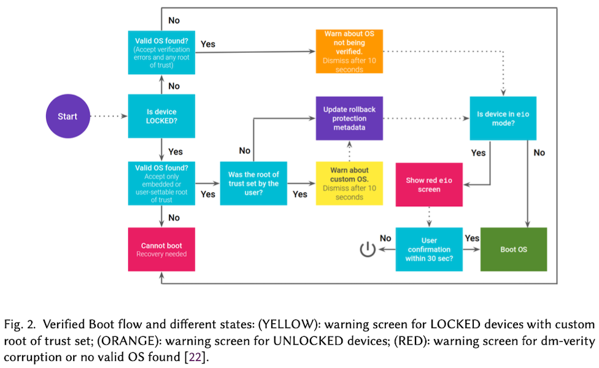

# DiD.4 补丁/更新

---

## 概述

* 定期发布补丁和打补丁
    * Android 设备碎片化给补丁管理带来巨大挑战
* 2015 年 8 月起，Android 每月公开发布一次安全通告和安全补丁
* Android 8 引入 [Treble](https://android-developers.googleblog.com/2017/05/here-comes-treble-modular-base-for.html) ：模块化 Android
    * 加快 Android 新版本系统在所有设备上的普及率
* 2018 年发布的 `Android Enterprise Recommended program` （设备、运营商服务以及企业移动管理服务的最低规格要求）： 
    * 普通设备：`90 天安全更新`
    * 加固型设备：`在设备推出后五年内，一旦有安全更新，就会在 90 天内及时安装`

---

## [Treble](https://android-developers.googleblog.com/2017/05/here-comes-treble-modular-base-for.html)  {id="treble-1"}

* `CTS` (`Compatibility Test Suite`) 通过设计稳定和一致的 API，解决应用开发者开发应用的多版本、多设备兼容性需求
* `VTS` (`Vendor Test Suite`) Android 操作系统框架层面的稳定和一致 API 计划，解耦「设备厂商实现代码」和「Android 操作系统框架代码」

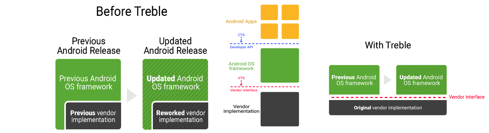

---

## [Treble](https://android-developers.googleblog.com/2017/05/here-comes-treble-modular-base-for.html)  {id="treble-2"}

* 通过硬件定义语言（`HIDL`）、Android `VTS` 在 `HAL` 和它的用户之间定义一个清晰的接口
    * `HIDL` 的目标是在不重新构建 `HAL` 的情况下替换操作系统框架
    * `HAL` 是由半导体供应商进行构建的，并且构建于设备的供应商分区中，这使得操作系统框架被放置于一个自己的分区中，无需重新编译 `HAL` 就能够通过 `OTA` 更新进行替换
    * 每个 `HAL` 组件运行在自己独立沙盒且只允许所控制的硬件设备驱动访问，上层应用不允许直接访问设备驱动而是只能访问对应关联的 `HAL` 组件

---        

## [Treble](https://android-developers.googleblog.com/2017/05/here-comes-treble-modular-base-for.html)  {id="treble-3"}

* `SELinux` 策略不再是出厂时固化在框架代码里，改为系统启动时从不同安全分区（`system` 和 `vendor`）加载动态组装
    * 安全策略可以局部、独立更新

# Android 应用开发基础 {id="android-dev-basics"}

---

## [开发者工作流程基础知识](https://developer.android.com/studio/workflow)

1. 设置开发环境
2. 编写应用代码
3. 构建并运行
4. 调试、剖析和测试
5. 发布应用

---

### 1. 设置开发环境 {id="setup-dev-1"}

* [安装 Android Studio](https://developer.android.com/studio)
* [创建项目](https://developer.android.com/studio/projects/create-project)

---

### Android Studio 安装后开发前配置 SDK {id="setup-sdk"}

见课本 [第五章 实验](https://c4pr1c3.github.io/cuc-mis/chap0x05/exp.html)

* SDK
* AVD
* [Gradle 依赖项目 - Offline components](https://developer.android.com/studio)

---

### 创建项目完毕后大概率会遇到的一个错误 {id="gradle-download-failed-1"}

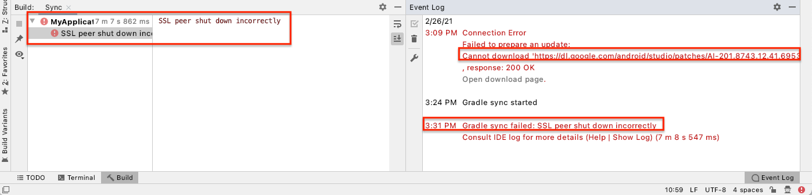

---

### 创建项目完毕后大概率会遇到的一个错误 {id="gradle-download-failed-2"}

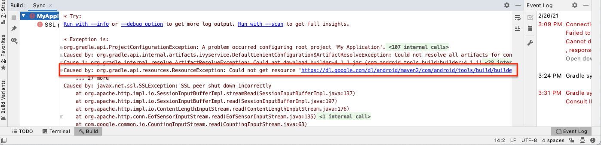

---

### 离线安装 Gradle 依赖项目 {id="offline-setup-gradle"}

* 提前从 [Android Studio 官网](https://developer.android.com/studio) 下载好 `Offline components` （`2.7GB+`）
* [Android Studio 3.6+ 开启 Gradle 的「离线模式」](https://stackoverflow.com/questions/60891740/android-studio-gradle-offline-mode-not-found): 从菜单栏中依次选择 View > Tool Windows > Gradle。然后，在 Gradle 窗口顶部附近，点击 Toggle Offline Mode 图标
* 解压缩上述 `Gradle 构建依赖压缩包` ，并按照压缩包中的 `README` 进行配置
    * 其中的可选步骤建议在新创建的项目中也一并完成，此时可能会自动执行一次 gradle 下载

---

### [2. 编写应用代码](https://developer.android.com/studio/write)

[开发第一个 Android 应用程序](https://developer.android.com/training/basics/firstapp)

> 动手编写 Hello World 时间

---

### 3. 构建并运行

---

### 4. 调试、剖析和测试

---

### 5. 发布应用

* 应用签名方法

# Android 应用开发与安全实验环境搭建 {id="setup-android-dev"}

---

* [adb](https://developer.android.com/studio/command-line/adb)
* [logcat](https://developer.android.com/studio/command-line/logcat)

# [Android 应用程序基础](https://developer.android.com/guide/components/fundamentals) {id="android-components-basics"}

---

## Android 应用开发语言与二进制载体 {id="dev-lang-and-media"}

* 可选应用程序编程语言：Kotlin、 **Java** 和 C++
* Android SDK 工具会将代码连同任何数据和资源文件编译成一个 APK（ `Android package`），即带有 `.apk` 后缀的（`zip 格式`）归档文件

---

## Android 应用与进程 {id="app-and-process"}

* Android 操作系统是一种多用户 Linux 系统，其中的 `每个应用都是一个不同的用户`
* 默认情况下，系统会为每个应用分配一个唯一的 Linux 用户 ID（该 ID 仅由系统使用，应用并不知晓）。系统会为应用中的所有文件设置权限，使得只有分配给该应用的用户 ID 才能访问这些文件；
* 每个进程都拥有自己的虚拟机 (VM)，因此应用代码独立于其他应用而运行。
* 默认情况下，每个应用都在其自己的 Linux 进程内运行。Android 系统会在需要执行任何应用组件时启动该进程，然后当不再需要该进程或系统必须为其他应用恢复内存时，其便会关闭该进程。

---

## Android 应用沙盒 {id="app-sandbox"}

* `最小化授权` 的应用
    * 按照 `用户 ID` 区分应用彼此属主：相同 `用户 ID` 的应用可以互相访问，否则被禁止互相访问
    * 申请许可制：参见前述 [Android permissions](https://developer.android.com/guide/topics/permissions/overview)

---

## 应用组件

* Activity
* 服务 `Service`
* 广播接收器 `BroadcastReceiver`
* 内容提供程序 `ContentProvider`

---

### Activity {id="activity-1"}

* `Activity` 是 Android 应用中负责与用户交互的组件
* `View` 是所有UI控件、容器控件的基类
    * 用户看到的部分
    * View 组件需要被放到容器组件中或使用 `Activity` 将它显示出来
        * `setContentView()`

```java
public class MainActivity extends AppCompatActivity {

    @Override
    protected void onCreate(Bundle savedInstanceState) {
        super.onCreate(savedInstanceState);
        setContentView(R.layout.activity_main);
    }
}
```

---

### Service {id="service-1"}

* 与 `Activity` 地位并列
* 后台运行，一般不需要与用户交互，无图形用户界面
* 所有的 `Service` 组件需要继承 `Service` 基类
* 一个 `Service` 组件被运行起来之后，拥有自己独立的生命周期
	* 为其他组件提供后台服务或监控其他组件运行状态

---

### BroadcastReceiver {id="BroadcastReceiver-1"}

* 类似于事件编程中的事件监听器
	* 普通事件监听器监听的事件源是程序中的对象
	* `BroadcastReceiver` 监听的事件源是 `Android` 应用中的其他组件
* 开发者实现自己的 `BroadcastReceiver` 子类，重写 `onReceive(Context cx, Intent it)` 方法即可

---

### BroadcastReceiver {id="BroadcastReceiver-2"}

* 其他组件通过 `sendBroadcast()`、`sendStickyBroadcast()` 或 `sendOrderedBroadcast()` 方法发送广播消息时，如该 `BroadcastReceiver` 也对该消息『感兴趣』， `onReceive` 方法会被自动调用
	* 配置 `IntentFilter` 实现『感兴趣』
	* 在 `Java` 代码中使用 `Context.registReceiver()` 方法注册 `BroadcastReceiver`
	* 在 `AndroidManifest.xml` 中使用 `<receiver …/>` 元素完成注册

---

### BroadcastReceiver {id="BroadcastReceiver-3"}

* 借助 `BroadcastReceiver`，系统能够在常规用户流之外向应用传递事件，从而允许应用响应系统范围内的广播通知
* 系统和第三方应用均可以主动发起广播消息
* `BroadcastReceiver` 不会显示界面，但其可以创建状态栏通知
* 每条广播都作为 [Intent](https://developer.android.com/reference/android/content/Intent) 对象进行传递

---

#### Intent 和 IntentFilter {id="intent-1"}

* `Android` 应用内不同组件之间通信的载体
	* 可以用于启动一个 `Activity` 或 `Service` 组件
	* 还可以发送一条广播消息来触发系统中所有已注册的 `BroadcastReceiver`
* `Intent` 封装了当前组件需要启动或触发的目标组件信息
	* 显式 `Intent`：明确指定需要启动或触发的组件类名
	* 隐式 `Intent`：仅指定需要启动或触发的组件应满足的条件
		* `IntentFilter` 声明当前应用能处理哪些隐式 `Intent`

---

#### Intent  {id="intent-2"}

```java
	    Intent intent = new Intent(this, DisplayMessageActivity.class);
        EditText editText = (EditText) findViewById(R.id.edit_message);
        String message = editText.getText().toString();
        intent.putExtra(EXTRA_MSG, message);
// Save Data
        editor.putString(getString(R.string.pref_usr_input_msg), message);
        editor.commit();

        startActivity(intent);
```

---

#### IntentFilter

```xml
<activity android:name=".MainActivity">
	<intent-filter>
		<action android:name="android.intent.action.MAIN" />
		<category android:name="android.intent.category.LAUNCHER" />
	</intent-filter>
</activity>
```

---

### ContentProvider

* `Android OS` 限制每个应用运行在自己独立的虚拟机实例中
	* 应用间需要实时数据交换：`ContentProvider`
* 开发者实现自己的 `ContentProvider` 需要实现以下抽象方法
	* `insert`、`delete`、`update` 和 `query`
		* 上述方法的第一个参数都是 `URI`
* `应用A` 通过 `ContentProvider` 暴露自己的数据访问接口，`应用B` 通过 `ContentResolver` 来访问数据

---

### 组件间关系

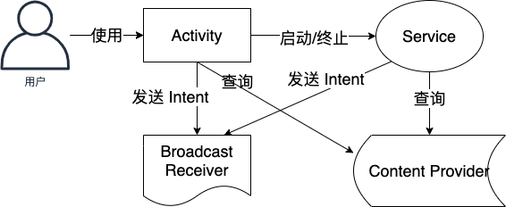

---

## 清单文件

* `AndroidManifest.xml`
* 位于应用项目目录的根目录下
* 声明应用中的所有组件
* 声明组件功能
	* 配合 `IntentFilter` 声明
* 声明应用要求
	* 确定应用需要的任何用户权限，如互联网访问权限或对用户联系人的读取权限
	* 根据应用使用的 API，声明应用所需的最低 API 级别
	* 声明应用使用或需要的硬件和软件功能，如相机、蓝牙服务或多点触摸屏幕
	* 声明应用需要链接的 API 库（Android 框架 API 除外），如 Google 地图库

---

## 应用资源

* 资源是指代码使用的附加文件和静态内容，例如位图、布局定义、界面字符串、动画说明等

