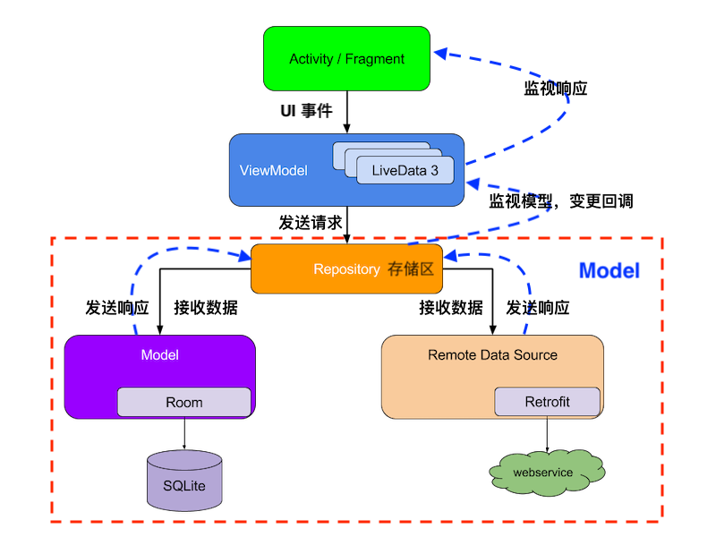

# 第八章 移动终端应用攻防与代码安全最佳实践

---

## 温故

* 逆向分析的目标之一是将「黑盒分析」问题转为「白盒分析」

---

## 知新

* 「白盒分析」是对「源代码」中存在的漏洞进行「攻防」的手段
* 本章假设攻击者已经拿到目标程序的所有未经混淆的「源代码」
    * 如何在「源代码」层面避免留下「安全漏洞」
* 编写安全可靠 Android 应用的最佳实践方法

# 典型安卓应用代码架构

---

## 常见架构原则

* 分离关注点
* 通过模型驱动界面

---

### 分离关注点

* 常见误区：将所有代码写入 UI 控件类
    * 操作系统会针对特定用户操作（例如将应用推入后台）或系统可用计算资源告急等状况对用户界面执行销毁操作
* 正确做法
    * UI 控件类专注于用户界面显示与交互处置
    * 通过模型驱动界面

---

### 通过模型驱动界面

* 此处的模型通常特指「持久化存储模型」
* 界面渲染结果来自于「持久化存储模型」中的数据，用户交互结果可以即时反馈到「持久化存储模型」里的数据更新
    * 即使操作系统“杀死了”用户界面，只要『数据』已持久化存储，则用户不必担心『丢失操作状态和结果』

---

## 安卓官方推荐应用架构 {id="android-recommend-arch-1"}

---

## 安卓官方推荐应用架构 {id="android-recommend-arch-2"}

* 上述应用架构方式 `MVVM` 非「唯一」选择，只是典型架构 **之一**
    * Model-View-ViewModel
* 分层（级）架构
    * 每个组件仅依赖于其下一级的组件
* `Model` 负责全部的业务逻辑，提供泛化数据，确保业务逻辑独立完整，被不同页面（`View`）共享
* `View` 负责展示数据，拥有 `ViewModel` 的引用, 而 `ViewModel` 独立于 `View` 
    * `View` 观察 `ViewModel` 提供的属性，监视到 `ViewModel` 有变化可以及时更新 UI
* `ViewModel` 是为事件驱动的页面提供数据流，以生命周期方式存储与管理页面相关数据，供 `View` 绑定，是 **一对多** 关系
    * 消费者(`View`)知道生产者(`ViewModel`)，而生产者只提供数据, 并不关心谁消费

---

## 安卓官方推荐应用架构 {id="android-recommend-arch-3"}

* `Repository` 是唯一依赖于其他多个类的类
    * 本地存储 
        * `SQLite`
    * 远程数据源
        * `RESTful API Service`
    * 共享偏好（首选项）对象
        * `Shared Preferences`

---

### 页面布局类

* [Activity](https://developer.android.com/guide/components/activities/intro-activities)
* [Fragment](https://developer.android.com/guide/fragments)
    * 表示应用界面中可重复使用的一部分
    * 独立于 `Activity` 定义和管理自己的布局，具有自己的生命周期，并且可以处理自己的输入事件
    * `Fragment` 不能独立存在，而是必须由 `Activity` 或另一个 `Fragment` 托管

---

### 视图生命周期控制类 ViewModel {id="viewmodel-1"}

---

### 视图生命周期控制类 ViewModel {id="viewmodel-2"}

* 用户界面状态数据通过 `ViewModel` 保存到「内存」中，支持保存复杂对象（但存储空间受可用内存限制），读写速度快，在配置更改后继续存在
* 系统发起的进程终止后 `ViewModel` 不复存在
* 用户完成 `Activity` 关闭或触发 `onFinish()` 方法调用后 `ViewModel` 不复存在
* [LiveData](https://developer.android.com/topic/libraries/architecture/livedata) 是一种可观察的数据存储器类
    * 遵循其他应用组件（如 `Activity`、`Fragment` 或 `Service`）的生命周期。这种感知能力可确保 `LiveData` 仅更新处于活跃生命周期状态的应用组件观察者

---

### 安卓应用存储模型

* [应用间数据共享与应用内数据存储](https://developer.android.com/guide/topics/providers/content-provider-creating#DataStorage)
    * `ContentProvider` 解决的是「应用间」 **数据共享** 问题
    * 结构化数据存储：关系型数据库（如 SQLite），非关系型键值数据存储区（如 [LevelDB](https://github.com/google/leveldb) ）
        * [Room](https://developer.android.com/training/data-storage/room) 在关系型数据库 `SQLite` 基础上提供了一个 `抽象层`，用来在本地保存应用数据
    * 非结构化数据存储：如音频、图像或视频媒体，则通常以文件形式存储数据

---

#### [使用 Room 将数据保存到本地数据库](https://developer.android.com/training/data-storage/room) {id="using-room-for-local-persistence-1"}

> 相比较于直接调用 SQLite API 和使用 SQL 语句操作本地数据库

* 一种对象映射（ORM）框架
* 编译期（而非运行时）检查 SQL 语句正确性，在代码测试运行前即确保健壮性
* 便于注释，可最大程度减少重复和易错的模板代码
* 简化数据库迁移路径

---

#### [使用 Room 将数据保存到本地数据库](https://developer.android.com/training/data-storage/room) {id="using-room-for-local-persistence-2"}

* `Room` 支持返回 `LiveData` 对象的可观察查询
* 当数据库更新时，`Room` 会生成更新 `LiveData` 对象所需的所有代码。在需要时，生成的代码会在后台线程上异步运行查询
* 此模式有助于使界面中显示的数据与存储在数据库中的数据保持同步

---

#### 使用 [Retrofit](https://square.github.io/retrofit/) 访问 RESTful 接口

> A type-safe HTTP client for Android and Java

* 采用注解风格定义接口，面向对象方式访问 `RESTful` 接口
* 同时支持同步和异步执行请求
* 简化了网络请求流程，同时内部实现对 [OkHttp](https://square.github.io/okhttp/) 做了封装
    * `Retrofit` 和 `OkHttp` 都是 `Square` 公司的开源解决方案

---

## [Android Jetpack](https://developer.android.com/jetpack)

* `Android` 官方推荐的面向「标准化开发模式」可以使用的一套组件库，独立于 `Android` 操作系统和开发工具包发布
    * 同时提供 `Java API` 和 `Kotlin API`
* [提供了安全性、易用性和高性能之间兼顾的安全组件，同时也可以用于实现最高安全等级需求](https://vnhacker.blogspot.com/2019/05/announcement-android-jetpack-security.html)：提供了与读取和写入静态数据以及密钥创建和验证相关的符合「最佳安全实践」的实现
* [基于 Jetpack 的最佳编程实践指导原则](https://developer.android.com/jetpack/guide?hl=zh-cn#best-practices)

# 本章内容注意事项

---

* 持续跟进 `Android` 官方开发团队推荐的 **最佳安全实践** ，不要局限于本章内容中的一些可能已过时的『经典安全编程实践范式』

# 应用组件安全

---

# 延伸阅读

---

* [Android Application Secure Design/Secure Coding Guidebook](https://www.jssec.org/dl/android_securecoding_en/index.html)

