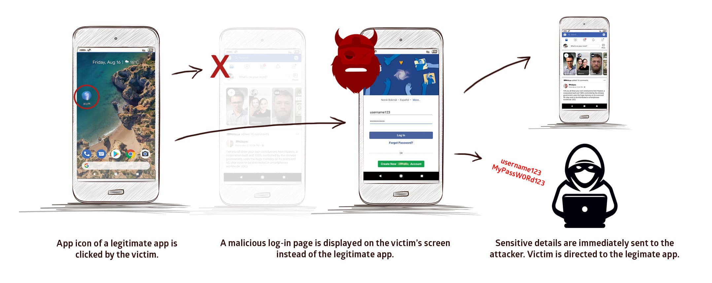
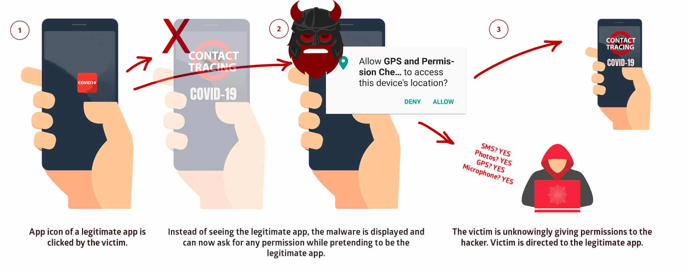

# 第八章 移动终端应用攻防与代码安全最佳实践

---

## 温故

* 逆向分析的目标之一是将「黑盒分析」问题转为「白盒分析」

---

## 知新

* 「白盒分析」是对「源代码」中存在的漏洞进行「攻防」的手段
* 本章假设攻击者已经拿到目标程序的所有未经混淆的「源代码」
    * 如何在「源代码」层面避免留下「安全漏洞」
* 编写安全可靠 Android 应用的最佳实践方法

# 典型安卓应用代码架构

---

## 常见架构原则

* 分离关注点
* 通过模型驱动界面

---

### 分离关注点

* 常见误区：将所有代码写入 UI 控件类
    * 操作系统会针对特定用户操作（例如将应用推入后台）或系统可用计算资源告急等状况对用户界面执行销毁操作
* 正确做法
    * UI 控件类专注于用户界面显示与交互处置
    * 通过模型驱动界面

---

### 通过模型驱动界面

* 此处的模型通常特指「持久化存储模型」
* 界面渲染结果来自于「持久化存储模型」中的数据，用户交互结果可以即时反馈到「持久化存储模型」里的数据更新
    * 即使操作系统“杀死了”用户界面，只要『数据』已持久化存储，则用户不必担心『丢失操作状态和结果』

---

## 安卓官方推荐应用架构 {id="android-recommend-arch-1"}

[](https://developer.android.com/jetpack/guide?hl=zh-cn)

---

## 安卓官方推荐应用架构 {id="android-recommend-arch-2"}

* 上述应用架构方式 `MVVM` 非「唯一」选择，只是典型架构 **之一**
    * Model-View-ViewModel
* 分层（级）架构
    * 每个组件仅依赖于其下一级的组件

---

## 安卓官方推荐应用架构 {id="android-recommend-arch-3"}

* `Model` 负责全部的业务逻辑，提供泛化数据，确保业务逻辑独立完整，被不同页面（`View`）共享
* `View` 负责展示数据，拥有 `ViewModel` 的引用, 而 `ViewModel` 独立于 `View` 
    * `View` 观察 `ViewModel` 提供的属性，监视到 `ViewModel` 有变化可以及时更新 UI
* `ViewModel` 是为事件驱动的页面提供数据流，以生命周期方式存储与管理页面相关数据，供 `View` 绑定，是 **一对多** 关系
    * 消费者(`View`)知道生产者(`ViewModel`)，而生产者只提供数据, 并不关心谁消费

---

## 安卓官方推荐应用架构 {id="android-recommend-arch-4"}

* `Repository` 是唯一依赖于其他多个类的类
    * 本地存储 
        * `SQLite`
    * 远程数据源
        * `RESTful API Service`
    * 共享偏好（首选项）对象
        * `Shared Preferences`

---

### 页面布局类

* [Activity](https://developer.android.com/guide/components/activities/intro-activities)
* [Fragment](https://developer.android.com/guide/fragments)
    * 表示应用界面中可重复使用的一部分
    * 独立于 `Activity` 定义和管理自己的布局，具有自己的生命周期，并且可以处理自己的输入事件
    * `Fragment` 不能独立存在，而是必须由 `Activity` 或另一个 `Fragment` 托管

---

### 视图生命周期控制类 ViewModel {id="viewmodel-1"}

[](https://developer.android.com/topic/libraries/architecture/viewmodel)

---

### 视图生命周期控制类 ViewModel {id="viewmodel-2"}

* 用户界面状态数据通过 `ViewModel` 保存到「内存」中，支持保存复杂对象（但存储空间受可用内存限制），读写速度快，在配置更改后继续存在
* 系统发起的进程终止后 `ViewModel` 不复存在
* 用户完成 `Activity` 关闭或触发 `onFinish()` 方法调用后 `ViewModel` 不复存在
* [LiveData](https://developer.android.com/topic/libraries/architecture/livedata) 是一种可观察的数据存储器类
    * 遵循其他应用组件（如 `Activity`、`Fragment` 或 `Service`）的生命周期。这种感知能力可确保 `LiveData` 仅更新处于活跃生命周期状态的应用组件观察者

---

### 安卓应用存储模型

* [应用间数据共享与应用内数据存储](https://developer.android.com/guide/topics/providers/content-provider-creating#DataStorage)
    * `ContentProvider` 解决的是「应用间」 **数据共享** 问题
    * 结构化数据存储：关系型数据库（如 SQLite），非关系型键值数据存储区（如 [LevelDB](https://github.com/google/leveldb) ）
        * [Room](https://developer.android.com/training/data-storage/room) 在关系型数据库 `SQLite` 基础上提供了一个 `抽象层`，用来在本地保存应用数据
    * 非结构化数据存储：如音频、图像或视频媒体，则通常以文件形式存储数据

---

#### [使用 Room 将数据保存到本地数据库](https://developer.android.com/training/data-storage/room) {id="using-room-for-local-persistence-1"}

> 相比较于直接调用 SQLite API 和使用 SQL 语句操作本地数据库

* 一种对象映射（ORM）框架
* 编译期（而非运行时）检查 SQL 语句正确性，在代码测试运行前即确保健壮性
* 便于注释，可最大程度减少重复和易错的模板代码
* 简化数据库迁移路径

---

#### [使用 Room 将数据保存到本地数据库](https://developer.android.com/training/data-storage/room) {id="using-room-for-local-persistence-2"}

* `Room` 支持返回 `LiveData` 对象的可观察查询
* 当数据库更新时，`Room` 会生成更新 `LiveData` 对象所需的所有代码。在需要时，生成的代码会在后台线程上异步运行查询
* 此模式有助于使界面中显示的数据与存储在数据库中的数据保持同步

---

#### 使用 [Retrofit](https://square.github.io/retrofit/) 访问 RESTful 接口

> A type-safe HTTP client for Android and Java

* 采用注解风格定义接口，面向对象方式访问 `RESTful` 接口
* 同时支持同步和异步执行请求
* 简化了网络请求流程，同时内部实现对 [OkHttp](https://square.github.io/okhttp/) 做了封装
    * `Retrofit` 和 `OkHttp` 都是 `Square` 公司的开源解决方案

---

## [Android Jetpack](https://developer.android.com/jetpack)

* `Android` 官方推荐的面向「标准化开发模式」可以使用的一套组件库，独立于 `Android` 操作系统和开发工具包发布
    * 同时提供 `Java API` 和 `Kotlin API`
* [提供了安全性、易用性和高性能之间兼顾的安全组件，同时也可以用于实现最高安全等级需求](https://vnhacker.blogspot.com/2019/05/announcement-android-jetpack-security.html)：提供了与读取和写入静态数据以及密钥创建和验证相关的符合「最佳安全实践」的实现
* [基于 Jetpack 的最佳编程实践指导原则](https://developer.android.com/jetpack/guide?hl=zh-cn#best-practices)

# 本章内容注意事项

---

* 持续跟进 `Android` 官方开发团队推荐的 **最佳安全实践** ，不要局限于本章内容中的一些可能已过时的『经典安全编程实践范式』

# 应用组件安全

---

## 组件访问控制不当风险 {id="intent-related-risks"}

| | 攻击手段 |
|--|---------|
| Activity | 构造Intent直接调⽤，实现⾮授权访问 <br/> 后台守护进程通过进程枚举，直接启动新Activity覆盖到当前Activity进⾏『点击』劫持，实现钓鱼攻击（零权限要求） |
| Service | 构造Intent直接调⽤，实现⾮授权访问 |
| Broadcast Receiver | 构造Intent直接发送虚假⼴播消息，实现⾮授权访问 <br/> 注册同名IntentFilter，实现⼴播消息监听和劫持 |
| Content Provider | 直接访问暴露的URI，实现⾮授权访问 |

---

## TA. 恶意调用 Activity {id="unexpected-call-activity"}

* TA.1. 公开可访问的 Activity
* TA.2. Activity （钓鱼）劫持

# TA.1. 公开可访问的 Activity  {id="public-callable-activity"}

---

## 第三方应用直接唤起目标 Activity {id="call-activity-directly"}

```bash
adb shell am start -n cuc.edu.cn/.MainActivity
```

---

## 漏洞成因 [CWE-926](https://cwe.mitre.org/data/definitions/926.html) {id="cwe-926-1"}

`android:exported="true"`

```{.xml .number-lines}
<activity
            android:name=".LoginActivity"
            android:label="@string/app_name"
            android:exported="true">
```

---

## 漏洞成因 [CWE-926](https://cwe.mitre.org/data/definitions/926.html) {id="cwe-926-2"}


---

## 获取指定应用的 Activity {id="find-activiy-names-in-a-package"}

```bash
# 获取系统中所有应用
adb shell pm list packages

# 获取系统中所有第 3 方应用
adb shell pm list packages -3

# 查看指定应用的所有可访问 Main Activity 类名
adb shell dumpsys package | grep Activity | grep -i cuc.edu.cn

# 查看当前打开应用的活动 Activity
adb shell dumpsys window windows | grep -i cuc.edu.cn

# ref: https://programmer.help/blogs/dumpsys-command-in-android.html
```

---

## android:exported 默认值的变迁 {id="android-exported-default-history-1"}

* [2012.7 Android 4.2 (API Level 17)](https://source.android.com/security/enhancements/enhancements42) 将 `ContentProvider` 组件包含的 `android:exported` 属性值默认设置为 `false`
* [2021.9 Android 12 (API Level 31)](https://android-developers.googleblog.com/2021/02/android-12-dp1.html) 将所有可能包含该属性值的组件对应的 `android:exported` 默认设置为 `false` ，即使子元素包含 `intent-filter` 定义也需要显示设置 `android:exported=true` ，否则依然为 `false`
    * [如果应用的目标平台被设置为 Android 12，且包含使用 intent 过滤器的 activity、服务或广播接收器，开发者必须为这些应用组件显式声明 android:exported 属性](https://developer.android.com/about/versions/12/behavior-changes-12#exported)

---

## android:exported 默认值的变迁 {id="android-exported-default-history-2"}

* `Android 12` 以前版本三大组件声明时的 `android:exported` 默认值的一般规则：如果包含 `intent-filter` 子元素定义，则没有声明 `android:exported` 属性也视为隐式声明该属性值为 `true` 。否则，默认值均为 `false`
    * [Activity](https://developer.android.com/guide/topics/manifest/activity-element#exported)
    * [Service](https://developer.android.com/guide/topics/manifest/service-element.html#exported)
    * [BroadcastReceiver](https://developer.android.com/guide/topics/manifest/receiver-element#exported)

---

## android:exported=true 时的真实案例

* [Opening arbitrary URLs/XSS in SAMLAuthActivity](https://hackerone.com/reports/283058) 社工钓鱼 $150
* [Access of Android protected components via embedded intent 2017-01-23](https://hackerone.com/reports/200427) 权限提升 $1,000
* [Possible to steal any protected files on Android 2016-08-21](https://hackerone.com/reports/161710) 信息泄露 $500
* [XSS in ImageViewerActivity 2017-10-26](https://hackerone.com/reports/283063) 社工钓鱼 $500
* [Theft of arbitrary files leading to token leakage 2017-11-10](https://hackerone.com/reports/288955) 隐私泄露 $500

---

## D.TA.1. 安全加固

* 最小化组件暴露 - [Google 官方开发者文档中的「核心应用质量」核对清单](https://developer.android.com/docs/quality-guidelines/core-app-quality#SC-5)
    * 仅导出与其他应用共享数据的应用组件，或应由其他应用调用的组件，这包括 `activity`、`service`、`广播接收器`，尤其是 `Content Provider`
    * **始终显式设置** `android:exported` 属性，以尽量避免混淆默认值
* 基于 `Android Permission` 机制对被访问 Activity 设置访问控制规则
    * 暴露组件对应代码的内部运行时检查

---

## android:exported=false 时的保护效果

```{.bash .number-lines}
adb shell am start -n cuc.edu.cn/.DisplayMessageActivity
# Starting: Intent { cmp=cuc.edu.cn/.DisplayMessageActivity }
# Security exception: Permission Denial: starting Intent { flg=0x10000000 cmp=cuc.edu.cn/.DisplayMessageActivity } from null (pid=3804, uid=2000) not exported from uid 10104
# 
# java.lang.SecurityException: Permission Denial: starting Intent { flg=0x10000000 cmp=cuc.edu.cn/.DisplayMessageActivity } from null (pid=3804, uid=2000) not exported from uid 10104
# 	at com.android.server.wm.ActivityStackSupervisor.checkStartAnyActivityPermission(ActivityStackSupervisor.java:1043)
# 	at com.android.server.wm.ActivityStarter.startActivity(ActivityStarter.java:760)
# 	at com.android.server.wm.ActivityStarter.startActivity(ActivityStarter.java:583)
# 	at com.android.server.wm.ActivityStarter.startActivityMayWait(ActivityStarter.java:1288)
# 	at com.android.server.wm.ActivityStarter.execute(ActivityStarter.java:514)
# 	at com.android.server.wm.ActivityTaskManagerService.startActivityAsUser(ActivityTaskManagerService.java:1058)
# 	at com.android.server.wm.ActivityTaskManagerService.startActivityAsUser(ActivityTaskManagerService.java:1032)
# 	at com.android.server.am.ActivityManagerService.startActivityAsUser(ActivityManagerService.java:3504)
# 	at com.android.server.am.ActivityManagerShellCommand.runStartActivity(ActivityManagerShellCommand.java:518)
# 	at com.android.server.am.ActivityManagerShellCommand.onCommand(ActivityManagerShellCommand.java:172)
# 	at android.os.ShellCommand.exec(ShellCommand.java:104)
# 	at com.android.server.am.ActivityManagerService.onShellCommand(ActivityManagerService.java:9774)
# 	at android.os.Binder.shellCommand(Binder.java:881)
# 	at android.os.Binder.onTransact(Binder.java:765)
# 	at android.app.IActivityManager$Stub.onTransact(IActivityManager.java:4498)
# 	at com.android.server.am.ActivityManagerService.onTransact(ActivityManagerService.java:2741)
# 	at android.os.Binder.execTransactInternal(Binder.java:1021)
# 	at android.os.Binder.execTransact(Binder.java:994)

# 如果在 AndroidManifest.xml 中没有显式设置 android:exported="true"
# Android 6.0 系统默认值视为 true
# 当 Activity 显式设置 android:exported="false" 时
# Android 6.0 系统并不会在终端输出如上异常信息，只是静默唤起 Activity 失败

# Android 10.0 11.0 系统默认值视为 false

# 获取 Android 系统版本信息
adb shell getprop ro.build.version.release
# 10

# 获取 Android 系统版本 API Level 
adb shell getprop ro.build.version.sdk
# 29

# 获取目标 Android 系统所有运行时信息
adb shell getprop

# 发送 Intent 时传参数
adb shell am start -n cuc.edu.cn/.DisplayMessageActivity --es cuc.edu.cn.MESSAGE hello
```

---

## D.TA.1. 被访问 Activity 设置访问控制规则 {id="protected-activity-1"}

```{.xml .number-lines}
<!-- 被访问 Activity 添加 `android:permission` 属性 -->
<activity android:name=".Another" android:label="@string/app_name"
           android:permission="com.test.custompermission">
</activity>

<!-- AndroidManifest.xml 中声明自定义权限 -->
<permission android:description="test"
        android:label="test"
        android:name="com.test.custompermission"
        android:protectionLevel="normal">
</permission>
```

---

### D.TA.1. android:protectionLevel

* `protectionLevel` 有四种级别 `normal`、`dangerous`、`signature`、`signatureOrSystem`
* 声明为 `signature`、`signatureOrSystem` 时，只有调用者 `apk` 和被调用者 `apk` 具备相同签名时才能调用

---

## D.TA.1. 发起访问的 Activity 声明请求授权 {id="activity-caller-declaration"}

```xml
<uses-permission android:name="com.test.custompermission" />
```

---

## D.TA.1. 发起访问的 Activity 检查用户是否已授权 {id="activity-caller-check-if-granted"}

```{.java .number-lines}
if (context.checkCallingOrSelfPermission("com.test.custompermission")
        != PackageManager.PERMISSION_GRANTED) {
            // The Application requires permission to access the Internet
} else {
    // OK to access the Internet
}
```

# TA.2. Activity （钓鱼）劫持 {id="activity-phishing"}

---

> 所「点」非所得

---

## [2019. StrandHogg](https://promon.co/security-news/strandhogg/)  {id="strandhogg-1"}

* [Ren, C., Zhang, Y., Xue, H., Wei, T., & Liu, P. (2015). Towards discovering and understanding task hijacking in android. 24th USENIX Security Symposium, 945–959.](https://s2.ist.psu.edu/paper/usenix15-final-ren.pdf)
* [熊璐, 彭国军, & 罗元. (2018). 一种新的基于 APP 启动模式的劫持攻击方案. 武汉大学学报 (理学版), 64(2), 141-149.](https://www.cnki.com.cn/Article/CJFDTotal-WHDY201802007.htm)
* 挪威安全公司 `Promon` 根据掌握的「在野」漏洞利用案例情况，报告了该漏洞，并宣称扩展了上述 2015 年发现的任务劫持理论模型，影响 Android 10 及更低版本，Android 开发团队却并不认可该漏洞

---

## [2019. StrandHogg](https://promon.co/security-news/strandhogg/)  {id="strandhogg-2"}

* `StrandHogg` 维京海盗突袭战术
    * 界面劫持：当目标应用 `lanchMode` 为 `standard` 或 `singleTop` 时，通过设定恶意程序 `taskAffinity` 与目标 `Activity` 所属应用包名一致，并配合使用 `android:allowTaskReparenting="true"`，将恶意 `Activity` 置于目标任务栈的内部或顶部，当用户点击受害者应用图标时恶意程序会伪装成正常应用程序的界面迷惑用户实现界面劫持攻击
    * 任务隐藏：对任意已运行目标程序，如果设定恶意程序的程序名称及 `taskAffinity` 与目标程序保持一致，且 `lanchMode` 设定为 `singleInstance` ，则恶意程序运行后可以构建与目标程序同名的返回栈，并以不同任务 ID 存在于后台，从而可将任务隐藏于后台

---

### taskAffinity 示意 {id="taskAffinity-1"}


---

### taskAffinity 示意 {id="taskAffinity-2"}


---

### taskAffinity 示意 {id="taskAffinity-3"}

```{.bash .number-lines}
adb shell getprop ro.build.version.release
# 8.1.0

adb shell dumpsys activity | grep -i "running activities" -A6
#    Running activities (most recent first):
#      TaskRecord{a771cb #19 A=cuc.edu.cn U=0 StackId=1 sz=2}
#        Run #5: ActivityRecord{8e9b1ab u0 cuc.edu.cn/.DisplayMessageActivity t19}
#        Run #4: ActivityRecord{8ba91c8 u0 cuc.edu.cn/.MainActivity t19}
#      TaskRecord{b0ed9f0 #11 A=com.android.settings U=0 StackId=1 sz=3}
#        Run #3: ActivityRecord{6ec9472 u0 com.android.settings/.SubSettings t11}
#        Run #2: ActivityRecord{f817f74 u0 com.android.settings/.Settings$NetworkDashboardActivity t11}

adb shell dumpsys activity activities | head -n 70
# ACTIVITY MANAGER ACTIVITIES (dumpsys activity activities)
# Display #0 (activities from top to bottom):
#   Stack #1:
#   mFullscreen=true
#   isSleeping=false
#   mBounds=null
#     Task id #19
#     mFullscreen=true
#     mBounds=null
#     mMinWidth=-1
#     mMinHeight=-1
#     mLastNonFullscreenBounds=null
#     * TaskRecord{a771cb #19 A=cuc.edu.cn U=0 StackId=1 sz=2}
#       userId=0 effectiveUid=u0a79 mCallingUid=2000 mUserSetupComplete=true mCallingPackage=null
#       affinity=cuc.edu.cn
#       intent={act=android.intent.action.MAIN cat=[android.intent.category.LAUNCHER] flg=0x10000000 cmp=cuc.edu.cn/.MainActivity}
#       realActivity=cuc.edu.cn/.MainActivity
#       autoRemoveRecents=false isPersistable=true numFullscreen=2 taskType=0 mTaskToReturnTo=1
#       rootWasReset=false mNeverRelinquishIdentity=true mReuseTask=false mLockTaskAuth=LOCK_TASK_AUTH_PINNABLE
#       Activities=[ActivityRecord{8ba91c8 u0 cuc.edu.cn/.MainActivity t19}, ActivityRecord{8e9b1ab u0 cuc.edu.cn/.DisplayMessageActivity t19}]
#       askedCompatMode=false inRecents=true isAvailable=true
#       lastThumbnail=null lastThumbnailFile=/data/system_ce/0/recent_images/19_task_thumbnail.png
#       stackId=1
#       hasBeenVisible=true mResizeMode=RESIZE_MODE_RESIZEABLE_VIA_SDK_VERSION mSupportsPictureInPicture=false isResizeable=true firstActiveTime=1622768158264 lastActiveTime=1622768169700 (inactive for 54s)
#       * Hist #1: ActivityRecord{8e9b1ab u0 cuc.edu.cn/.DisplayMessageActivity t19}
#           packageName=cuc.edu.cn processName=cuc.edu.cn
#           launchedFromUid=10079 launchedFromPackage=cuc.edu.cn userId=0
#           app=ProcessRecord{9f97da8 9061:cuc.edu.cn/u0a79}
#           Intent { cmp=cuc.edu.cn/.DisplayMessageActivity (has extras) }
#           frontOfTask=false task=TaskRecord{a771cb #19 A=cuc.edu.cn U=0 StackId=1 sz=2}
#           taskAffinity=cuc.edu.cn
#           realActivity=cuc.edu.cn/.DisplayMessageActivity
#           baseDir=/data/app/cuc.edu.cn-qLptM63CTI1Wt0oFxe2RRg==/base.apk
#           dataDir=/data/user/0/cuc.edu.cn
#           stateNotNeeded=false componentSpecified=true mActivityType=0
#           compat={560dpi} labelRes=0x7f0e001b icon=0x7f0c0001 theme=0x7f0f019c
#           mLastReportedConfigurations:
#            mGlobalConfig={1.0 310mcc260mnc [en_US] ldltr sw411dp w411dp h659dp 560dpi nrml port finger qwerty/v/v -nav/h appBounds=Rect(0, 0 - 1440, 2392) s.6}
#            mOverrideConfig={1.0 310mcc260mnc [en_US] ldltr sw411dp w411dp h659dp 560dpi nrml port finger qwerty/v/v -nav/h appBounds=Rect(0, 0 - 1440, 2392) s.6}
#           CurrentConfiguration={1.0 310mcc260mnc [en_US] ldltr sw411dp w411dp h659dp 560dpi nrml port finger qwerty/v/v -nav/h appBounds=Rect(0, 0 - 1440, 2392) s.6}
#           taskDescription: iconFilename=null label="null" primaryColor=ff6200ee
#             backgroundColor=ffffffff
#             statusBarColor=ff3700b3
#             navigationBarColor=ff000000
#           launchFailed=false launchCount=1 lastLaunchTime=-54s318ms
#           haveState=false icicle=null
#           state=RESUMED stopped=false delayedResume=false finishing=false
#           keysPaused=false inHistory=true visible=true sleeping=false idle=true mStartingWindowState=STARTING_WINDOW_NOT_SHOWN
#           fullscreen=true noDisplay=false immersive=false launchMode=0
#           frozenBeforeDestroy=false forceNewConfig=false
#           mActivityType=APPLICATION_ACTIVITY_TYPE
#           waitingVisible=false nowVisible=true lastVisibleTime=-53s785ms
#           resizeMode=RESIZE_MODE_RESIZEABLE_VIA_SDK_VERSION
#           mLastReportedMultiWindowMode=false mLastReportedPictureInPictureMode=false
#       * Hist #0: ActivityRecord{8ba91c8 u0 cuc.edu.cn/.MainActivity t19}
#           packageName=cuc.edu.cn processName=cuc.edu.cn
#           launchedFromUid=2000 launchedFromPackage=null userId=0
#           app=ProcessRecord{9f97da8 9061:cuc.edu.cn/u0a79}
#           Intent { act=android.intent.action.MAIN cat=[android.intent.category.LAUNCHER] flg=0x10000000 cmp=cuc.edu.cn/.MainActivity }
#           frontOfTask=true task=TaskRecord{a771cb #19 A=cuc.edu.cn U=0 StackId=1 sz=2}
#           taskAffinity=cuc.edu.cn
#           realActivity=cuc.edu.cn/.MainActivity
#           baseDir=/data/app/cuc.edu.cn-qLptM63CTI1Wt0oFxe2RRg==/base.apk
#           dataDir=/data/user/0/cuc.edu.cn
#           stateNotNeeded=false componentSpecified=true mActivityType=0
#           compat={560dpi} labelRes=0x7f0e001b icon=0x7f0c0001 theme=0x7f0f019c
#           mLastReportedConfigurations:
#            mGlobalConfig={1.0 310mcc260mnc [en_US] ldltr sw411dp w411dp h659dp 560dpi nrml port finger qwerty/v/v -nav/h appBounds=Rect(0, 0 - 1440, 2392) s.6}
#            mOverrideConfig={1.0 310mcc260mnc [en_US] ldltr sw411dp w411dp h659dp 560dpi nrml port finger qwerty/v/v -nav/h appBounds=Rect(0, 0 - 1440, 2392) s.6}
#           CurrentConfiguration={1.0 310mcc260mnc [en_US] ldltr sw411dp w411dp h659dp 560dpi nrml port finger qwerty/v/v -nav/h appBounds=Rect(0, 0 - 1440, 2392) s.6}
```

---

### 简化版漏洞利用过程 {id="StrandHogg-explained-1"}

1. 包含 `StrandHogg` 攻击方法的恶意应用被安装到用户手机上
2. 用户主动打开该恶意应用
3. 用户通过 `Home` 键退出应用
    * 此时恶意应用成功获得在后台运行机会，并将自己置于系统默认的任务堆栈顶部，并监视「目标应用」被打开事件

---

### 简化版漏洞利用过程 {id="StrandHogg-explained-2"}

4. 用户点击打开「目标应用」，但由于 `Android` 多任务调度机制特性，后台恶意应用可以被唤起到前台
    * 只要恶意应用伪装成「目标应用」界面，用户无法察觉出自己正在操作的是仿冒应用
    * 如果用户此时输入用户名密码到界面中控件，则恶意应用就成功实现了数据钓鱼
    * 如果此时后台恶意应用申请运行时敏感权限（例如读取通讯录、通话历史记录、相册访问等），用户会误以为是「目标应用」在向自己申请授权，大概率会同意授权，实际上是恶意应用得到了授权

---

### 简化版界面劫持漏洞原理


---

### 漏洞影响范围

* 早在 2017 年就已经被安全公司 `Lookout` 发现 36 款恶意软件有利用该漏洞进行攻击的事件
* 漏洞发现者 `Promon` 公司的研究人员测试了 `Top 500` 应用均证明受该漏洞影响
    * 应用情报公司 `42matters` 提供的应用排名榜单
* 无需 root 权限即可利用该漏洞 

---

### 漏洞利用可造成的危害 {id="impacts-of-strandhogg-1"}

* 界面劫持（实现社工钓鱼）
    * 盗取用户名和密码
    * 偷取银行账号
* （任务隐藏后）通过权限申请伪装获得敏感数据读取权限
    * 盗取私人 SMS 信息
    * 盗取/访问私人照片和文件
    * 盗录通话内容
    * 通过手机摄像头和麦克风进行间谍活动
    * 跟踪受害者的移动和位置
    * 访问受害者的联系人信息、电话日志、电邮

---

### 界面劫持 {id="impacts-of-strandhogg-2"}



---

### 权限申请伪装 {id="impacts-of-strandhogg-3"}


---

## [2020.5.26. StrandHogg 2.0 - The ‘evil twin’](https://promon.co/strandhogg-2-0/)

* [CVE-2020-0096](https://nvd.nist.gov/vuln/detail/CVE-2020-0096) 影响 Android 9/8.1/8.0



---

### StrandHogg 2.0 vs. StrandHogg {id="strandhogg-2-diffs-1"}

* `StrandHogg 2.0` 无法完全依赖于应用商店审核机制发现恶意应用
    * `StrandHogg` 会在恶意应用的清单文件中留下明显痕迹
        * 权限申请伪装：需要声明使用哪些权限，易被静态分析发现（应用商店普遍使用静态分析工具检查「滥用权限」的应用，并限制上架）
    * `StrandHogg 2.0` 无需在应用清单文件中申请任何特殊权限或设置设置 `taskAffinity` 属性，而是在代码运行时利用 Java 的反射机制执行恶意代码

---

## D.TA.2. 安全加固 - StrandHogg {id="d.ta.2-1"}

* `Google` 之所以不认可针对 `StrandHogg` 为代表的 `taskAffinity` 属性字段 **滥用** 导致的 `UI 欺骗与劫持` 风险为有效漏洞，是因为 `Google` 认为这是一个正常的 `feature` ，`Google` 认为开发者无需进行代码级别安全加固（官方自然也不会发布什么代码级别修复补丁，无需代码级别补丁的缺陷报告是不会被 `Google` 认定为是安全漏洞的），只需要 **应用商店** 在审核应用时对第三方应用设置 `taskAffinity` 为非自家开发应用时给予禁止上架处理即可
    * `Google` 观点：用户只要没有渠道能下载安装包含 `StrandHogg` 攻击方式的恶意应用，则不存在上述安全风险

---

## D.TA.2. 安全加固 - StrandHogg {id="d.ta.2-2"}

* 在 `Android` 系统中，`taskAffinity` 与 `launchMode` 均为正常的属性，且在 `Android` 应用中有较多的应用，尤其在第三方插件中使用较为广泛，实际依赖于人工检测工作量肯定太大，必定要依赖于自动化检测程序
* 如果 **应用商店** 没有尽到应用安全审查责任或没有相应自动化检测能力，那么用户只能通过 `每次启动新应用` 之前清理一遍所有后台任务方式来自保了
* [一个可能会影响用户交互体验的第三方代码级别安全加固方案](https://androidexplained.github.io/security/android/malware/2020/09/23/strandhogg.html) ：在应用清单文件中对欲保护 `Activity` 设置属性 `android:taskAffinity=""`

---

## D.TA.2. 安全加固 - StrandHogg 2.0 {id="d.ta.2-3"}

*  [一个可能会影响用户交互体验的第三方代码级别安全加固方案](https://androidexplained.github.io/security/android/malware/2020/09/23/strandhogg.html)
：对每一个可被第三方应用公开调用的 `Activity` 添加 `singleTask` 或 `singleInstance` 属性字段
* 依赖于用户升级 `Android` 系统到不受该漏洞影响版本是从根本上进行安全加固

---

## （可选实验） 漏洞复现

* [Ivan-Markovic/Android-Task-Injection](https://github.com/Ivan-Markovic/Android-Task-Injection)
* [BoxFighter/Android-StrandHogg-Vulnerability](https://github.com/BoxFighter/Android-StrandHogg-Vulnerability)

# 数据安全

---

## 概述

* 存储安全
* [密钥认证](https://c4pr1c3.github.io/cuc-mis/chap0x06/main.html#%E5%AF%86%E9%92%A5%E5%AD%98%E5%82%A8%E4%B8%8E%E5%AF%86%E7%A0%81%E5%AD%A6%E7%AE%97%E6%B3%95)
* [传输（通信）](https://c4pr1c3.github.io/cuc-mis/chap0x06/main.html#%E8%AF%81%E4%B9%A6%E4%B8%8Epki)
* ROM 安全
* 边信道信息泄露

---

## 数据和文件存储类型

* 应用专属存储空间：存储仅供指定应用使用的文件，可以存储到内部存储卷中的专属目录或外部存储空间中的其他专属目录。使用内部存储空间中的目录保存其他应用不应访问的敏感信息
* 共享存储：存储应用打算与其他应用共享的文件，包括媒体、文档和其他文件
* 偏好设置：以键值对形式存储私有原始数据
* 数据库：使用 `Room` 持久化库将结构化数据存储在专用数据库中

---

### 存储位置类别

* 内部存储空间
* 外部存储空间
    * 可移除卷（例如 SD 卡）在文件系统中属于外部存储空间。`Android` 使用路径（例如 `/sdcard` ）表示这些存储设备

> ⚠️  注意：可用于保存文件的确切位置可能因设备而异。因此，请勿使用硬编码的文件路径。

---

### 外部存储安全

* 在较低版本的 `Android` 系统中，应用需要声明这些权限才能访问位于外部存储空间中应用专属目录之外的任何文件
* Android 系统的版本越新，就越依赖于文件的用途而不是位置来确定应用对文件的访问能力
    * 这种基于用途的存储模型可增强用户隐私保护，因为应用只能访问其在设备文件系统中实际使用的区域

```xml
<!-- API Level >= 19 需要声明以下权限才能读取外部存储空间中的数据 -->
<!-- API Level < 19  无需声明以下权限就能读取外部存储空间中的数据 -->
<uses-permission android:name="android.permission.READ_EXTERNAL_STORAGE ">

<!-- 应用获得了 WRITE_EXTERNAL_STORAGE 授权则自动获得 READ_EXTERNAL_STORAGE 授权 -->
<uses-permission android:name="android.permission.WRITE_EXTERNAL_STORAGE">
```

---

### 内部存储安全

* 应用使用内部存储时，数据默认是只能被当前应用访问（基于文件访问权限设置）
* 一旦系统被 `root` 或代码编写错误，受保护数据将被其他程序访问到
* 受保护的数据需要开放给第三方应用访问时应优先正确使用 [ContentProvider](https://developer.android.com/training/articles/security-tips?hl=zh-cn#ContentProviders) 方式而不是通过对数据文件设置读写权限

```{.java .number-lines}
try {
    // 确保该文件被保存到应用专属目录下，且文件属主被设置为应用属主，其他人无法访问
    FileOutputStream fos = openFileOutput("config.txt", MODE_PRIVATE);
    fors.write("hello world".getBytes());
    fos.close();
} catch (Exception e) {
    e.printStackTrace();
}
```

---

### 关于存储安全的延伸阅读

* [数据存储安全最佳实践](https://developer.android.com/training/articles/security-tips?hl=zh-cn#StoringData)

---

## ROM 安全 {id="rom-security"}

* 原生 ROM - 直接使用 `AOSP` 源代码编译出来的系统镜像
* 设备厂商定制 ROM - 消费者实际能够购买到的设备基本都是来自设备厂商预装了厂商基于上游 `AOSP` 源代码修改定制之后的系统
* 第三方 ROM - `独立于设备厂商的个人或社区团队组织基于 AOSP 代码修改编译出来的系统镜像`

> ⚠️ 小心第三方 ROM 内置的后门

---

## 边信道信息泄露

* 日志
* 系统剪贴板信息
* URL缓存和浏览器Cookie对象
* 第三方统计数据

# 官方 Android 安全编码最佳实践 {id="official-android-security-dev"}

---

## [应用安全编码最佳实践](https://developer.android.com/topic/security/best-practices)

* 强制采用安全通信方式
* 提供恰当的权限
* 安全地存储数据
* 确保服务和依赖项处于最新状态

---

## [应用安全性改进计划 - ASI](https://developer.android.com/google/play/asi)

* App Security Improvement program
* `Google Play` 对已知重要漏洞和缺陷代码模式建立的 **改进指南** 案例库

# 延伸阅读

---

* [Android Application Secure Design/Secure Coding Guidebook](https://www.jssec.org/dl/android_securecoding_en/index.html)

