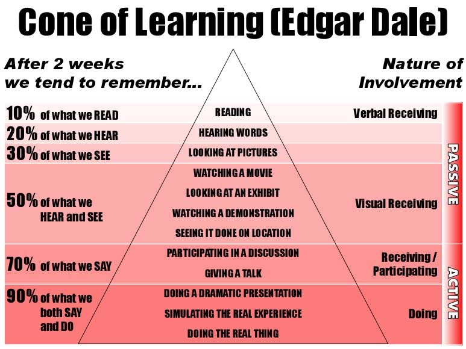
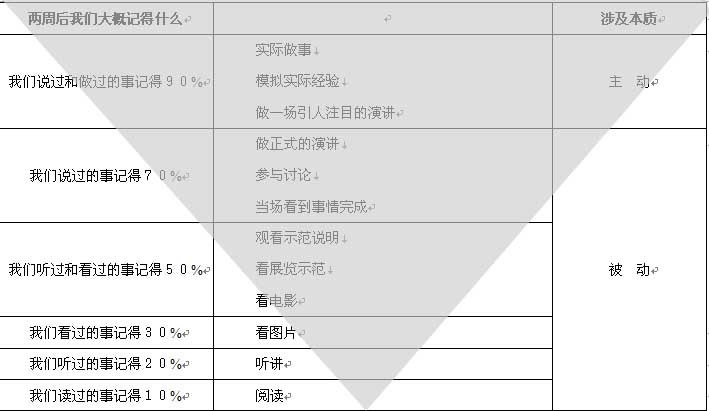

# 课程概况

---

## 先修课程

* 计算机安全与维护
* 计算机⽹络A
* [Linux 系统与网络管理](https://c4pr1c3.github.io/cuc-wiki/linux.html)
* [网络安全](https://c4pr1c3.github.io/cuc-wiki/ns.html)
* [密码学应用实践（推荐）](https://c4pr1c3.github.io/cuc-wiki/ac.html)

---

## 本课程使用教材

[自编教材 - 在线](https://c4pr1c3.github.io/cuc-mis/)

---

## 硬件和软件环境

* PC
* Linux (Kali)
* [USB 无线网卡](https://c4pr1c3.github.io/cuc-mis/chap0x02/wifi_card_list.html)
* 无线接入点（可选）

# 关于课程的教、学方法和原则

---

## 教

* 授⼈以渔
* 重思路、⽅向讲解，轻傻瓜式重复

---

## 学

* 兴趣第⼀
* 尽信师，不如⽆师：质疑、思考、实践
* 会用、用好互联⽹，特别是“搜索”
* ⼀定要亲自动⼿实践 

---

## 学习金字塔

---

## 遗忘金字塔

---

## 重要的事情说三遍

* 主动 **学** 主动 **做** 主动 **讲**
* 主动 **学** 主动 **做** 主动 **讲**
* 主动 **学** 主动 **做** 主动 **讲**

# 课程目标

---

通过本课程的讲授和实验操作

* 你能了解到
    * 无线⽹络攻防基本原理和手段
    * 物联网安全基本原理和手段
    * 智能终端攻防基本原理和手段
* 你不能了解到
    * 如何编写恶意代码

# 课程体系

---

| 内容主题     | 讲授学时 | 实验学时 | 难度评级 |
| :-:          | :-:      | :-:      | :-:      |
| 无线网络攻防 | 14       | 8        | ⭐️⭐️⭐️⭐️ |
| 物联网安全   | 4        | 2        | ⭐️⭐️     |
| 智能终端攻防 | 14       | 6        | ⭐️⭐️     |

---

## 移动互联网全生命周期视角

| 阶段             | 攻防知识点和技能                   |
| :-               | :-                                 |
| 加入无线网络之前 | **嗅探** 、⼊侵（⽹络）、钓鱼、DoS |
| 加入无线网络之后 | **嗅探** 、⼊侵（终端）、MITM      |
| 使用蜂窝数据网络 | **嗅探** 、MITM                    |
| 使用移动应用     | **嗅探** 、篡改、⼊侵（终端&云端） |

# [考核方式](https://c4pr1c3.github.io/cuc-wiki/mis/2021/homework.html)

---

* 平时成绩 30%
    * 上课考勤 
    * 主观评价：随堂测试，积极参与课堂讨论
* 实验报告 70%
    * 3+ 次实验报告

# Q&A

---

欢迎提问😁

